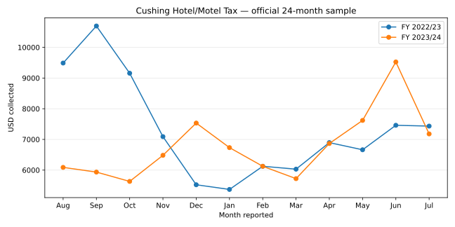
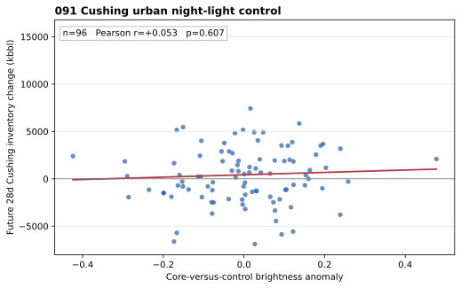
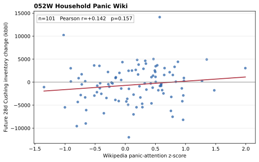
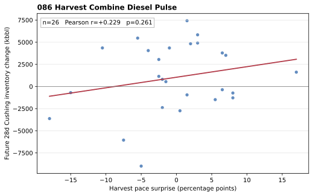
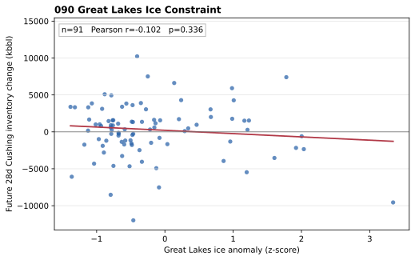
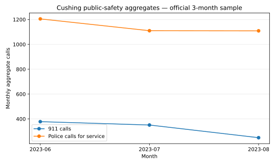
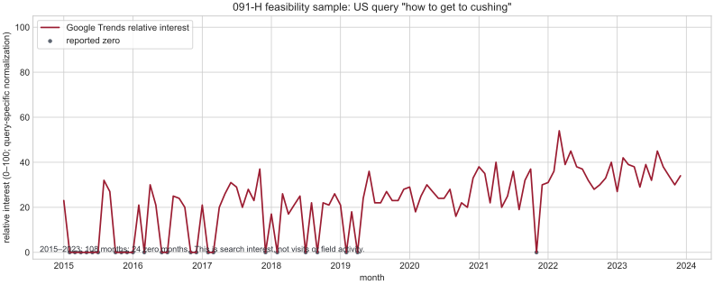

# 091 — Cushing Operations Research Workflow

이 문서는 091을 하나의 상위 연구 트랙으로 관리한다. `091-A/B/C`는 서로 다른 새 팩터가 아니라, 같은 ‘쿠싱이 바쁜가’ 질문을 다른 공개 관측으로 확인한 하위 작업이다.

```text
관찰 가설
  → 허용된 실제 자료가 있는가
    → 무엇을 실제로 측정하는가
      → 개별 시각화·미래 전용 검정
        → 같은 상태를 측정하고 둘 다 통과할 때만 제한 조합
```

## 현재 지도

| 하위 작업 | 질문 | 실제 관측 | 상태 |
| --- | --- | --- | --- |
| 091-A | 외부 인력·운영이 늘었는가 | City 숙박세와 쿠싱 근접 고정구간 트럭 | **PARK / E1** — 두 자료 경로·실제 표본은 확인, 장기 패널은 미확보 |
| 091-B | 도시권 활동이 달라졌는가 | VIIRS 도심 대비 대조점 야간광 | **RUN / 미통과** |
| 091-C | 계절·전국 문맥이 쿠싱 재고 상태를 설명하는가 | 052W Wikipedia, 086 수확, 090 결빙 | **RUN / 조합 미통과** |
| 091-D | 탱크 자체의 빈·참 상태를 무료 영상으로 판독할 수 있는가 | Sentinel-2 L2A 대형 floating-roof 탱크 그림자 | **PARK / E1** — 메타데이터 표본만 확보 |
| 091-E | 운영사의 실제 용량 제약 공지가 공개되는가 | Cushing 연결 crude pipeline apportionment | **PARK / E1** — 절차 확인, 공지 이력 미확보 |
| 091-F | 도시 소비·반입 활동이 달라졌는가 | City sales tax와 use tax를 분리한 월별 수입 | **PARK / E1** — 실제 월별 표본·보고월 확인 |
| 091-G | 지역 공공안전 요청량이 달라졌는가 | 911·Police calls for service 월별 익명 집계 | **PARK / E1** — 실제 월별 표본·시각화 완료 |
| 091-H | 쿠싱 방문 의도가 바뀌었는가 | `how to get to cushing` 공개 집계 검색 관심 | **PARK / E1** — 장기 표본은 실제 확보했으나 희소·현재빈티지이며 방문/작업 목적 미관측 |
| 091-I | 공개 집계 이동 자료가 현장 이동을 잴 수 있는가 | Census LODES 등 | **PARK / E1** — LODES 실제 OD 원본은 확보, 연간 구조 자료라 실시간 이동 불가 |
| 091-J | 허브 근접 활동 7종을 실제로 관측할 수 있는가 | 주차·호텔·점심·심야·경로·모바일·이벤트 | **PARK / E1** — 접근성·기존 표본을 분리 감사, 조합 미실행 |
| 091-K | 통신 신호로 움직임을 재구성할 수 있는가 | CDR/base-station/device aggregation | **BLOCKED / E1** — carrier/licensed data, raw 또는 fine-grid 수집 금지 |
| 091-L | 대체에너지 정책이 쿠싱 현장활동을 바꾸는가 | EV oil displacement·정책 노출 | **PARK / E1** — 연간 adoption 결과는 확인, 정책 빈티지·현장 정답 없음 |
| 091-M | 시청 공개 채용이 늘었는가 | City Open Positions 목록 | **PARK / E1** — 실제 3건 공고 표본, 게시/마감/역사 없음 |
| 091-N | 시청이 공개하는 기록 중 실제 활동 패널이 있는가 | 부서·재정·공항·회의문서의 공개 경로 | **PARK / E1** — 실제 페이지 4개 원문 확보; 의제 첨부문서만 월별 집계 가능성이 있고 새 패널은 미발견 |
| 091-O | 공항이 실제로 바쁜가 | Jet-A/AvGas 판매·ramp stay·응급비행 지원 | **PARK / E1** — 실제 월간보고 4건을 개별 시각화 완료; 불연속·짧은 표본이라 연관 검정은 불가 |
| 091-U | 직접 산업직 수요가 늘었는가 | 사전 고정 규칙을 통과한 Cushing 산업직 공고 | **FORWARD_ONLY / E1** — 실제 고신뢰 공고 4건의 1회 스냅샷; 90일 전향 패널 대기 |
| 091-Y | 쿠싱 현지 운전자·트럭이 실제로 얼마를 내는가 | 고정 주유소 Regular/Diesel 공개 표시가격 | **FORWARD_ONLY / E1** — [Maverik 실제 1회 가격 표본·시각화](../../indexes/091-cushing-operations-nowcasting/20260908T091YZ/README.md) 완료; 현지 장기 패널이 없어 WTI 상관 검정 불가. 전국/주 평균으로 대체하지 않음 |
| 091-X | 시장이 Cushing 대 Houston/Midland 흐름 압력을 어떻게 가격화하는가 | 일간 위치 스프레드 | **PARK / E1** — [Cushing EIA 실측 표본·두 외부 레그 접근성 감사](../../indexes/091-cushing-operations-nowcasting/20260908T091XZ/README.md) 완료; 무료·동일정의 장기 쌍 패널 미확보, Brent 대체 금지 |
| 091-W | 쿠싱 공기가 지금 어떤가 + 연간 시설 배출 구조는 어떤가 | AirCasting · DEQ · IQAir · 연간 배출량 | **PARK / E1** — 실시간 [원자료 접근성 감사](../../indexes/091-cushing-operations-nowcasting/20260908T091WZ/README.md)는 완료했고 쿠싱 연속 공개 측정소·재현 가능한 원시 패널 없음. 반면 [DEQ 2024 연간 VOC/HAP 시설 발자국](../../indexes/091-cushing-operations-nowcasting/20260908T091WENVZ/README.md)은 실제 공식 표본·시각화 완료; 둘 다 CFAM과 분리 |
| 091-V | 산업·상업·인프라 공사가 늘었는가 | City/County building permits 및 State DEQ 시설허가 | **PARK / E1** — City/County 장기 원장 미확보; DEQ 실제 시설심사 1건은 이벤트 경로일 뿐 월간 건설량 아님 |
| 무효 실험 | Cushing Busy ML/DL | WTI·거래량 기반 합성 타깃 | **무효** — 실제 쿠싱 관측 아님 |

## 091-A — 숙박세 × 고정 도로구간 트럭

### 가설

터미널 정비·파이프라인 작업·감사·비상운영으로 외부 인력이 증가하면 도시 전체 숙박 과세수입과 사전 고정한 쿠싱 근접 도로구간의 트럭 수치가 함께 달라질 수 있다.

이것은 모텔 객실점유율, 개인 투숙객, 유조차 수, 실제 원유 흐름을 직접 측정하지 않는다.

### 현재 확보 범위 — 2026-09-08 갱신

| 입력 | 확보 상태 | 왜 아직 그림·검정을 하지 않는가 |
| --- | --- | --- |
| City Hotel/Motel Tax | 공식 2025-11-17 의제 PDF의 FY 2022/23·2023/24·2024/25 **36개월 월별 비교표**와 2023년 월별 표본을 확인 | 아직 60개월은 아니다. 세금은 객실점유율·근로자 수가 아니라 도시 전체 숙박 과세수입이며, 관측월·보고월·게시일을 행별로 복원해야 한다 |
| ODOT 트럭 수치 | 공개 AADT Network API에서 쿠싱 반경 후보 도로의 2023 AADT·직전 AADT·일부 단일/복합 트럭 비율 필드를 실제 조회. 추가로 공식 Payne County AADT 지도에서 **AVC 40**과 2023 AADT `6,178`을 확인 | 지도는 AVC가 매일 교통량·차종 분류를 기록한다고 명시한다. 하지만 공개된 일별/월별 AVC 40 이력과 발표 빈티지는 아직 확보하지 못했다 |

ODOT 표본에서 확인한 한 후보 구간은 AADT 9,300, 단일 트럭 10%, 복합 트럭 7%였지만, 이는 **최종 고정구간 선택이나 장기 트럭 시계열이 아니다.** 접근 확인용 실제 표본일 뿐이다. 이 수치를 월별로 보간하거나 쿠싱 활동 점수에 넣지 않는다.

### 2026-09-08 추가 소스 감사 — FAA · ODOT · DeFlock

| 경로 | 실제 확인값 | CFAM 판정 | 다음 행동 |
| --- | --- | --- | --- |
| [ODOT Payne County AADT 지도](https://oklahoma.gov/content/dam/ok/en/odot/maps/aadt/county-maps/60_Payne.pdf) | Cushing 인근 **AVC 40**, 2023 AADT `6,178`; AVC는 일별 volume·classification 기록 장비라고 명시 | **PARK / 우선순위 상승** — 고정·공식·차종분류라서 091-A의 의도에 가장 가깝다 | AVC 40의 일별/월별 원자료와 차종 정의, 과거 파일, 공개 시점을 확보한 뒤 트럭 계열만 독립 시각화·검정 |
| [FAA WeatherCams CUH](https://weathercams.faa.gov/) | 공개 앱은 이미지 이력 기능을 표방하지만, CUH API 경로는 이 수집 환경에서 인증을 요구 | **PARK** — 날씨/공항시정용이지 검증된 공항 활동 패널은 아님 | 공개된 CUH 시간표시 이미지 이력과 공항 활동 집계가 모두 확인될 때만 이벤트 문맥으로 재심사 |
| [DeFlock OKC map](https://deflockokc.com/map.html) | OKC권 Flock ALPR의 crowdsourced **위치** 지도 | **EXCLUDE** — 통행량·차종·장기 집계가 없고 쿠싱 운영량을 측정하지 않음 | 위치·개별 차량·번호판 데이터를 수집하거나 추적하지 않음 |

ODOT은 기존 091-A의 막연한 ‘도로 데이터’가 아니라, **실제 Cushing-area continuous classifier**까지 좁혀진 첫 공식 경로다. 단, 현재 지도 한 장의 AADT 값은 장기 activity time series가 아니므로 즉시 점수화·상관분석하지 않는다.

### Hotel/Motel Tax 개별 시각화

쿠싱의 공개 세목은 **Hotel/Motel Tax 통합값**이다. 호텔과 모텔을 분리한 세금·점유율은 이 자료에서 알 수 없다. 아래는 공식 2025-11-17 문서의 FY 2022/23·2023/24 24개월 표본을 그대로 그린 것이며, 두 해의 차트는 관측 경로를 보이는 용도일 뿐 쿠싱 운영 또는 가격과의 관계를 뜻하지 않는다.



따라서 현재는 가격·재고 상관 차트나 추정치를 만들지 않는다. 수집 경로와 한계는 [091-A 데이터 접근 기록](../../gathering/notes/2026-09-08-cfam-091a-data-access.md)에 남긴다.

### 재개 조건 — 동결

1. City 숙박세 원문을 **60개월 이상** 확보하고 관측월·세율·게시일을 함께 기록한다.
2. 쿠싱 근접의 **사전 고정 도로구간** 장기 트럭 수치와 단위·트럭 정의·관측일·공개일을 확보한다.
3. 두 입력을 각자 먼저 시각화하고, 계절성·공개지연을 고정한 미래 전용 독립 검정을 한다.
4. 두 독립 검정이 측정 적합성과 해석 가능한 관계를 보일 때에만 야간광을 포함해 최대 2~3개 관측을 제한적으로 조합한다. 결측을 0·가격·합성 변수로 메우지 않는다.

## 091-B — 도시권 야간광

### 실제 측정

World Bank Light Every Night 월간 VIIRS COG에서 쿠싱 중심 5×5 픽셀의 중앙값과 고정 농촌 대조점 4개의 중앙값 차이를 처리본별·월별로 정규화했다. 이는 **도시권 밝기**일 뿐 모텔·근무자·주차장 활동은 아니다.

### 개별 시각화



| 미래 전용 EIA 쿠싱 타깃 | Pearson r | p | n | 판정 |
| --- | ---: | ---: | ---: | --- |
| 다음 28일 순재고 변화 | +0.053 | .607 | 96 | 관계 없음 |
| 다음 28일 주간 변화 절댓값 평균 | +0.068 | .508 | 96 | 관계 없음 |

관측월 말 +45일 이용가능 계약을 적용했고, 2015-01~2023-12 Suomi-NPP 월간 표본만 사용했다. 야간광은 조합 입력에서 제외한다.

## 091-C — 외부 문맥 브리지

세 신호는 쿠싱 현장 활동 프록시가 아니다. 각자 실제 공개시점 후의 EIA 쿠싱 재고 28일 창과 독립적으로만 붙였다.

### 052W — Household Panic Wiki



전미 고정 Wikipedia 문서 관심도의 월간 `z_mean`이다. 순재고 변화 `r=+0.142`, `p=.157`, `n=101`; 재고 변화 크기 `r=+.013`, `p=.898`이다. 쿠싱 활동 대체 입력이 아닌 문맥 패널로만 유지한다.

### 086 — Harvest Combine Diesel Pulse



USDA 선택주 수확 진도 이례치다. 순재고 변화 `r=+0.229`, `p=.261`, `n=26`; 재고 변화 크기 `r=-.168`, `p=.411`이다. 가을(9~11월) 디젤 운영 문맥으로만 보존한다.

### 090 — Great Lakes Ice Constraint



NOAA GLERL의 전체 오대호 결빙 이례치다. 순재고 변화 `r=-.102`, `p=.336`, `n=91`; 재고 변화 크기 `r=+.120`, `p=.257`이다. 실제 쇄빙선·항로 폐쇄·연료 사용량을 측정하지 않는다.

086은 9~11월, 090은 12~4월 관측이어서 같은 날 표본이 **0건**이다. 따라서 평균·AND·가중합 같은 단일 문맥 점수는 만들지 않는다.

## 091-D — 탱크 지붕 그림자 feasibility

### 실제 표본과 측정 경계

Copernicus Data Space의 공개 STAC 카탈로그에서 쿠싱 인근 bounding box의 Sentinel-2 L2A 메타데이터 5건을 실제 조회했다. 2023-09-26에는 cloud cover 0.0%인 두 tile이 확인되어, **영상 존재·날짜·구름 필드**는 관측 가능하다. 영수증은 [`ALT-20260908-04`](../../gathering/raw/ALT-20260908-04/20260908T000000Z/README.md)에 남긴다.

그러나 카탈로그 검색과 영상 픽셀 다운로드는 다르다. Copernicus의 제품 다운로드·처리 API는 계정 OAuth 토큰을 요구한다. 따라서 현재는 10m 무료 영상의 실제 탱크 그림자를 한 장도 판독·저장하지 않았고, fill level·배럴·EIA 관계도 계산하지 않았다.

### 다음 단일 관문

사전에 고정한 대형 탱크 20~30개와 구름이 적은 영상 쌍을 선택한다. 각 탱크에서 지붕·내부 벽 그림자가 10m 픽셀에서 반복적으로 구분되는지 **사람 시각 점검**만 먼저 한다. 실패하면 Sentinel-2 aggregate volume 가설을 KILL한다. 성공하면 ‘빈/찬 상태 분류’와 인접 유효 장면 간의 **반복적인 상태 변화 강도**를 분리한다. 후자는 사람이 아니라도 쿠싱 터미널이 실제로 움직이는가를 보는 직접적인 현장 운영 후보이며, 공개 쿠싱 재고 *변화*와 먼저 측정 타당성을 확인한다. 배럴 추정·가격 알파로 바로 건너뛰지 않는다.

## 091-E — 파이프라인 apportionment 공지

### 실제 확인과 측정 경계

Keystone의 공식 tariff는 고객 포털의 Notice of Shipment와 `Mid-Month Apportionment` 절차를 명시한다. 즉 이론상 해당 공지는 인접 프록시가 아니라 운송사가 직접 말하는 가용용량 감축 신호다. [절차 접근 기록](../../candidates/ALT-20260908-05.md)을 남겼다.

하지만 tariff는 **규칙 문서**지, 특정 월의 nomination·배정률·최초 게시시각·Cushing 유입/유출 방향을 담은 역사 이벤트 데이터가 아니다. 포털은 기존 고객·shipper 범위로 안내되어 있으며 로그인·신청·우회는 하지 않았다. 따라서 실제 공지 시계열·지수·검정은 미실행이다.

### 다음 단일 관문

공개적으로 재사용 가능한 역사 공지를 제공하는 Cushing 연결 운영사를 하나라도 찾는다. 각 행에 pipeline, 방향, 서비스월, 발표시각, effective date, allocation/apportionment %, 정비/force-majeure 여부가 있어야 한다. 이 형식이 갖춰지기 전에는 FERC tariff나 기사 언급을 apportionment 사건 데이터로 바꾸지 않는다.

## 091-F — Sales/Use Tax 도시활동 관측

### 실제 표본과 정의

City Manager의 2023-09 공식 보고서에는 sales tax와 use tax가 **각각** 2023년 5~7월 월별로 제시된다. sales tax는 시가 ‘Cushing의 retail sales’에서 나온다고 설명하고, use tax는 Oklahoma 외부에서 구매해 쿠싱으로 배송·반입된 물품(온라인 판매·장비 포함)에 부과된다고 설명한다. 따라서 sales tax를 넓은 지역 소비·사업활동 관측으로, use tax를 물품 반입·조달 관측으로 따로 보존한다.

둘을 단순 합계해 ‘foot traffic’ 또는 ‘쿠싱이 바쁨’으로 부르지 않는다. use tax에는 온라인 구매와 장비 반입이 포함될 수 있고, sales tax도 원유 터미널 운영량·근무자 수·원유 유입/유출을 직접 재지 않는다.

### 확보 상태와 다음 단일 관문

2025-11-17 의제 PDF에는 `DATE RECEIVED`, `MONTH REPORTED`, `SALES TAX MONTH` 필드가 있는 FY 2023/24~2025/26 sales tax 비교표가 있다. 현재 확인한 범위에서는 sales tax는 적어도 27개 월별 행, use tax는 3개 월별 공식 표본이다. [091-F 수집 기록](../../candidates/ALT-20260908-06.md)에 실제 숫자·한계를 남긴다.

다음 단계는 의제 아카이브에서 sales와 use를 각각 60개월 이상 추출하고, 각 행의 세금월·수령일·문서 게시일을 분리하는 것이다. 확보된 표본의 개별 관측 그림은 날짜·단위·결측과 함께 먼저 표시할 수 있다. 60개월은 이 후보의 장기 검정 준비 목표이며 공통 시각화 요건이 아니다. 조합·EIA/가격 검정은 해당 명세의 별도 조건을 충족하기 전 보류한다.

## 091-G — 911/경찰 Calls for Service 집계

### 실제 표본과 측정 경계

공식 2023-09 City Manager Report에는 익명 월별 집계가 있다: 2023년 6·7·8월 각각 911 calls는 `378 / 351 / 249`, Police Calls for Service는 `1,205 / 1,110 / 1,109`이다. 2021 Cushing Police Annual Report도 calls-for-service의 월별 도표를 제공한다. 개별 신고, 위치, 사건유형, 전화번호, 피신고자 정보는 수집하지 않았다.



이것은 공공안전·사건·교통·행정 수요의 혼합 집계다. 따라서 경찰호출이 늘었다고 경제활동·석유작업·현장 인력이 늘었다고 해석할 수 없다. ‘직접적 local activity intensity’ 지표가 아니라, **공개 월별 집계의 장기성·정의 안정성**을 검증할 후보일 뿐이다.

### 다음 단일 관문

동일 정의의 60개월 이상 월별 911·police-CFS 집계를 공식 PDF/연차보고서에서 확보한다. 짧은 표본의 익명 합계는 이미 관측 그림으로 표시할 수 있으며, 장기 비교에는 정의·CAD 시스템·관할 변경 확인이 필요하다. 그 뒤에도 먼저 Cushing 운영 기준값과의 측정 타당성부터 평가하며, EIA·가격 검정으로 바로 건너뛰지 않는다.

## 091-H — 쿠싱 여행의도 검색 관측

### 실제 표본과 측정 경계

공개 Google Trends Explore에서 미국 Web Search의 정확한 검색어 `how to get to cushing`을 2004년부터 현재까지 월별 CSV로 한 번 내보냈다. 2015-01~2023-12에는 108개월이 있고, 그 중 **29개월(26.9%)은 0**이다. 원본 영수증과 해시는 [`ALT-20260908-08`](../../candidates/ALT-20260908-08.md)에 보존한다.



이 수치는 검색어 하나의 상대 관심도(0–100)다. 사람 수, 실제 이동, 출장·유전·파이프라인 업무 목적, 숙박, 트럭 또는 터미널 운영을 측정하지 않는다. 0은 ‘방문자가 0명’이 아니라 그 검색어의 정규화된 관심도가 낮거나 표본이 희소하다는 뜻일 수 있다. 현재 UI 내보내기는 과거 시점의 게시·이용가능 빈티지를 복원하지 않으므로, 관측월에 거래자가 알 수 있었던 값을 가정하지 않는다.

### 개별 검정 판정

**NOT_RUN.** 이 단계는 데이터가 존재하는지와 의도한 관측인지의 확인만 했다. 위키피디아 `Cushing` 문서 관심도는 이미 다른 구성개념(일반/뉴스 관심)으로 WTI 검정에서 KILL됐으며, 091-H의 대체물·확인값으로 사용하지 않는다. 검색어를 사후로 여러 개 더 넣거나, 서로 독립 정규화된 Trends 시계열을 평균내는 것도 하지 않는다.

### 다음 단일 관문

먼저 날짜가 보존된 **실제 집계 방문·운영 기준값 60개월 이상**(예: 숙박세 장기 원문 또는 고정 교통 관측)을 확보한다. 그 후 검정 전에 정확 문구·지역·검색 유형의 세트를 고정하고, 검색 관심이 그 기준값을 실제로 설명하는지부터 확인한다. 그 측정타당성 관문을 통과하기 전 EIA 재고·WTI·점수 조합에는 붙이지 않는다.

## 091-I — 공개 집계 이동 관측

사용자가 제안한 첫 번째 묶음(footfall·dwell·OD·상대활동·수동/센서·모빌리티·영상 이동)의 공개 데이터 경로를 실제 원본으로 감사했다. Census LODES8 Oklahoma 2022 origin-destination 파일은 공개로 확보되며, 원본 1,400,695 OD 행을 수집했다. 작업지 블록 GEOID가 Payne County(`40119`)인 행은 27,056개, 그 행의 job count 합계는 32,543이다. [원본 영수증과 재현 검사](../../candidates/ALT-20260908-09.md)를 보존한다.

그러나 이것은 연간 고용·통근의 **구조**다. 일간 foot traffic, 체류시간, 현장 진입, 야간 교대, 주차 회전 또는 정비일 이동을 재지 않는다. 따라서 LODES는 data-access를 통과했지만 intended-observation을 통과하지 못해 차트·EIA·WTI 검정을 실행하지 않았다. 한 해짜리 LODES를 호텔세·트럭·검색량과 평균내는 일도 하지 않는다.

## 091-J — 허브 근접 활동 관측

두 번째 7개 항목을 각각 기존 실제 관측과 대조했다. 주차 회전·점심 foot traffic에는 무료 장기 쿠싱 자료가 없고, 호텔 check-in/out은 세금과 다르며 비공개다. 심야 활동의 공개 도시권 야간광은 이미 091-B에서 재고 관계가 무효였다. ODOT AADT/트럭 필드는 실제 표본이 있지만 장기 고정 관측소 패널이 아니고, pipeline tariff는 공지 절차만 보일 뿐 사건일 역사 패널이 아니다. 전체 감사는 [`ALT-20260908-10`](../../candidates/ALT-20260908-10.md)에 있다.

따라서 가중치 40/30/20/10 또는 7성분 지수는 만들지 않는다. 고정 도로 카운터와 사전정의된 독립 운영 공지 날짜를 얻은 경우에만 정상일-사건일 비교를 수행할 수 있다. 이벤트를 이동량 급등 후에 정의하면 순환논증이다.

## 091-K — 통신 신호 모빌리티 경로

세 번째 통신 신호 파이프라인은 본 연구의 무료·공개 경로가 아니다. CDR, 신호 강도, timing/network metadata, device-to-tower assignment, 100m site grid, home/work 추정 또는 개별 trajectory는 수집하지 않는다. 실제 공급자/통신사가 계약과 프라이버시 검토 아래 최소 집계·최소셀 억제·식별자 미제공 제품을 별도로 제공하는 경우에만 새 data-access 심사를 시작할 수 있다. [차단 기록](../../candidates/ALT-20260908-11.md)을 참조한다.

집계 제품이 생겨도 먼저 고정 도로 카운터와 검증한다. 100m 격자나 개인·기기 관찰을 이용해 CFAM을 만드는 방식은 허용하지 않는다.

## 091-L — 미국 대체에너지 정책의 장기 구조 경로

정책은 쿠싱을 직접 ‘바쁘게’ 하는 관측이 아니라, 전동화·발전 전환·연료대체를 거쳐 전국/권역 수요와 물류를 바꿀 수 있는 **장기 구조 경로**다. 기존 [004 Transport Electrification](../004-renewable-displacement/README.md)은 IEA의 실제 연간 EV 석유대체량을 수집했지만, 이는 정책 자체가 아닌 adoption 결과이며 2015–2023 비교가 7–8개뿐이다. 다음해 WTI 수익률과의 탐색 상관도 `-.280`/`-.230`으로 통과하지 못했다.

쿠싱 현장활동의 실제 정답(트럭·숙박·정비·throughput)과, 당시 이용가능했던 정책 노출의 장기 빈티지 패널이 모두 없으므로 상관·event study·DiD·ML을 실행하지 않았다. 정책 수·보도량·ETF를 사후로 세어 월간 CFAM 입력으로 만들면 정책 효과와 관심/가격/금리 충격을 혼동한다. 상세 경계는 [`ALT-20260908-12`](../../candidates/ALT-20260908-12.md)에 남긴다.

재개 조건은 **(a)** 사전고정한 dated policy exposure/vintage panel, **(b)** 60개월 이상 독립 Cushing operational ground truth다. 두 조건이 생기면 그때만 사전고정 시차의 구조/이벤트 검정을 하며, 그 전에는 CFAM 점수에 넣지 않는다.

## 091-M — 쿠싱 시청 공개 구인공고

공식 City of Cushing Open Positions 페이지를 2026-09-08에 실제 수집했다. 당시 Water/Sewer Maintenance Skilled Laborer, Streets Skilled Laborer, Police Officer의 **3건**이 표시됐다. [원본 영수증](../../candidates/ALT-20260908-13.md)은 HTML 해시와 목록을 보존한다.

이는 시정부의 현재 공석 목록이다. 민간 에너지·물류 채용, 지원자 수, 실제 채용, 작업량, 터미널 활동 또는 ‘쿠싱 전체가 바쁨’을 측정하지 않는다. 특히 두 maintenance 직군이 있다는 사실만으로 원유 허브 활동을 추정하면 안 된다. 이 화면에는 게시일·마감일·공석 수·과거 아카이브도 없다.

따라서 현재는 **PARK / E1**이며 검정·시각화·점수화하지 않는다. 재개하려면 허용된 범위에서 같은 페이지를 고정 주기로 전향 보존해 월간 60개 이상 공개 스냅샷을 만들고, 독립적인 고정 도로 트럭 또는 실제 운영 기준값과 먼저 측정타당성을 확인해야 한다.

## 091-N — 쿠싱 시청 공개자료 지도

시청 홈페이지는 부서·위원회·예산·공항·전력·공공안전·채용·행사 및 **Meeting Agendas and Minutes**로 이어지는 공개 안내 지도다. 2026-09-08에 홈페이지, Community Development, Finance/Budgets and Audits, Municipal Airport의 실제 원문 페이지 4개를 수집했고, 원문 해시·크기는 [`ALT-20260908-14` 수집 영수증](../../gathering/raw/ALT-20260908-14/20260908T140000Z/README.md)에 남겼다.

이 감사에서 확인한 핵심은 두 가지다.

1. **회의 의제 첨부문서가 가장 유망하다.** 091-A/F/G에서 이미 확인한 호텔세·sales/use tax·익명 police aggregate처럼, 월별 값·보고월·수령일이 들어간 문서가 있을 수 있다.
2. **부서 안내 페이지는 지표가 아니다.** Community Development는 permit/inspection 업무를, Airport는 경제개발 역할을, Finance는 주 감사원/연간 예산 경로를 보여 주지만 각각 날짜가 보존된 월별 permits, airport operations/fuel sales, utility output/load를 공개하지 않는다. 채용·행사·공지·페이지 갱신 건수도 웹 게시 활동일 뿐 현장 운영량이 아니다.

따라서 이 트랙은 **PARK / E1**이다. 새 차트·상관·조합은 실행하지 않았다. 다음 단일 관문은 agenda packet 안에서 `60개월 이상 + 안정 정의 + 대상월 + 공개일 + 독립 운영 기준값`을 갖춘 하나의 집계 시계열을 실제로 찾는 것이다. 그 전에는 시청 웹사이트 전체를 하나의 ‘바쁨 점수’로 세지 않는다. 상세 표와 결정은 [`ALT-20260908-14`](../../candidates/ALT-20260908-14.md)에 보존한다.

## 091-O — 쿠싱 공항 활동 월간보고

091-N의 의제문서 경로에서 실제로 발견한 가장 강한 후보는 **Cushing Regional Airport Monthly Report**다. 2023-05-15, 06-20, 07-17, 09-18의 City Manager Report 네 건에는 transient overnight ramp stays/hangar rentals, Survival Flight 지원 건수, Jet-A/AvGas 판매 갤런, based aircraft가 숫자로 기록돼 있다. 예를 들어 Jet-A는 `3,600 / 4,800 / 4,400 / 5,300` 갤런, AvGas는 `3,200 / 4,700 / 4,500 / 3,600` 갤런이다. 원문과 해시·모든 표본값은 [`ALT-20260908-15` 영수증](../../gathering/raw/ALT-20260908-15/20260908T150000Z/README.md)에 보존했다.

이는 실제 개인 이동정보가 아닌 **공항의 집계 운영 활동**이며, 따라서 ‘시청 페이지 조회수’보다 훨씬 나은 관측이다. 하지만 공항 한 곳의 항공유·항공기 활동일 뿐, 쿠싱 원유 터미널·파이프라인·전체 도로물류 또는 도시 전체 활동의 정답이 아니다. 보고서마다 메트릭의 정확한 대상 기간도 아직 분리 표기돼 있지 않아 보고일을 임시 시각표지로만 보존한다. 문서에 인쇄된 보고일은 실제 웹 공개시각의 증거가 아니며 available_at은 미확인이다.

현재 표본은 불연속 4건이므로 WTI/EIA 상관·CFAM 점수는 **실행하지 않았다**. 그러나 워크플로우의 개별 관측 단계는 [091-O 시각화](../../indexes/091-cushing-operations-nowcasting/20260908T091OZ/README.md)로 완료했다. 보고일을 임시 시각표지로 보존한 Jet-A, AvGas, ramp stay/rental, Survival Flight 수치를 분리해서 그렸다. 네 불규칙 관측에 상관·회귀·Monte Carlo·ML을 적용하는 것은 검정이 아니라 곡선 맞추기이므로 하지 않는다.

관측 그림은 현재4보고서로 완료되어 있다. 장기 관계 검정의 재개 조건은 동일 정의의 보고서·metric-period/실제 공개일 복원이며 60개월은 이 후보의 기존 준비 목표다. Jet-A, AvGas, ramp stays, emergency-flight support를 분리하고 독립 local ground truth와 측정타당성을 확인한 뒤 관계 검정 여부를 결정한다.

## 091-U — Cushing Industrial Job Pulse

사용자가 사전 고정한 강한 포함·제외 규칙을 그대로 적용해, Cushing 현장에 직접 귀속되는 terminal/pipeline/midstream/industrial-maintenance/heavy-logistics 공고만 센다. City 정부·소매·식당·호텔·교육·의료·종교·순수 사무·비산업 영업·일반 농업은 제외한다. 모호한 maintenance/CDL/general-construction 공고도 제외하고, duplicate는 회사·직무·Cushing 기준으로 한 건으로 묶는다.

실제 공개 1회 감사에서는 Plains Terminal Operator I, ONEOK Operator, Enterprise Products Operator, Pipeline, South Bow Gauger Technician의 **4개**가 고신뢰 규칙을 통과했다. 이 사실은 [091-U 스냅샷](../../indexes/091-cushing-operations-nowcasting/20260908T091UZ/README.md)에 제목·회사·규칙·URL만 남겼다. 이것은 현재 채용이 증가했다는 뜻이 아니라, 공개 자료로 이 필터를 적용할 수 있다는 E1 표본이다.

따라서 현재 상태는 **FORWARD_ONLY / E1**이다. [동결된 90일 프로토콜](../../indexes/091-cushing-operations-nowcasting/20260908T091UZ/091u-industrial-job-pulse-protocol.md)에 따라 수요일 10:00 CT에 공개·무로그인 화면을 수동 점검하고, 공개 공고의 집계 필드만 기록한다. 12회 이상·80% 이상 완결 후에도 먼저 D의 terminal-state 변화, 기간이 명시된 O, 또는 고정 도로 트럭 같은 독립 운영 관측과 측정 타당성을 확인한다. WTI/EIA와 바로 검정하거나 검색 결과 수를 채용/작업량으로 바꾸지 않는다.

## 091-V — Industrial Permit / Construction Monitor

City의 건축코드와 경제개발 안내는 Cushing 내 building/plumbing/mechanical/fuel-gas/fire 허가가 City 절차임을 확인한다. 그러나 공개 검색에서 **날짜가 보존된 City/County 허가 대장·월별 발급 건수·산업/상업 분류 패널은 찾지 못했다.** 그래서 City의 허가 규정이나 회의 언급을 공사량으로 세지 않는다.

State DEQ 공개 심사에는 `Cushing South Terminal`의 실제 시설허가 이벤트가 보인다. 이는 구체적 산업 시설의 규제 절차를 확인하는 유효 표본이지만, building permit·공사 시작·작업자 수·자재 반입량이 아니다. 따라서 이 트랙은 [091-F/V 감사](../../indexes/091-cushing-operations-nowcasting/20260908T091FVZ/README.md)에서 **PARK / E1**로 보존한다. City/County가 시설·허가유형·발급일·상태를 가진 안정적 장기 대장을 공개할 때만, 우선 개별 이벤트/월간 집계를 시각화하고 D/U/O와의 결합 가능성을 다시 판정한다.

## 091-P — 지역 커뮤니티 발자국 · 운영 주의도

사용자가 제안한 스카이다이빙·숙박·소매/치과 고객수, 지역 라디오, 고교 등록학생, 병원, 교회를 모두 같은 워크플로우에 넣었다. 핵심은 **공개 집계가 실제 현장량을 재는가**다. 사업체 매출·고객수, 호텔 check-in/out, Google Maps 인기시간/리뷰, 환자수의 원자료는 공개 장기 집계가 아니므로 수집·추정하지 않는다. 환자·교인·청취자·방문자 개인 기록도 사용하지 않는다.

| 제안 | 실제 자료 접근 | 의도한 관측 | 결정 |
| --- | --- | --- | --- |
| Cushing High School 등록학생 | Oklahoma SDE의 연간 학교별 공개 집계 5개 표본 확보 | 연간 정주·교육 구조 | **PARK** — 실제 [개별 그림](../../indexes/091-cushing-operations-nowcasting/20260908T091PZ/README.md) 완료. 현재 바쁨/원유 허브 활동은 아님 |
| KUSH Radio 1600 AM | 공개 WordPress 메타데이터 5,200건을 고정 title rule로 월별 집계 | 지역 운영 사안의 **보도 주의도** | **PARK** — 실제 [개별 그림](../../indexes/091-cushing-operations-nowcasting/20260908T091PZ/README.md) 완료. 사람·차량·물류·throughput은 아님 |
| KOSU | 공개이나 주 전역 매체 | 쿠싱만의 활동 | **EXCLUDE** — 지역 귀속이 약함 |
| Holiday Inn/Executive Inn 및 숙박 사업체 실적 | 공개 장기 집계 미확보 | 객실·외부인 체류 | **PARK** — 091-A 도시 집계 숙박세만 계속 추적 |
| Oklahoma Skydiving 고객/이익 | 공개 장기 집계 미확보 | 특정 사업체 수요 | **PARK** — 091-O 공항 운영 집계가 더 적합한 공개 대체물 |
| Walmart·치과 등 고객수 | 공개 장기 집계 미확보 | 민간 footfall | **PARK** |
| 병원 환자수 | 안정적인 시설별 공개 집계 미확보 | 의료 이용량 | **PARK** — 환자 행 단위 자료는 쓰지 않음 |
| 교회 등록/출석 집계 | 자가 공시된 장기 집계 미확보 | 장기 공동체 구조 | **PARK** — 교회가 자발적으로 낸 집계만 미래에 별도 심사 가능 |

두 실제 표본은 서로 시간축·측정대상이 다르고, 독립적인 CFAM `busy` 기준값이 없다. 따라서 상관·WTI/EIA 검정·가중치·조합은 **실행하지 않았다**. 새 입력을 ‘0’으로 채우거나 보도량을 활동량으로 바꾸지 않는다. 소스 범위·값·그림·해시는 [`20260908T091PZ`](../../indexes/091-cushing-operations-nowcasting/20260908T091PZ/README.md), 후보 원장은 [ALT-17](../../candidates/ALT-20260908-17.md)·[ALT-18](../../candidates/ALT-20260908-18.md)에 보존한다.

## 091-Q/R/S — 날씨·행사·빠른 외식 관측

최근 제안된 KUSH weather, KUSH After Dark, Google Maps의 Wendy’s·Taco Bell·Sonic·Golden Chick·Pizza Hut·Boomarang Diner 혼잡/배달 표시는 각각 별개로 실제 표본을 확보했다. [091-Q/R/S 개별 시각화와 원문 경계](../../indexes/091-cushing-operations-nowcasting/20260908T091QRSZ/README.md)에 모두 기록했다.

| 트랙 | 실제 공개 표본 | 관측 가능한 것 | 판정 |
| --- | --- | --- | --- |
| 091-Q — 날씨 | NOAA KCUH 관측소 최신 24개 보고 | 기온·바람 등 **날씨** | **PARK** — 날씨는 활동량이 아니라 현장/도로/공항의 외생 조건. 독립 활동 기준값이 생길 때 사전고정 통제변수로만 사용 |
| 091-R — KUSH After Dark | 공개 카테고리 31개 글, Cushing 언급 4개 | 지역 문화/행사 **보도**의 희소한 흔적 | **PARK** — 비쿠싱 행사가 섞이고 구조화된 개최일이 없어 실제 행사수·참석자수를 만들 수 없음 |
| 091-S — Quick-Service Pulse | 6개 점포의 visible Maps feature snapshot | Popular-times 기능 존재, 배달/drive-through 표시 | **FORWARD_ONLY / E1** — 방문 상대패턴의 UI 표시로서 현재 ‘도시 footfall’에 가장 가까운 공개 live 후보. [고정 바스켓·90일 측정타당성 관문](../../indexes/091-cushing-operations-nowcasting/20260908T091QRSZ/091s-live-monitor-protocol.md) 전에는 주문·매출·현장 인원·장기 역사값으로 부르지 않음 |
| 091-T — fine dining/배달 매출 | 공개 장기 집계 없음 | 없음 | **PARK** — 매출·주문·보너스·고객수·라이더수는 민간 자료. 리뷰·Maps 링크·영업시간을 매출로 대체하지 않음 |

Google Maps의 `Popular times`는 집계 방문 기반의 상대 프로필이라는 점은 유용하지만, 이 실행에서 숫자·역사 시계열로 추출하지 않았다. 091-S는 이제 고정 바스켓 6개 점포와 Central Time `07:30 / 12:30 / 18:30`의 [전향 수동 관측 프로토콜](../../indexes/091-cushing-operations-nowcasting/20260908T091QRSZ/091s-live-monitor-protocol.md)로만 진행할 수 있다. `live 표시 여부·상대 busy label·영업 여부·delivery 표시`만 기록하고 고객/기기/개인 정보를 기록하지 않는다. 90일·80% 이상 완결 뒤에도 먼저 독립적인 지역 운영 집계와 함께 해당 UI 관측이 실제 활동을 설명하는지 측정타당성부터 판정한다.

## 091-I~S 시각화 재감사 — 2026-09-08

091-I 이후에 ‘실제 원문/표본은 있으나 의도한 관측이 아니어서’ 개별 그림이 생략된 상태를 보완했다. [I~S evidence & visualisation completion audit](../../indexes/091-cushing-operations-nowcasting/20260908T091INSZ/README.md)는 I의 LODES 연간 구조, J의 7개 근접신호 접근게이트, K의 통신수집 차단, L의 IEA 전동화 엔드포인트, M의 시청 3개 공석, N의 공식사이트 4개 경로/0개 신규 장기패널을 각각 그림으로 남긴다. O, P, Q/R/S는 이미 별도 개별 시각화가 있어 그 결과를 링크했다.

그림이 있다고 해서 관계 검정이 가능해진 것은 아니다. I~N에는 timestamp가 맞는 독립 ‘쿠싱 바쁨’ 정답 패널이 없으므로 WTI/EIA·ML·조합 검정은 실행하지 않았다. 현재 후보의 우선순위는 [091-S Google Maps 고정 6점포 전향 footfall panel](../../indexes/091-cushing-operations-nowcasting/20260908T091QRSZ/091s-live-monitor-protocol.md) → 091-O 공항 물리활동 → 091-A 숙박세 → (미확보) 고정 트럭 카운터 순서다.

## 검정 해석 규칙

- 모든 상관은 신호 **이용가능일 뒤** EIA 관측만 사용한 미래 28일 창이다.
- 2015~2023 탐색 범위다. 2024+는 이미 별도 탐색에서 열람되어 새 OOS 인증으로 쓰지 않는다.
- p값은 소표본·계절성을 해소하지 않는 탐색적 기술치다.
- 유의하지 않은 관계를 ML/DL·임계값·결측 대체로 살리지 않는다.

## 광범위 검증 배터리 — 실제 장기 입력에 적용

‘거의 모든 방법’은 무한히 많은 모델을 시도한다는 뜻이 아니라, **현재 데이터 형식에서 의미 있는 반증 방법을 사전에 고정해 모두 통과해야 한다**는 뜻으로 적용한다. 실제 장기 패널이 있는 입력은 야간광뿐이므로, 그 입력에 Pearson·Spearman·Kendall·winsor sensitivity·HAC/HC3 regression·moving-block bootstrap·random permutation·circular-shift null·leave-one-year-out·시간분할·expanding-window CV·원수준/계절정규화 민감도·시차 탐색 감사를 실행했다.

결과는 [`20260908T091VZ`](../../indexes/091-cushing-operations-nowcasting/20260908T091VZ/README.md)에 고정했다. 96개 월간 관측에서 계절정규화 야간광은 이후 28일 재고 순변화에 `r=+.053`, block-bootstrap 95% CI `[-.073,+.188]`, circular p `.625`, CV R² `-.033`이며, 재고 변화 크기에도 `r=+.068`, CI `[-.071,+.258]`, circular p `.583`, CV R² `-.133`이다. 따라서 091-B는 **KILL as quantitative input**이다.

이 결과는 야간광을 ‘쿠싱이 바쁨’의 진짜값으로 검증한 결과가 아니다. 호텔·트럭·운영공지처럼 서로 독립적인 장기 운영 관측 두 개 이상과 실제 공개 시점이 확보되기 전에는 CFAM 0–100 점수·ML/DL 모델·거래 지표를 만들지 않는다.

## 재현·근거

- 통합 관측판: [2026-09-08 Cushing Observation Board](../../reports/2026-09-08-cushing-observation-board.md)
- 조합 게이트: [2026-09-08 Cushing observation combination gate](../../reports/2026-09-08-cushing-observation-combination-gate.md)
- 외부 문맥 상세 검정: [2026-09-08 Cushing context bridge test](../../reports/2026-09-08-cushing-context-bridge-test.md)
- 개별 그림 생성: [`render_observation_board_figures.py`](../../notebooks/091-cushing-operations-nowcasting/render_observation_board_figures.py)
- 그림 실행 영수증: [`20260908T030000Z`](../../indexes/091-cushing-operations-nowcasting/20260908T030000Z/README.md)
- 동결 야간광 IS 영수증: [`20260908T110000Z`](../../indexes/091-cushing-operations-nowcasting/20260908T110000Z/README.md)

원본 CSV·JSON 및 재생성 패널은 `raw/`·`processed/`에 gitignored로 보존한다. 공개 문서는 관측 범위, 해시/수집 영수증, 코드와 결과만 기록한다.
