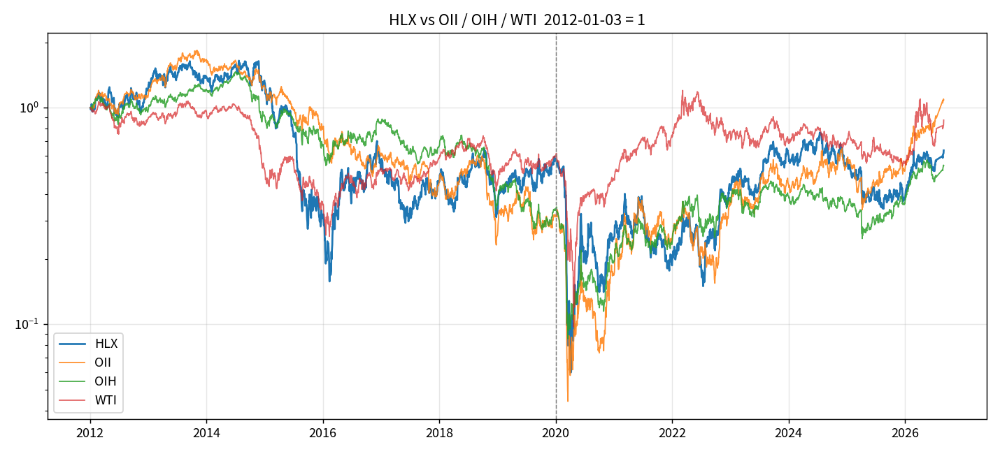
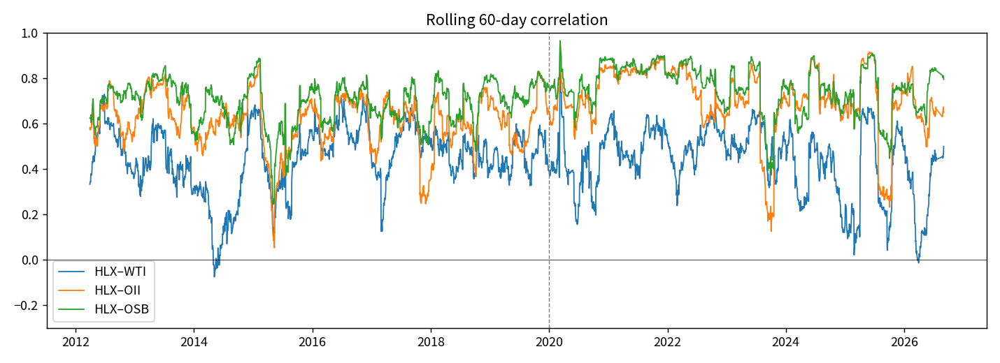
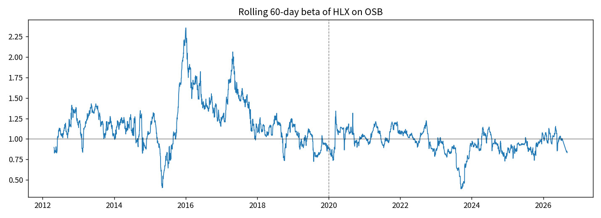
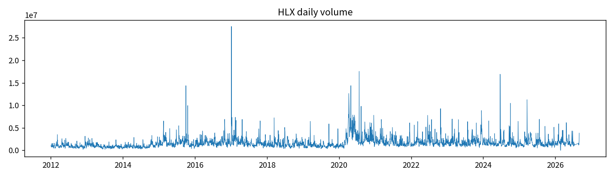
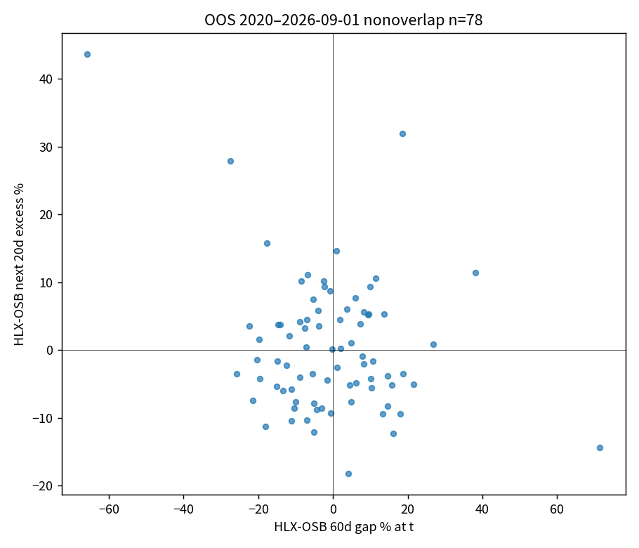
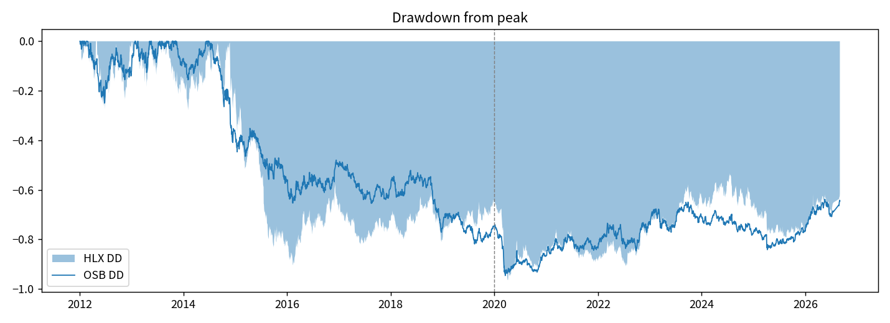

# 097 — HLX Cycle-Lag Screen

| | |
| --- | --- |
| Status | **KILL engine / PARK history book** / E1 / weight 0.0 |
| Universe | **HLX only**, 2012-01-01 → **2026-09-01** last print |
| Out of scope | HOS from 2026-09-02. New name, new float. Do not study it here. Do not splice. |
| Source | [Liam-Son/helix-factor-screen](https://github.com/Liam-Son/helix-factor-screen) |
| Trading | **LOCKED**. 21-trade path is in-sample after 2022. |

Question:

> On the HLX tape only: when oil and oil-service peers are already in a cycle, and HLX still lags the peer basket, does a two-day confirmed three-gate rule beat buy-and-hold?


## Figures

Levels, correlation, beta, volume, excess, year bars, OOS gap scatter, drawdown.














Target is the **equity**, not WTI. Same-day energy-chain ICs in `screen/factor_screen.csv` are descriptive. They are not an oil-trading signal.

## Workflow

```
prices → HLX panel through 2026-09-01 → G1 G2 G3
                 → 2-day confirm → next session
                 → stop. No HOS rows.
```

| Gate | Meaning | Frozen rule |
| --- | --- | --- |
| G1 oil | WTI off 12m low ≥ +20%, **or** off 12m high ≥ −25% crash bounce, **or** UPB 60d log-sum > 0. Need 2 of 3. | `WTI_RALLY=0.20`, `WTI_CRASH=-0.25` |
| G2 services | OSB 60d log-sum > 0 **or** OIH > 120d low × 1.02 | peers on |
| G3 lag | HLX 60d log-sum − OSB 60d ≤ **−10pp**, two days | HLX tape only |

Exit when any gate drops. VIX above 12m 80th percentile → 0.5x. Code: [`engine/buy_engine.py`](engine/buy_engine.py).

OSB = equal-weight SLB HAL NOV RIG OII. UPB = XOM CVX COP EOG OXY. HLX not in OSB.

## What the source repo already showed

Imported snapshot 2026-09-09. Full notes: [`RESULTS.md`](RESULTS.md), trades: [`signals/SIGNALS.md`](signals/SIGNALS.md).

Cycle-lag engine on **HLX 2012-01-01 → 2026-09-01** (21 tight trades):

| | End NAV (start=1) |
| --- | ---: |
| Strategy | 2.06× |
| Buy & hold HLX | 0.69× |
| OSB peers | 0.71× |

Hit 71%, avg +3.9%. **Path lives in 2021–22.** Not an untouched OOS claim.

Oil-up / stock-down as a **buy** rule (the trader sentence):

| Rule | n | HLX +60d hit | avg +60d |
| --- | ---: | ---: | ---: |
| Loose 60d WTI ≥ +10% and gap ≤ −15pp | 24 | 58% | −0.8% |
| Tight 60d WTI ≥ +20% and gap ≤ −20pp | 8 | **25%** | **−19.5%** |

Tight “buy the lag after an oil spike” is the **opposite** of a buy rule.

Factor screen (same-day IC vs HLX vs forward 20d) lives in [`screen/factor_screen.csv`](screen/factor_screen.csv). Same-day WTI/Brent ICs are large because they are the energy complex. Forward-20d ICs are small or negative. Do not promote a same-day IC to a forecast.

## Scope cut 2026-09-10

HOS is dropped from this factor. Combined-company tape is a different security. Next work stays inside HLX dates: year-split of the 21 trades, pre-2021 vs 2021–22 vs 2025–26, and whether G2 (peers) is doing all the work.

## Deep footprint 2026-09-10

Full panel, five figures, extra batteries: [`../../indexes/097-helix-hos-cycle-lag/20260910T097DEEPZ/`](../../indexes/097-helix-hos-cycle-lag/20260910T097DEEPZ/). Still not alpha. Strongest leftover: OOS gap60 vs OSB → +20d excess r=−0.286 n=78, not a trade rule.

## Walk-forward 2026-09-10

See [`WALKFORWARD.md`](WALKFORWARD.md). Frozen gates + 10bp. 2020–2026-09-01 engine 0.45× vs B&H 1.10× vs OSB 1.40×. Drop-pack TP/SL/pyramid still loses OOS. G3 adds nothing. 4.19× book is in-sample after 2022.

## Verdict

```
UNIVERSE: HLX through 2026-09-01
HOS: OUT
SPLICE: FORBIDDEN
OOS 2020–2026-09-01: FAIL vs B&H and OSB
G3 INCREMENT: FAIL
DROP-PACK 4.19x: IS after 2022, not alpha
ALPHA CANDIDATE: NO
LIVE ENGINE: KILL
HISTORY BOOK: PARK
```

Do not retune −10pp / 20% / TP / pyramid on this tape.

Run:

```
python3 research/factors/097-helix-hos-cycle-lag/engine/buy_engine.py
```

Needs WTI, HLX, SLB, HAL, NOV, RIG, OII, XOM, CVX, COP, EOG, OXY, OIH, VIX. Drop rows after 2026-09-01.
