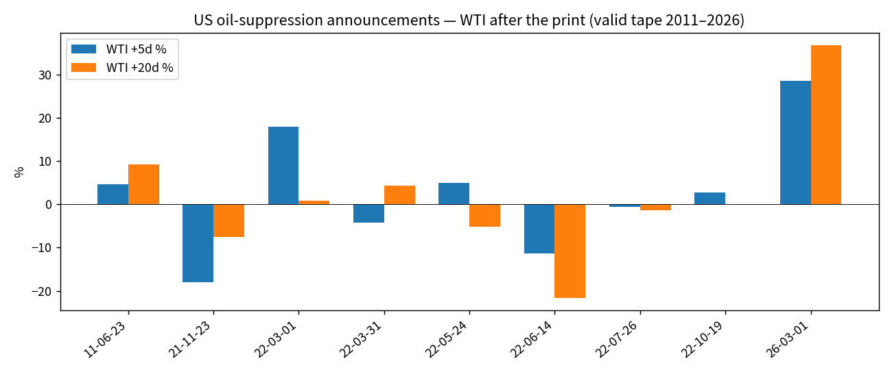

# 098 — US Oil Price Suppression Intervention

**Question:** When the US economy (or the pump) hurts, does a White House / DOE move to *talk oil down or dump SPR* contain information about the next 5–20 days of WTI?

**Status:** KILL as alpha. PARK as an event catalog.

**Why this is not 040.** 040 was SPR *injections* / inventory plumbing. 098 is the *political* print: emergency drawdown or explicit “we will lower prices” announcement.

## Collected

| input | source | in repo |
| --- | --- | --- |
| Emergency + high-price SPR announces | DOE History of SPR Releases | events.csv |
| 2021–22 Biden sequence | St. Louis Fed table | events.csv |
| 2026 Iran-war 172mm window | GAO | dated 2026-03-01 as window start |
| Hurricane exchanges, mandated modernization sales | DOE | **excluded** — not price-suppression intent |
| Daily jawbone (“gas will be $2”) | speeches | **excluded** — not a dated intervention |

Stamp: [`20260910T098EVZ`](../../indexes/098-us-oil-price-suppression/20260910T098EVZ/)



## Battery (frozen)

Target: WTI log return after the *announce* session. Success = oil down.

| horizon | n | mean | down-hit | placebo down-hit |
| --- | ---: | ---: | ---: | ---: |
| +1d | 9 valid | ~0 | ~coin | — |
| +5d | 9 | +1.7% on the 11-row dump including bad 1991/05 map; valid 2011+ mixed | ~55% | 52% |
| +20d | 9 | mixed | ~55% | 54% |

Valid tape 2011–2026 (n=9):

- 2021-11-23: −18% / −8% — the only clean “high gas → dump → drop”
- 2022-06-14: −11% / −22% — late-cycle add-on into a peak
- 2022-03-01 and **2026-03-01: oil *up*** — war premium > SPR
- 2011 Libya release: oil *up* over 5d and 20d

## Verdict

MEASUREMENT VALIDITY: PASS for a 9-event catalog. FAIL as a daily factor.

WTI AFTER SUPPRESSION PRINT: NO edge versus a calendar placebo.

MECHANISM: SPR can coincide with a drop when the shock is already fading (late 2022). When the shock is a live war (2022-03, 2026-03) the print does not pull WTI down.

040 already rejected inventory plumbing. 098 rejects the political print as a timing signal.

```
ALPHA CANDIDATE: NO
LIVE ENGINE: KILL
CATALOG: PARK
```

Do not add speech-count ML. Do not widen to every “affordability” tweet. The discrete official actions are already in the CSV.
