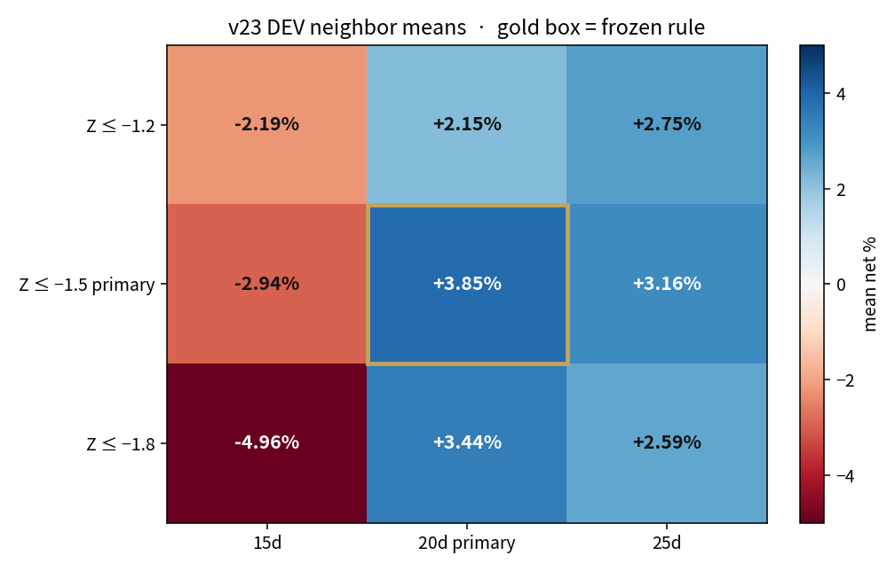
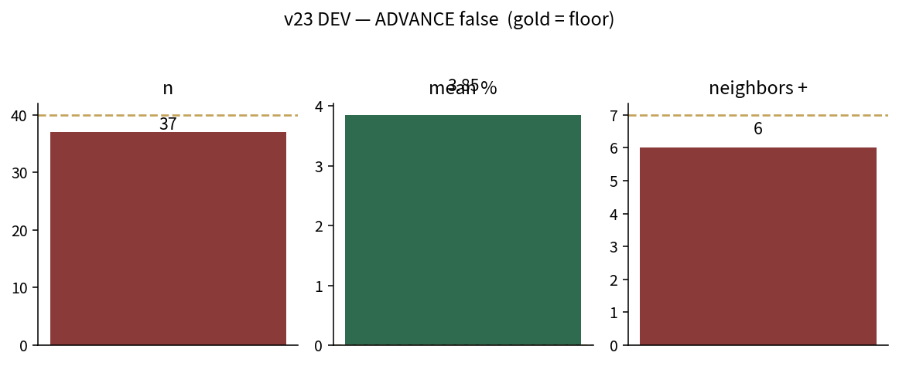
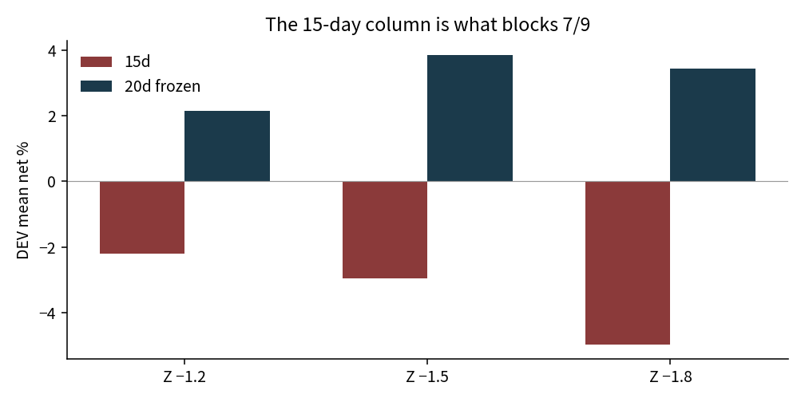

# 102 / v23 — capped-episode 2TURN (DEV only)

HOLD sealed. This engine has no proof mode.

**ADVANCE: false.**  
n=37 · mean +3.85% · neighbors 6/9 · bootstrap lo −1.24%.

The gold box is the frozen rule (Z ≤ −1.50, 20 sessions). Red cells are why the book does not advance. Do not delete the 15-day column to manufacture 7/9.







## How to read the grid

Nine neighbor means, same two-turn + 10-session cap, DEV only, exit purge at 2021-12-31, 40 bp, HLX−OSB.

- Frozen cell is **+3.85%**. That is the only number that would go to HOLD, if ADVANCE passed. It did not.
- Every **15-day** cell is negative. The written neighbor floor counts those cells. They are the 3 misses.
- 20- and 25-day cells are positive at all three thresholds. That is horizon sensitivity, not a license to drop 15 days.

## What v23 changed

After Z ≤ −1.50, two consecutive HIR improvements must arrive within **10 sessions**. Otherwise abandon the episode.

v22 had n=38 and mean +2.65%. The cap raised the mean and did not raise n or the neighbor count.

## Selftest

PASS on synthetic data. Cannot emit ALPHA_PROVEN.

## Files

- `helix_v23.py` / `HELIX_v23_DEV_ONLY.py`
- `DEV_report.json` `DEV_neighbors.csv` `DEV_trades.csv`

```
NOT_PROVEN — DEV move documented, HOLD still sealed
```

Next allowed move, later sitting: open-to-open fills on this same rule. Not another cap. Not HOLD.
