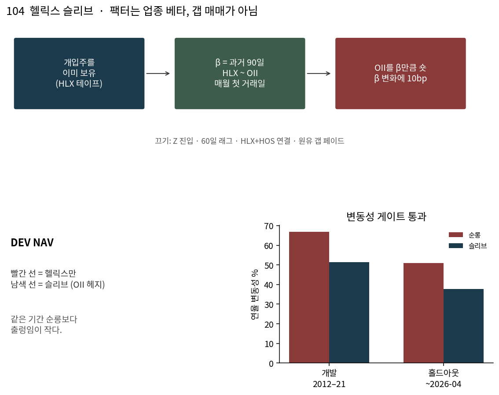

# 104 — 헬릭스 슬리브 헤지

알파 책이 아니다. 개입주를 **이미** 들고 있을 때 석유서비스 베타를 OII로 빼는 운영 규칙이다.

영문 원문과 그림: [README.md](README.md) · [strategy.png](figures/strategy.png)

## 규칙

- 헬릭스(역사 테이프, 2026-09-01까지)를 보유한 날에만 켠다.
- 헤지 = −β × OII. β는 **직전** 90거래일 회귀. 매월 첫 거래일에만 갱신.
- β가 변한 만큼에 10bp.
- HOS와 잇지 않는다.
- Z 진입, 60일 래그, 원유 갭 페이드는 끈다.

통과 조건은 하나다. 슬리브 연율 변동성 < 헬릭스 순롱 변동성.  
샤프로 전진시키지 않는다.

## 숫자

| 구간 | 순롱 변동성 | 슬리브 | 감소 |
| --- | ---: | ---: | ---: |
| 개발 2012–2021 | 66.8% | 51.3% | 23% |
| 홀드아웃 ~2026-04-21 | 50.9% | 37.8% | 26% |

홀드아웃 연수익이 줄어든 것은 2022–24 서비스 랠리를 헤지가 팔아서다. 그게 헤지다.

## 판결

리스크 슬리브로 **유지**. 알파 후보 아님.
