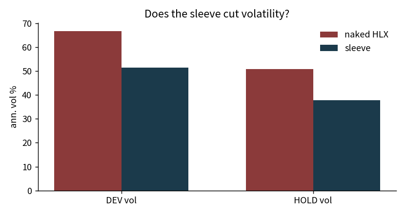
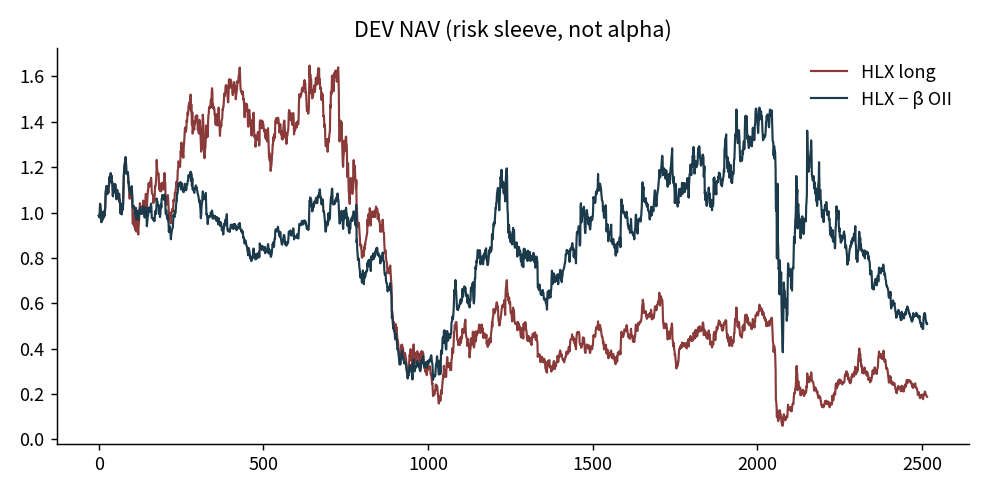
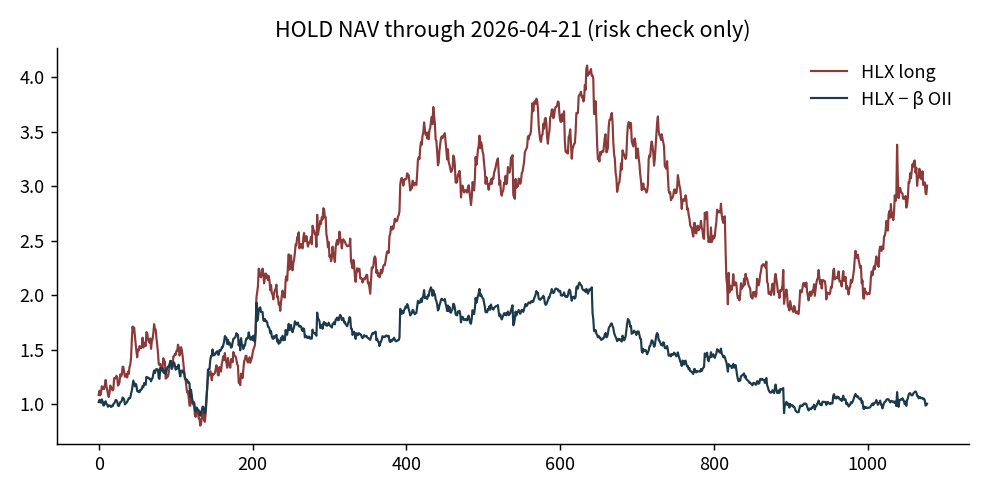

# 104 — Helix sleeve hedge

## What shipped

A usable risk sleeve. Not a signal.

DEV vol 66.8% → 51.3%. HOLD vol 50.9% → 37.8%. Return engines 097/102/103 remain NOT_PROVEN.


Not an alpha book. Operating rule: if you already hold a well-intervention name, hedge oil-service beta with OII.

> Helix confirms oil-service comovement. Residual pairs and the cycle-lag engine did not clear frozen return gates. This card uses comovement as a **hedge**, not as a gap-fill entry.

## Rule (frozen)

- Long 1 unit HLX whenever the name is in the book.
- Hedge \(-\beta\) OII. \(\beta\) from prior 90 sessions OLS, updated first session of each month. No same-day \(\beta\).
- 10 bp on the change in hedge notional.
- HLX tape ends 2026-09-01. No HOS splice.
- Z-score, 60-day lag, two-turn HIR: **off**.

Primary gate: sleeve annualized volatility < naked HLX volatility.  
Return Sharpe is reported and **does not** ADVANCE anything.

## Result

| book | naked vol | sleeve vol | vol cut | naked maxDD | sleeve maxDD |
| --- | ---: | ---: | ---: | ---: | ---: |
| DEV 2012–2021 | 66.8% | **51.3%** | −23% | −2.03 | **−1.36** |
| HOLD to 2026-04-21 | 50.9% | **37.8%** | −26% | −0.72 | −0.76 |

HOLD mean return falls (38.6% → 7.2% ann.) because the hedge sold the 2022–24 service rally. That is the hedge working, not alpha dying.

Mean DEV \(\beta\) ≈ 0.83.







## Verdict

```
KEEP as risk sleeve
NOT an alpha candidate
```

Kill if a later tape shows sleeve vol ≥ naked vol on the same rule. Do not retune 90d / monthly after seeing HOLD returns.

## Use

This line is a **filter**, not a signal.

- Use: if the well-intervention name is already on, hedge with OII (104). Do not splice HOS. Do not drop HLX into a USO–XLE or OFS-equity-alpha notebook as its own residual (105).
- Do not use: fade a gap with oil, predict WTI, or turn the 2.06× in-sample NAV back on.

A filter does not pay. It stops one more bad book from opening.
