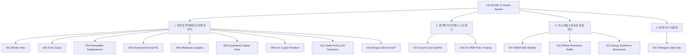

# 🛢️ LS CRUDE 팩터 시스템 (15-Factor Quantitative Architecture)

**최종 목표**: Ultimate Oil Pizza (검증 통과한 다중 신호원 결합 + 통계적 차익거래 오버레이)  
**상태**: 15개 팩터 설계 및 아키텍처 완성 (2026-09-02)  
**위치**: `research/factors/`

---

## 🏛️ 팩터 아키텍처 및 분류 체계 (Taxonomy)

LS CRUDE의 15개 팩터(001~015)는 데이터 특성과 트레이딩 스타일에 따라 **4대 핵심 클러스터**로 구성됩니다.



---

## 📊 마스터 팩터 비교표 (001 ~ 015 Master Matrix)

| # | 팩터 명칭 | 신호 유형 | 주요 데이터 소스 | 갱신 빈도 | 선행성 / 반감기 | 구현 상태 | 가중치 |
|---|---|---|---|---|---|---|---|
| **001** | [Pentagon Uber Eats](001-pentagon-ubereats.md) | ↑ 양의 방향 | 배달 앱 API (접근 불가) | 실시간 | — | ❌ **SKIP** | 0.0 |
| **002** | [Whale Network Index](002-whale-index.md) | ↑ 양의 방향 | CoinEx, Glassnode, CryptoQuant | 실시간 | 5~10일 | 📋 평가 중 | 1.5 |
| **003** | [Truth Social Factor](003-truth-social.md) | ↑ 양의 방향 | CNN Truth Social JSON 아카이브 | 5분 | 0~3일 | ✅ **구현 완료** | 1.0 |
| **004** | [Renewable Displacement](004-renewable-displacement.md) | ↓ 음의 방향 | IEA 발전량, RenewableNow | 월간 | 3~6개월 lag | 📋 평가 중 | -1.5 |
| **005** | [Financial Demand Index](005-financial-demand.md) | ↓ 음의 방향 | SEC EDGAR, yfinance (XGBoost/LSTM) | 분기 | 45일 lag | 🔬 R&D 완료 | -1.0 |
| **006** | [Wholesale-Logistics](006-wholesale-logistics.md) | ↑ 양의 방향 | Cass Freight Index, 물류주 (UPS/FDX) | 월간/일간 | 5~20일 | 🟢 **즉시 추천** | 1.5 |
| **007** | [MENA Elite Mobility](007-doomsday-bunker-index.md) | ↕ 레짐/변동성 | 비식별 투자이민·로펌 자문 집계 | 분기/월간 | 3~12개월 | ⏸️ **HOLD** | 0.0 |
| **008** | [Hyperliquid Capital Flow](008-hyperliquid-capital-flow.md) | ↑ 양의 방향 | Hyperliquid Info API, Arbitrum Bridge | 실시간 | 1~5일 | 📋 R&D 평가 중 | 2.0 |
| **009** | [Iran Crypto Premium](009-iran-middleeast-premium.md) | ↑ 양의 방향 | Nobitex Ticker API (USDTIRT), Bonbast | 실시간 | 1~3일 | 📋 R&D 평가 중 | 1.5 |
| **010** | [Official Petroleum Buffer](010-official-petroleum-buffer.md) | ↕ 변동성 레짐 | IEA 회원국 공개 석유 재고 | 월간 | 1~3개월 | ⏸️ **HOLD** | 0.0 |
| **011** | [Energy Workforce Momentum](011-energy-workforce-momentum.md) | ↕ 중기 공급 | U.S. BLS NAICS 211, StatCan 고용 | 월간/분기 | 1~6개월 | ⏸️ **HOLD** | 0.0 |
| **012** | [Policy Cartel & AI Dynamics](012-cartel-policy-ai-dynamics.md) | ↑ 양의 방향 | EIA 주간 SPR, 위성 재고, AI 해석 지수 | 주간/실시간 | 1~4주 | 📋 R&D 평가 중 | 1.5 |
| **013** | [Gasoil Crack Mean-Reversion](013-oil-pairs-gasoil-crack.md) | ↔ StatArb | ICE Gasoil (GO) vs Brent/WTI 선물 | 일간 | 반감기 15~18일 | 📋 StatArb 검증 | 1.5 |
| **014** | [OU-HMM Pairs Trading](014-ou-hmm-oil-pairs.md) | ↔ 체제전환 | WTI, Brent, Dubai, Shanghai 선물 | 일간 | 레짐 적응형 | 📋 StatArb 검증 | 1.5 |
| **015** | [Mosque Sermon Sentiment](015-mosque-sermon-oil-signal.md) | ↕ 변동성/경보 | 걸프국 공개 금요 설교문(Khutbah) NLP | 주간 | 1~7일 선행 | 📋 연구 프로토타입 | 1.0 |

---

## 🎯 Ultimate Oil Pizza & StatArb 포트폴리오 산출 공식

LS CRUDE의 트레이딩 엔진은 **단방향 매크로 신호(Directional Alpha)**와 **시장 중립적 통계적 차익거래(Market-Neutral StatArb Overlay)**를 결합하여 수익률을 극대화하고 최대 낙폭(MDD)을 통제합니다.

### 1️⃣ 방향성 시그널 (Directional Oil Pizza)
```python
# 1. 펀더멘털 / 대체데이터 방향성 가중합
directional_score = (
    2.0 * oil_slice_index +              # ✅ 뉴스 헤드라인 (호르무즈+CPI)
    1.0 * truth_social_factor +          # ✅ 트럼프 발언 키워드
    1.5 * wholesale_logistics +          # 🟢 Cass 화물 물류 모멘텀
    2.0 * hyperliquid_capital_flow +     # 📋 PerpDEX 중동 자금 이탈
    1.5 * iran_crypto_premium +          # 📋 Nobitex 테더 프리미엄
    1.5 * cartel_policy_ai_dynamics +    # 📋 미국 SPR 하단 방어 & AI 해석 속도
    1.5 * whale_network_index +          # 📋 온체인 고래 넷플로우
    -1.5 * renewable_displacement +      # 📋 재생에너지 전력 대체
    -1.0 * financial_demand_ml           # 🔬 기업 재무 ML 수요
)

# 20일 롤링 표준화 Z-Score
pizza_z = zscore(directional_score, window=20)
```

### 2️⃣ 시장 중립 차익거래 오버레이 (Market-Neutral StatArb)
$$\text{Overlay}_{\text{StatArb}} = w_{\text{GO}} \cdot \text{Signal}_{\text{Gasoil-Crack}} (\text{Factor 013}) + w_{\text{HMM}} \cdot \text{Signal}_{\text{OU-HMM}} (\text{Factor 014})$$
- **기능**: 방향성 유가 급변 시 포트폴리오 MDD를 0.4~1.2% 수준으로 압축하는 위험 완충(Hedge) 역할 수행.

### 3️⃣ 변동성 및 지정학 게이트 (Regime & Volatility Filter)
$$\text{Volatility Gate} = \mathbb{I}\Big(\text{Mosque\_Sermon\_Z} > 2.0 \lor \text{Buffer\_Tightness} > 1.5\Big)$$
- 고위험 지정학 레짐 발동 시: 단방향 레버리지 축소 및 옵션 롱/스프레드 비중 확대.

---

## 📁 팩터별 상세 프로필 및 파일 연계

### 1. 검증 및 즉시 구현 추천 팩터 (Core Actives)
- [003 — Truth Social Factor](003-truth-social.md): 트럼프 SNS 유가 키워드 빈도 및 감성 실시간 지수 (`research/data/TTS scrapper/trump_truth_factor.py`).
- [006 — Wholesale-Logistics Activity Index](006-wholesale-logistics.md): Cass Freight 화물 물동량 및 물류 대형주(UPS, FDX) 모멘텀 기반 실물 경기 선행 신호.

### 2. 온체인 & 대체 데이터 팩터 (Alternative & On-Chain)
- [008 — Hyperliquid PerpDEX Capital Flow](008-hyperliquid-capital-flow.md): 무KYC PerpDEX로 유입되는 중동 오프쇼어 자금 및 지정학적 사전 도피성 이체 포착.
- [009 — Iran & Middle East Crypto Premium](009-iran-middleeast-premium.md): 이란 최대 거래소 Nobitex의 USDT/IRR 환율 프리미엄을 통한 현지 공포/리스크 실시간 반영.
- [012 — Policy-Cartel Synergy & AI Market Dynamics](012-cartel-policy-ai-dynamics.md): 미국 DOE의 SPR 재매입 가격 하단(Floor)과 AI 위성/멀티모달 해석 속도 결합 지표.
- [015 — Gulf Mosque Sermon Sentiment & Volatility](015-mosque-sermon-oil-signal.md): 걸프 산유국 공개 금요 설교문(Khutbah)의 아랍어 NLP 에스컬레이션 4단계 스코어링 지표 (`015-mosque_sermon_oil_signal/`).

### 3. 통계적 차익거래 및 스프레드 모델 (Statistical Arbitrage)
- [013 — Oil Futures Pairs Trading & Gasoil Crack Spreads](013-oil-pairs-gasoil-crack.md): ICE Gasoil과 Brent/WTI 간의 정제 마진 크랙 스프레드 평균 회귀 모델 (SSRN-4601806, `013-factor_oil_pairs_go_crack/`).
- [014 — OU-HMM Regime-Switching Oil Pairs Trading](014-ou-hmm-oil-pairs.md): 은닉 마르코프(HMM) 체제 전환 기반 Ornstein-Uhlenbeck 원유 선물 차익거래 (Zanatta 2025, `014-ou_hmm_oil_pairs/`).

### 4. 장기 거시 및 보류 후보 (HOLD Candidates)
- [007 — MENA Elite Mobility Framework](007-doomsday-bunker-index.md): 초고액 자산가 이민 자문 집계 기반 지정학적 꼬리위험 분석 (다기관 비식별 제휴 시에만 활성화).
- [010 — Official Petroleum Buffer Disclosure](010-official-petroleum-buffer.md): IEA 공식 석유 재고 완충 여력 지표 (월간 발표 시차 보정 필요).
- [011 — Energy Workforce Momentum](011-energy-workforce-momentum.md): 미국 BLS NAICS 211 업스트림 고용 및 작업 허가 기반 중기 공급능력 관측 지표.

### 5. 아이디어 평가 후 제외 (Skipped)
- [001 — Pentagon Uber Eats Index](001-pentagon-ubereats.md): 공개 API 부재 및 개인정보 제한으로 실현 불가능 판단 (방산 ETF 시계열로 대체 권장).

---

## 🚀 통합 구현 로드맵 (Phase-by-Phase Roadmap)

### 🟢 Phase 1 (1~2주) — 핵심 파이프라인 구축 및 가동
- [x] 001-Pentagon: SKIP 확정 및 방산 ETF 대안 설계
- [x] 003-Truth Social: 코드 구현 및 CNN JSON 실시간 수집 연동
- [ ] **006-Wholesale-Logistics**: FRED Cass Freight 및 Yahoo 물류주 수집기 가동
- [ ] **013-Gasoil-Crack**: ICE Gasoil/Brent 일봉 데이터 로더 및 Engle-Granger 회귀 백테스트
- [ ] **014-OU-HMM**: 3-Regime HMM 필터 파라미터 튜닝

### 🟡 Phase 2 (2~4주) — 대안 데이터 & 온체인 신호 검증
- [ ] 008-Hyperliquid: Info API 및 Arbitrum Bridge 실시간 입금 모니터링 노드 구축
- [ ] 009-Iran-Premium: Nobitex 마켓 Ticker 및 암시장 환율 스프레드 실시간 추적
- [ ] 015-Mosque-Sermon: 공개 아카이브 텍스트 정규화 및 에스컬레이션 렉시콘 테스트
- [ ] Granger 인과성(선행성 1~10일) 및 WTI `CL=F` 상관성 검정

### 🔵 Phase 3 (4~8주) — 머신러닝 & 고도화
- [ ] 005-Financial Demand: SEC EDGAR 10-Q/K 파싱 및 XGBoost/LSTM 수요 모델
- [ ] 004-Renewable Displacement: IEA 월간 전력 데이터셋 파이프라인 완성
- [ ] 012-Cartel-AI-Dynamics: EIA 주간 SPR 재고 및 위성 데이터 통합
- [ ] Oil Pulse 관측 데스크 UI (`app/`) 실시간 데이터 소켓 연결

### 🟣 Phase 4 (8~12주) — 전구간 Walk-Forward 검증 & 라이브 페이퍼 트레이딩
- [ ] Factor Lab 전체 통합 테스트 (In-Sample: 2015~2023, Out-Sample: 2024~현재)
- [ ] 거래비용, 롤오버 비용, 슬리피지(1~2틱) 포함 순 샤프지수(Net Sharpe > 1.2) 달성
- [ ] 모의 매매(Paper Trading) 및 위험 한도(Risk Limits) 오케스트레이션

---

## 📁 디렉토리 구조 (Repository Layout)

```
research/factors/
├── README.md                                 # [본 문서] 15-Factor 통합 아키텍처 및 마스터 인덱스
├── 001-pentagon-ubereats.md                  # ❌ 아이디어 (SKIP)
├── 002-whale-index.md                        # 📋 크립토 고래 포지셔닝
├── 003-truth-social.md                       # ✅ 트럼프 Truth Social 실시간 신호
├── 004-renewable-displacement.md             # 📋 재생에너지 전력 대체
├── 005-financial-demand.md                   # 🔬 SEC 재무제표 ML 수요 예측
├── 006-wholesale-logistics.md                # 🟢 Cass 화물 물류 모멘텀 (즉시 구현)
├── 007-doomsday-bunker-index.md              # ⏸️ MENA 엘리트 이동성 (HOLD)
├── 008-hyperliquid-capital-flow.md           # 📋 Hyperliquid PerpDEX 자금 이탈
├── 009-iran-middleeast-premium.md            # 📋 이란 Nobitex 테더 프리미엄
├── 010-official-petroleum-buffer.md          # ⏸️ IEA 비축 완충여력 (HOLD)
├── 011-energy-workforce-momentum.md          # ⏸️ 업스트림 노동 모멘텀 (HOLD)
├── 012-cartel-policy-ai-dynamics.md          # 📋 미국 SPR 하단 & AI 해석 속도
├── 013-oil-pairs-gasoil-crack.md             # 📋 Gasoil 크랙 스프레드 StatArb
├── 013-factor_oil_pairs_go_crack/            # 📦 013 소스코드 및 논문 (SSRN-4601806)
├── 014-ou-hmm-oil-pairs.md                   # 📋 OU-HMM 체제전환 페어 트레이딩
├── 014-ou_hmm_oil_pairs/                     # 📦 014 소스코드 (Python 패키지 & 논문)
├── 015-mosque-sermon-oil-signal.md           # 📋 걸프 금요 설교문 NLP 조기경보
└── 015-mosque_sermon_oil_signal/             # 📦 015 NLP 파이프라인 프로토타입
```

---

## 📜 퀀트 연구 및 데이터 윤리 원칙 (Methodology & Ethics)

1. **룩어헤드 편향(Look-Ahead Bias) 엄격 배제**:
   - 모든 거시 경제 지표(IEA, BLS, SEC 재무제표 등)는 관측 기준일이 아닌 **공식 발표일(Publication Timestamp) 기준**으로만 시계열 정렬.
2. **합법적 공개 데이터(Public Data Only)**:
   - 비공개 고객 비밀, 사적 녹음물, 무허가 웹 스크래핑(LinkedIn 등)은 원천 배제. 공개 API, 정부 통계, 인가된 데이터 피드만 채택.
3. **엄격한 표본 외(Out-of-Sample) 검증**:
   - 모델 설계 및 하이퍼파라미터 튜닝은 인샘플(2015-01-01 ~ 2023-12-31)에서만 수행하며, 2024년 이후 아웃샘플은 단 1회 최종 검증에만 사용.

---

**작성 및 갱신**: 2026-09-02  
**아키텍처 설계**: LS CRUDE Quantitative Research Team
