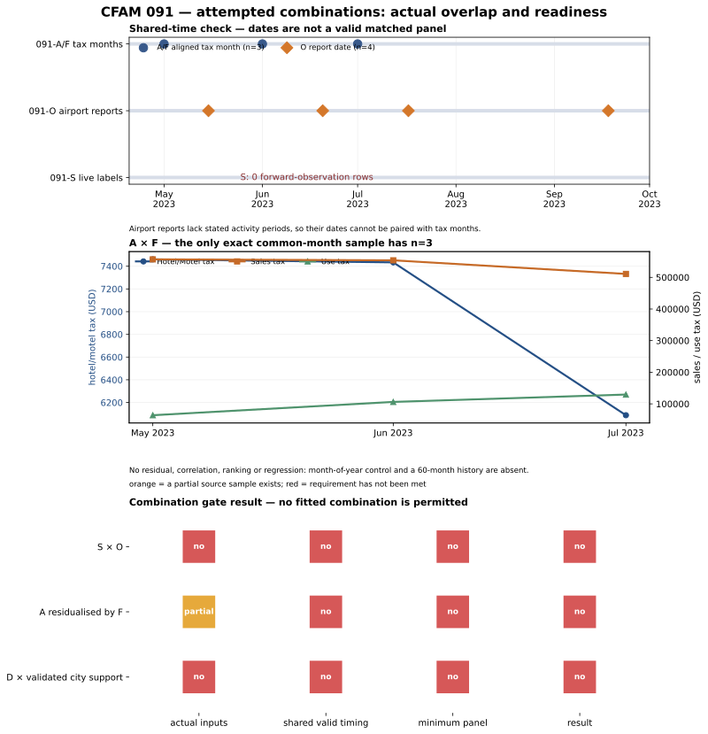

# CFAM 091 — attempted S×O and A×F combination audit

## Result

**No quantitative combination passed.** This is an executed availability and measurement-validity test using every currently dateable source observation; it is not an omitted backtest.

## 091-S × 091-O

| requirement | observed result | decision |
| --- | --- | --- |
| S numeric/live-label history | one-time six-venue feature audit only; fixed forward log has **0 observation rows** | fail |
| O numeric series | 4 report-date rows | partial |
| matching activity period | Airport reports do not state underlying metric period | fail |
| matched panel | 0 valid matched rows | **NOT_RUN** |

No correlation, model, implied alignment chart, or score is calculated.

## 091-A residualised by 091-F

The official September 2023 City Manager Report has exactly three shared tax months. The values are retained in [`091a_f_exact_three_month_overlap.csv`](091a_f_exact_three_month_overlap.csv).

| tax month | hotel/motel tax | sales tax | use tax |
| --- | ---: | ---: | ---: |
| 2023-05 | $7,460.20 | $556,914.55 | $64,104.31 |
| 2023-06 | $7,433.66 | $553,851.71 | $106,137.08 |
| 2023-07 | $6,088.32 | $510,833.95 | $129,448.38 |

This is a real aligned aggregate sample, but `n=3` cannot support a seasonal lodging residual, regression, association claim, or out-of-sample split. The required 60 comparable months with tax month, receipt date and disclosure date are still absent. **Result: NOT_RUN—not negative and not positive.**

## Reproducibility and boundary

- visual renderer: [`render_091_combination_readiness.py`](../../../notebooks/091-cushing-operations-nowcasting/render_091_combination_readiness.py)
- airport values: [091-O source receipt](../../../gathering/raw/ALT-20260908-15/20260908T150000Z/README.md)
- city report: [official September 2023 PDF](https://www.cityofcushing.com/sites/g/files/vyhlif4306/f/agendas/cm_report_september_23_final_.pdf)
- S protocol: [091-S forward-only monitor](../20260908T091QRSZ/091s-live-monitor-protocol.md)

All inputs are public aggregates or visible business-level UI states. No customers, orders, revenue, devices, plates, or individual movements are used.
