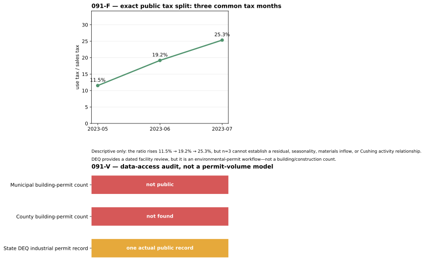

# CFAM 091-F / 091-V — tax-split and permit-access audit

## 091-F — Sales Tax versus Use Tax

The exact public common-month sample is three rows. Use-tax divided by sales-tax
rose from **11.5%** in May 2023 to **19.2%** in June and **25.3%** in July.
Those values are real and retained in [the CSV](091f_three_month_tax_split.csv).

This is **not** a `use-tax residual`: there is no 60-month history, seasonal
model, disclosure-vintage panel, comparable tax-base audit, independent local
validation target, or out-of-sample interval. Use tax can reflect online
purchases and many non-project goods. Therefore the claimed mechanism—incoming
project materials—is **NOT_RUN**, not proven by this three-point rise.

## 091-V — Building / construction permits

| workflow gate | result |
| --- | --- |
| City building-permit authority exists | **yes** — City building code and Cushing economic-development pages confirm City permitting |
| Public, dated municipal permit ledger or monthly count | **not found** |
| Payne County public Cushing permit panel | **not found** |
| Actual industrial public permit sample | **yes, one State DEQ record** — `Cushing South Terminal` is in a public environmental permit review workflow |
| Intended construction/maintenance volume | **no** — a DEQ review is not a building permit, construction start, labour count, or material volume |
| series / visual association / combination | **NOT_RUN** |

The 2026-09-08 recheck confirmed that the State DEQ public-review route now
exposes stable facility, permit type and status fields for multiple named
Cushing industrial facilities. Therefore **091-V is FORWARD_ONLY / E1 as a
human-reviewed industrial-permit event log**, with the first public routes in
the [PARK recheck receipt](../20260908T091PARKZ/README.md). It remains **PARK**
as a building/construction *volume* panel until City or County publishes a
dated aggregate ledger. Missing months are never filled with zeros.

## Sources

- [Cushing building code](https://ecode360.com/48280883)
- [Cushing permitting description](https://www.cityofcushing.com/cushing-economic-development-foundation/pages/incentives)
- [Oklahoma DEQ public-review search](https://applications.deq.ok.gov/PermitsPublicReview/)
- [City Manager Report, September 2023](https://www.cityofcushing.com/sites/g/files/vyhlif4306/f/agendas/cm_report_september_23_final_.pdf)

All values are public aggregates or public facility-level regulatory records;
no applicants, owners, customers, workers, or individual location data are collected.
