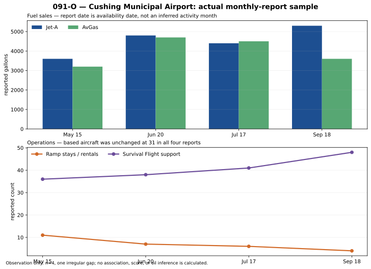
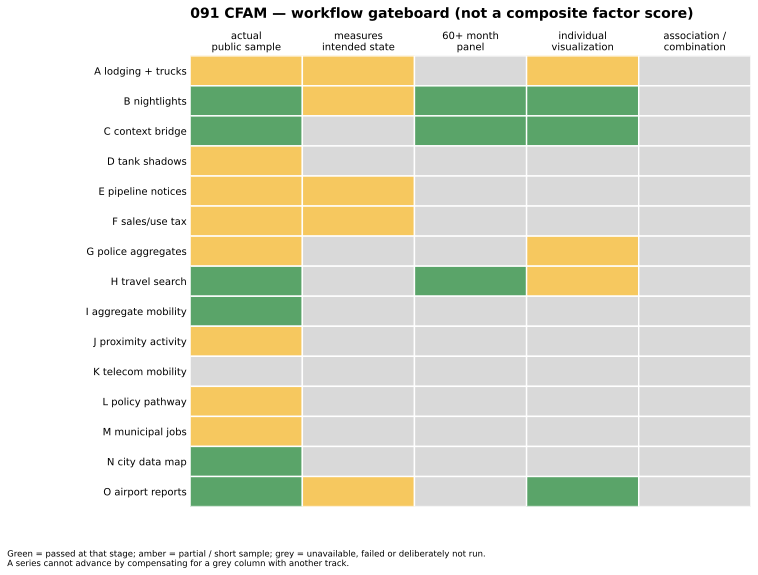

# 091-O — Airport Activity Sample Visualization

The four City Manager Reports recorded a repeated **Cushing Regional Airport Monthly Report** section with Jet-A/AvGas fuel sales, transient ramp stays/hangar rentals, Survival Flight support and based aircraft. The source PDFs, exact URLs, sizes and SHA-256 values are in [`ALT-20260908-15`](../../gathering/raw/ALT-20260908-15/20260908T150000Z/README.md).

| workflow stage | result |
| --- | --- |
| allowed actual sample | **PASS.** Four public reports contain numeric fields. |
| intended observation | **PARTIAL PASS.** It observes one airport's aggregate aviation activity, not terminal throughput, pipelines, citywide work or total traffic. |
| individual visualization | **PASS.** The figure preserves report dates and metrics separately. |
| long comparable series | **FAIL / PARK.** `n=4`, one report-date gap, and no verified metric-period field. |
| association / predictive test | **NOT RUN.** Correlation, regression, Monte Carlo or ML on four irregular observations is non-evidence. |
| combination | **NOT RUN.** No mixing with hotel tax, nightlights or EIA until long-series and measurement-validity gates pass. |

## Reproducibility

- renderer: [`render_091o_airport_sample.py`](../../../notebooks/091-cushing-operations-nowcasting/render_091o_airport_sample.py)
- plotted data: [`091o_airport_sample.csv`](091o_airport_sample.csv)
- source report dates: 2023-05-15, 2023-06-20, 2023-07-17 and 2023-09-18

The renderer uses no WTI, EIA inventory, price, volatility or synthetic activity target.

The [gateboard renderer](../../../notebooks/091-cushing-operations-nowcasting/render_091_workflow_gateboard.py) makes the current position of every 091 subtrack visible. It is not a score, ranking, or claim that partial columns can be averaged into “Cushing busy.”
