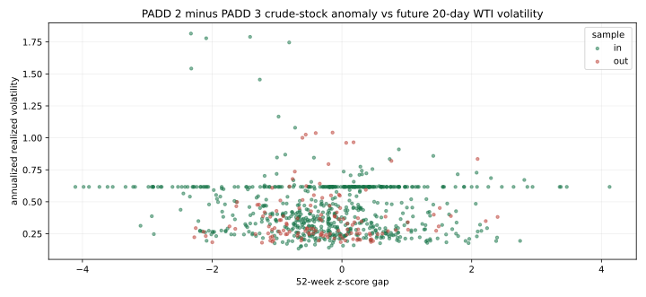

# 091 — PADD balance and calendar-spread collection audit

## Result

| Proposed input | Free collection | Test result | Decision |
| --- | --- | --- | --- |
| WTI prompt-vs-6th calendar spread | **Not collected** | Not run | **PARK** — the tested Nasdaq CL1/CL6 public endpoints returned access-block pages; FRED has spot WTI, not a matched historical futures curve. |
| PADD 2/3 stocks and utilization | **Collected** | IS/OOS volatility relation changes sign | **CONTEXT ONLY** — official balance data, but no stable CFAM/WTI-volatility factor. |

## What was collected and tested

Official EIA weekly histories were retrieved for PADD 2 and PADD 3 commercial crude stocks, refinery utilization, and Cushing crude stocks. Each weekly datum was made usable **five calendar days after** its Friday report week. The supplied `clf-daily-2015-2026.csv` then produced the next-20-trading-day realized WTI volatility target.

| Signal → next 20d WTI realized volatility | IS 2015–2023 | OOS 2024–2026 | Verdict |
| --- | ---: | ---: | --- |
| PADD 2 minus PADD 3 52-week crude-stock anomaly | `r=-0.107`, n=653 | `r=+0.075`, n=136 | sign reversal |
| PADD 2 minus PADD 3 utilization gap | `r=+0.032`, n=704 | `r=-0.214`, n=136 | sign reversal |

Neither component is an observed pipeline flow. The direct physical check against next-four-week Cushing inventory change is also unstable: stock-gap IS/OOS `-0.061/-0.066`; utilization-gap `-0.102/+0.393`.

Outputs: [future-volatility test](padd_balance_to_future_wti_volatility.csv), [physical check](padd_balance_to_cushing_4w.csv), [aligned weekly panel](padd_balance_weekly_panel.csv), and [reproduction code](../../../notebooks/091-cushing-operations-nowcasting/run_091_padd_balance.py).

## Calendar-spread availability verdict

The claim that a long prompt-versus-6th WTI curve is “100% free” was not reproducible in this run. Nasdaq Data Link `CHRIS/CME_CL1` and `CL6` returned access-control HTML instead of CSV. Yahoo Finance’s continuous `CL=F` does not by itself provide historical paired CL1/CL6 contract observations, and FRED’s `DCOILWTICO` is a spot series. The blocked responses are preserved—not silently omitted—in the raw receipt.

**Restart condition:** a source that provides dated historical front and sixth-contract settlements under terms permitting repeated retrieval. Do not build a spread from spot WTI or a changing pair of current expired Yahoo tickers.

Raw sources, response hashes and failed calendar responses: [`ALT-20260908-29`](../../../../gathering/raw/ALT-20260908-29/20260908T220000Z/README.md).
