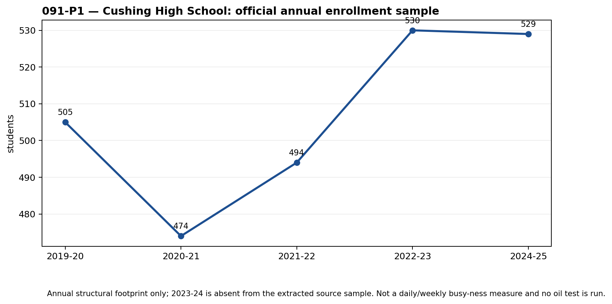
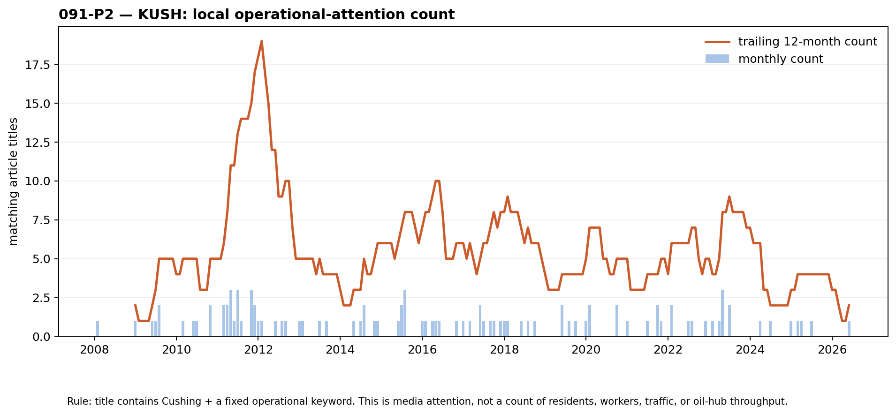

# 091-P — Community footprint & local operational-attention sample

**Purpose:** evaluate the user-proposed community sources under CFAM’s fixed workflow. This is a pair of individual observations, **not** a CFAM score and **not** an oil-price/backtest result.

## 1. Data accessible?

| proposed source | public, repeatable series? | sample retrieved | result |
| --- | --- | --- | --- |
| Cushing High School enrollment | Yes — Oklahoma SDE annual public workbook | Five school-level annual totals, 2019-20 to 2024-25 with 2023-24 absent | **PASS as annual structural context** |
| KUSH Radio 1600 AM local news | Yes — public WordPress metadata endpoint | 5,200 public post metadata rows, counted to 221 monthly aggregates; source snapshot contains discontinuous publication dates | **PASS as a reproducible attention proxy, not activity** |
| hotel business profit / guest count | No | none | **PARK** — City hotel tax remains the aggregate substitute |
| skydiving customer count / profit | No | none | **PARK** — airport monthly report is the physical public substitute |
| Walmart, dental or restaurant customers | No | none | **PARK** — private business metrics / Maps popularity are not a reproducible historical aggregate |
| hospital patient count | no stable facility-level aggregate found | none | **PARK** — never use patient-level data |
| church membership / attendance | aggregate-only would be permissible if a church self-publishes it; no stable historical series was verified | none | **PARK** — never use member directories or person-level data |
| KOSU statewide content | public but not Cushing-specific | not collected as an input | **EXCLUDE** — local attribution too weak |

## 2. Individual observations

### P1 — school enrollment

The five available annual totals are `505`, `474`, `494`, `530`, and `529` students. They can describe a slow-moving community footprint. They cannot answer “is Cushing busy this week?” and are not tested against WTI, EIA inventories, or other CFAM tracks. The original workbook filenames and hashes are in the [source receipt](../../gathering/raw/ALT-20260908-16/20260908T160000Z/README.md).

### P2 — KUSH local operational-attention count

This counts only public post titles that contain `Cushing` and one fixed operational word (for example, `pipeline`, `truck`, `fuel`, `power outage`, or `construction`). The snapshot produces **101 matches across 221 calendar months**; the highest monthly count is 3. It is a limited *editorial-attention* series. A rise can reflect reporting practice, an outage, local politics, or a headline cycle; it does **not** count workers, vehicles, guests, fuel sales, refinery activity, or city footfall.

The public metadata endpoint and raw-response hashes are recorded in the [source receipt](../../gathering/raw/ALT-20260908-17/20260908T170000Z/README.md). The tracked CSV contains aggregate month/count values only; raw titles stay outside Git.

## 3. Intended-observation gate

| observation | does it measure current Cushing busy-ness? | association test now? | combination now? |
| --- | --- | --- | --- |
| school enrollment | No — annual residential/education structure | No | No |
| KUSH attention count | No — local operational media attention only | No independent local ground-truth label | No |
| hotel tax / airport activity / fixed truck counter | potentially partial direct aggregates | historical panel incomplete | only after each passes independently |

No correlation is reported because neither new series has a valid, independently measured CFAM “busy” target. Correlating them directly with WTI or EIA would answer a different question and violate the workflow.

## Reproduce

Run `research/notebooks/091-cushing-operations-nowcasting/run_091p_community_sources.py` with an existing raw directory, or `--fetch-kush` to refresh the public metadata snapshot. The code always publishes only monthly counts and the five annual school totals.
