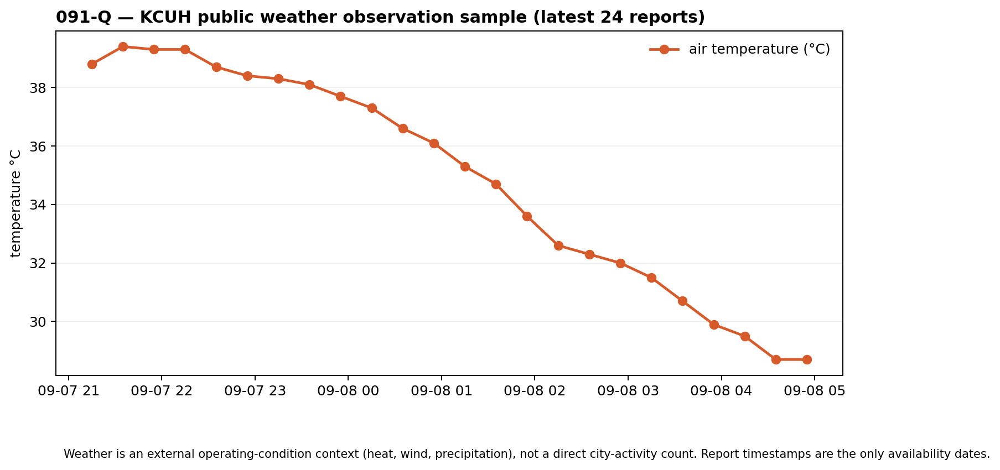
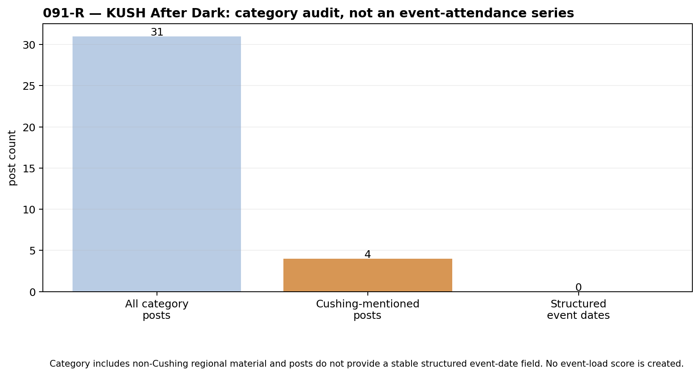
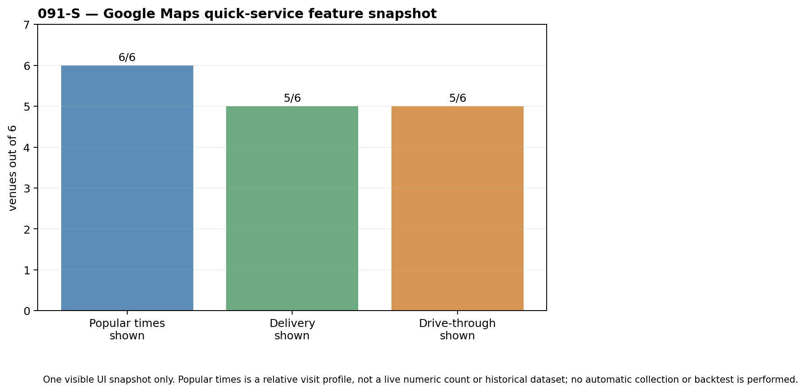

# 091-Q/R/S — Weather, events, and quick-service workflow audit

This run executes the user’s recent CFAM ideas through the required gates: accessible public data → actual sample → intended observation → individual visualisation → no combination without a shared valid ground truth.

## 091-Q — Weather operating context

The official NOAA station `KCUH` returned 24 current observation reports with timestamps, temperature, wind and other weather fields. This passes data access and accurately observes **local weather conditions**. It does not measure city busyness; it is a confounder/context for airport, road, restaurant, or field-work activity. The [KUSH weather page](https://www.1600kush.com/weather/) is useful as a live human-facing view, but NOAA is the reproducible raw source.

**Decision: PARK / E1.** Build a long, as-of weather panel only when an independently measured Cushing activity series exists; then pre-register weather controls before testing it.

## 091-R — KUSH After Dark event load

The public KUSH category contains 31 posts in its returned sample, but only 4 mention Cushing. Its entries include events across Oklahoma and do not provide a stable structured event-date field. A post is not attendance, ticket sales, local footfall, restaurant demand, or an event held in Cushing.

**Decision: PARK / E1.** `KUSH After Dark` cannot produce an event-load factor from its current public structure. It can remain a manual lead source: a future Cushing-only calendar must provide dated venue/event fields before a `next-7-days event count` can be constructed.

## 091-S — Quick-service pulse / delivery availability

One visible Google Maps snapshot was inspected for Wendy’s, Taco Bell, Sonic Drive-In, Golden Chick, Pizza Hut, and Boomarang Diner. All six displayed a Popular-times feature. Five displayed delivery and drive-through; Pizza Hut did not show those two feature labels in this visit.

This **does not** retrieve a numerical historical Google Maps traffic series. Popular times is an aggregate relative visit profile; its live display and layout may be absent or change. Delivery availability is a business/platform feature and not an order count. No automated Maps collection, transaction data collection, revenue inference, or historical backtest is performed.

**Decision: FORWARD_ONLY / E1.** This is CFAM’s strongest currently accessible live *city-footfall* candidate. The frozen venue basket, fixed-time fields, privacy boundary, and pre-registered 90-day measurement-validity gate are in the [091-S live-monitor protocol](091s-live-monitor-protocol.md). It must first validate against a real aggregate local activity ground truth.

## 091-T — Fine dining and delivery sales hypothesis

Fine-dining revenue, restaurant profit, orders, bonuses, driver counts, customer totals, and delivery-platform volume remain private business data. Google Maps popularity, reviews, ordering links, and opening hours cannot be relabelled as sales. There is no accessible public sample, so the workflow stops at **data-access fail / PARK**.

## Source & reproducibility boundary

The raw receipt records public URLs, sizes, hashes and the collection boundary: [ALT-20260908-19 receipt](../../gathering/raw/ALT-20260908-19/20260908T180000Z/README.md). The raw JSON is ignored by Git because it can include public article text. Tracked CSVs contain only observation timestamps/values, booleans, and aggregate audit fields.
