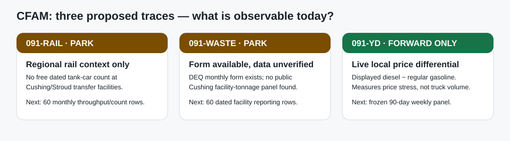

# 091 — Rail, waste and diesel–gasoline triage

**Date:** 2026-09-08  
**Question:** can any of these three public traces measure *current Cushing field activity* rather than merely tell a good story?



## Result

| Track | What was actually verified | Status | Quantitative test |
| --- | --- | --- | --- |
| **091-RAIL — rail tank-car flow** | Public evidence points to the **Stroud rail-to-pipeline terminal**, with oil then piped to Cushing—not to a public Cushing tank-car count. BNSF/UP do not provide a free, dated Cushing/Stroud tank-car throughput history. | **PARK / E1** | **NOT RUN** — no target series exists. |
| **091-WASTE — industrial waste intake** | Oklahoma DEQ publishes monthly-reporting forms and requirements, but not a verified public, facility-level Cushing monthly-tonnage panel. | **PARK / E1** | **NOT RUN** — no Cushing facility series exists. |
| **091-YD — local retail diesel–gasoline dislocation** | Cushing pump boards are observable now; prior 091-Y evidence has five irregular archived points only. | **FORWARD_ONLY / E1** | **NOT RUN** — five irregular historical points cannot establish lead/lag. |

The raw-source receipt, byte counts and hashes are in
[`ALT-20260908-28`](../../../../gathering/raw/ALT-20260908-28/20260908T210000Z/README.md).

## 091-RAIL — do not confuse rail access with a Cushing rail-flow measurement

The proposed mechanism is economically plausible: rail can arbitrate a pipeline constraint and a loaded unit train is a material flow. The public evidence, however, does **not** support calling railcars around Cushing a directly observable CFAM input. Oklahoma’s rail plan describes crude being moved from **Stroud** to Cushing by pipeline, while USD’s Stroud terminal describes rail service and pipeline connectivity to Cushing. That makes this a possible **regional rail-to-pipeline context** route, not a Cushing siding/tank-car activity measure.

Free Sentinel-2 imagery also has 10 m pixels: it is not an honest way to repeatedly count individual tank cars or distinguish loaded from empty cars. No count is inferred from train schedules, generic rail maps, or a single satellite image.

**Frozen restart gate:** identify one fixed Stroud/Cushing transfer facility *and* obtain a dated, aggregated public train/car count or throughput record spanning at least 60 monthly observations. Test the rail measure first against an independently dated physical outcome; only then consider it as a regional context input. Until then, do not add it to CFAM.

Sources: [ODOT 2012 Rail Plan](https://www.okladot.state.ok.us/rail/rail-plan/pdfs/2012_RailPlan.pdf), [USD Stroud terminal](https://usdg.com/terminal/stroud/).

## 091-WASTE — the monthly form is not the monthly Cushing data

DEQ’s solid-waste reporting page makes a useful distinction: a Non-Hazardous Industrial Waste Monthly Report form exists, but a form is not a public time series. This audit did not find a Cushing-area industrial-waste facility identifier with downloadable month, inbound tons, reporting date and historical rows. Restaurant payment approvals/order counts are not a free, public aggregate dataset either, so they are deliberately not substituted.

**Frozen restart gate:** obtain a source-authorized, facility-specific Cushing-area monthly record with at least 60 rows, facility identity, reporting month, inbound industrial tons (or equivalent fee basis), and publication date. First chart it alone against known permit/maintenance events. It cannot be treated as total terminal activity, because disposal can rise for cleanup, construction or one-off remediation.

Sources: [DEQ solid-waste reporting forms](https://oklahoma.gov/deq/divisions/land-protection/waste-management/solid-waste/solid-waste-reporting-forms.html), [monthly industrial-waste form sample](https://www.deq.ok.gov/wp-content/uploads/land-division/515-031MonthlyReportApril2017.pdf).

## 091-YD — Cushing Diesel–Gasoline Retail Dislocation Board

For one fixed Cushing pump board, record:

```text
diesel–gasoline dislocation = displayed diesel $/gal − displayed regular gasoline $/gal
```

This is a **local retail product-price differential**, not diesel gallons sold, truck queue length, terminal throughput, or a WTI lead signal. It includes wholesale product balance, taxes, seasonality, local retail competition and pricing policy. A wide spread can be useful as a local product-stress display, but it cannot on its own prove that trucks are consuming more diesel.

The present board should keep the same fixed Maverik location and collection time each week for 90 days. A later robustness extension may use the median across pre-registered Cushing stations, never an opportunistic daily station choice. The historic five-point Maverik archive is retained only as a visibility sample; it is not used for a correlation or predictive result.

**Forward test:** after 12 weekly readings, check timestamp consistency and missingness. After 52, pre-register a comparison against (a) a regional diesel–gasoline benchmark and (b) independently dated ODOT truck counts, if those become available. Test *activity validity* before any WTI claim.

Sources: [Maverik Cushing pump board](https://locations.maverik.com/ok/cushing/2001-e-main-st#fuel), [Way Cushing price board](https://www.way.com/gas/prices/oklahoma/cushing), [EIA Oklahoma price portal](https://www.eia.gov/dnav/pet/pet_sum_mkt_dcu_sok_m.htm).

## What this changes

These ideas are preserved because their causal stories are worth revisiting, but none earns a CFAM composite score today. The only immediately repeatable observation is 091-YD’s displayed retail price differential—and it is correctly labelled a **price board**, not a measured count of local activity.
