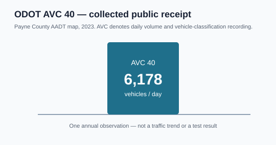
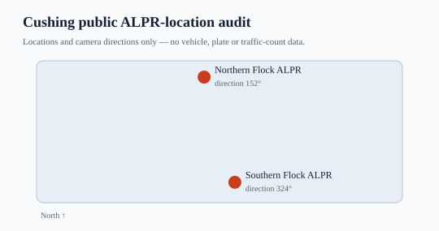

# 091 — Recent public-source audit

## Decision

The supplied links create one stronger CFAM route and preserve four useful
context paths. They do not yet create a new validated composite.

| source | collected data | visualised | test result | decision |
| --- | --- | --- | --- | --- |
| **ODOT AVC 40** | Official 2023 Cushing-area AADT `6,178` | [single-point receipt](figures/091-source-odot-avc40-receipt.svg) | Not run: one annual value is not a time series | **PARK / priority** — seek dated daily classification history |
| **OSM Flock nodes** | Two fixed Cushing traffic-zone ALPR positions and directions | [location audit](figures/091-source-osm-alpr-location-audit.svg) | Not run: no aggregate traffic count | **EXCLUDE as input**; retain only for road-observation context |
| **FAA WeatherCams CUH** | public application shell and access outcome | not applicable | Not run: no public, timestamped aggregate activity series obtained | **PARK** — weather/airport context only |
| **OilPriceAPI** | current Cushing storage display | existing live link | Not a separate test: source is EIA | **DISPLAY ONLY** — no double counting |
| **MacroMicro** | EIA inventory-chart route and access outcome | existing live link | Not a separate test: source is EIA | **DISPLAY ONLY** — trend and five-year-average lens |

## Visual evidence

## Why no price or inventory correlation was run

ODOT supplies a valid fixed-site candidate, but this collection has one
annualized value rather than a dated history. OSM and DeFlock supply camera
locations, not traffic volume. FAA access did not produce a repeatable airport
activity series. Testing any of these against WTI or EIA inventory now would
manufacture a result from non-series data.

The next valid test is: obtain AVC 40 daily or monthly counts with vehicle-class
definitions and publication dates; make its first standalone time-series chart;
then test its availability-date-lagged relationship with a pre-defined future
physical target.

## Raw receipt

[ALT-20260908-24 collection receipt](../../../gathering/raw/ALT-20260908-24/20260908T170000Z/README.md)
