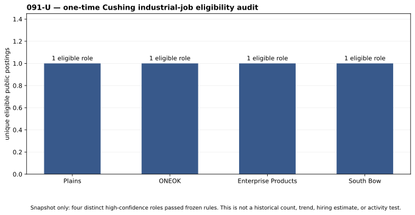

# 091-U — Cushing Industrial Job Pulse

## First public eligibility audit

Four distinct public role listings passed the frozen **high-confidence** rule
in a one-time audit. The snapshot preserves no job descriptions, applicant
information, applications, salary, or employer inference—only the public title,
employer, Cushing location claim, inclusion rule, and source URL.

| eligible public listing | employer | rule that passed | stale flag |
| --- | --- | --- | --- |
| Terminal Operator I | Plains | Terminal Operator + terminal/pipeline/tank context | no |
| Operator | ONEOK | Cushing + pipeline/terminal/product movement | yes (one-month label) |
| Operator, Pipeline | Enterprise Products | Cushing + crude delivery/tankage | no |
| Gauger Technician | South Bow | Cushing + petroleum terminal/facility | no |

**Snapshot count: 4.** This is not yet a weekly time-series value: public
listing pages can change, displayed posting ages are not publication archives,
and no prior fixed source universe exists. The snapshot is an E1 proof that the
filter can identify direct industrial roles, not proof that Cushing hiring has
risen or that Cushing is busy.

## Next gate

Run the frozen [90-day collection protocol](091u-industrial-job-pulse-protocol.md)
using the blank [forward log](091u_job_pulse_log_template.csv). First validate
the finished series against an independent operational series—not against WTI.

## Sources

- [Plains Terminal Operator I public listing](https://www.linkedin.com/jobs/view/terminal-operator-i-at-plains-4409731603)
- [ONEOK Operator public listing](https://www.linkedin.com/jobs/view/operator-at-oneok-4398544014)
- [Enterprise Pipeline Operator public search listing](https://www.indeed.com/q-oil-field-l-cushing%2C-ok-jobs.html)
- [South Bow Gauger Technician public listing](https://www.linkedin.com/jobs/view/gauger-technician-at-south-bow-4440288691)

The public listing pages were inspected manually; this project does not
automate or scrape the job platforms.
