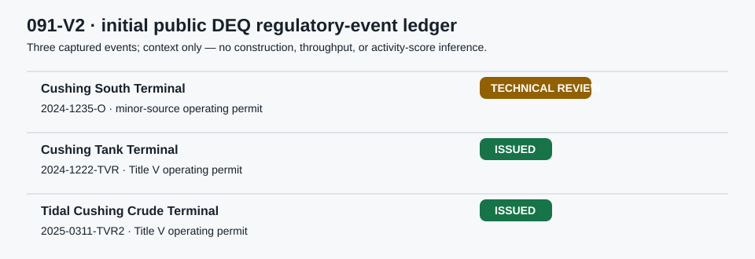

# 091-V2 — Cushing Industrial Regulatory Event Pulse

**Status:** FORWARD_ONLY / E1  
**Purpose:** record publicly observable regulatory milestones at a frozen list of Cushing crude-terminal facilities. It is **not** a construction-volume index, a worker count, an emissions signal, or a WTI factor.

## What was improved

091-V is now a dated **event ledger**, rather than an undefined count of “permits.” DEQ statuses can reflect renewal, an operating permit, technical review or compliance paperwork. They may be operationally relevant, but do not prove that a tank was built or that Cushing is busy.

| Frozen component | Rule |
| --- | --- |
| Facility universe | Cushing South Terminal; Cushing Tank Terminal; Tidal Cushing Crude Terminal. Additions require an official DEQ facility record and a review note; never add a facility after seeing a market move. |
| Include | A public DEQ record naming one frozen facility and a dated permit number/type/status change. |
| Exclude | City retail/office permits, generic Payne County records, environmental news with no DEQ facility record, and any inference about employees, throughput or construction. |
| Deduplicate | One event per `facility + permit number + status`. A changed status for the same permit is a new transition, not a duplicate. |
| Time | Store the DEQ-visible date (and capture time separately). Do not backdate a status to a presumed construction start. |
| Initial output | Counts by event class and facility, plus a human-reviewed event table; **no score**. |

## Initial collected ledger

| Facility | Permit | Event class | Captured status | Interpretation boundary |
| --- | --- | --- | --- | --- |
| Cushing South Terminal | 2024-1235-O | Minor-source operating permit | technical review | regulatory review, not verified construction |
| Cushing Tank Terminal | 2024-1222-TVR | Title V operating permit | issued | regulatory issuance, not throughput |
| Tidal Cushing Crude Terminal | 2025-0311-TVR2 | Title V operating permit | issued | regulatory issuance, not throughput |

The exact initial rows are preserved in [`initial_deq_event_ledger.csv`](initial_deq_event_ledger.csv), based on the original [DEQ collection receipt](../../../../gathering/raw/ALT-20260908-27/20260908T200000Z/current_deq_industrial_event_routes.csv).

## Forward workflow

1. Capture the DEQ public-review result at one fixed weekly time for 90 days.
2. Write only a new `permit-number + status` transition to the ledger, with source URL, capture time and a one-line reviewer reason.
3. At 12 weeks, audit: source availability, duplicate rate, number of transitions and whether statuses can be dated consistently.
4. At 180 days **and only if 12+ valid transitions exist**, chart the ledger against independently dated DEQ/City events. Do not test WTI or create a CFAM score before measurement validity is established.
5. If data remain sparse, preserve the event log as regulatory context and keep the factor at zero weight.

## Relationship to other CFAM tracks

091-V2 can eventually act as an **event annotation** for 091-U industrial-job postings and 091-Z local news. It is not a component in their score: a permit review, a job posting and a news headline all need their own collection histories before a restricted event-study can be considered.

## Sources

- [Oklahoma DEQ Public Permit Review](https://applications.deq.ok.gov/PermitsPublicReview/)
- [091 PARK recheck](../20260908T091PARKZ/README.md)
- [091-F/V original access audit](../20260908T091FVZ/README.md)
