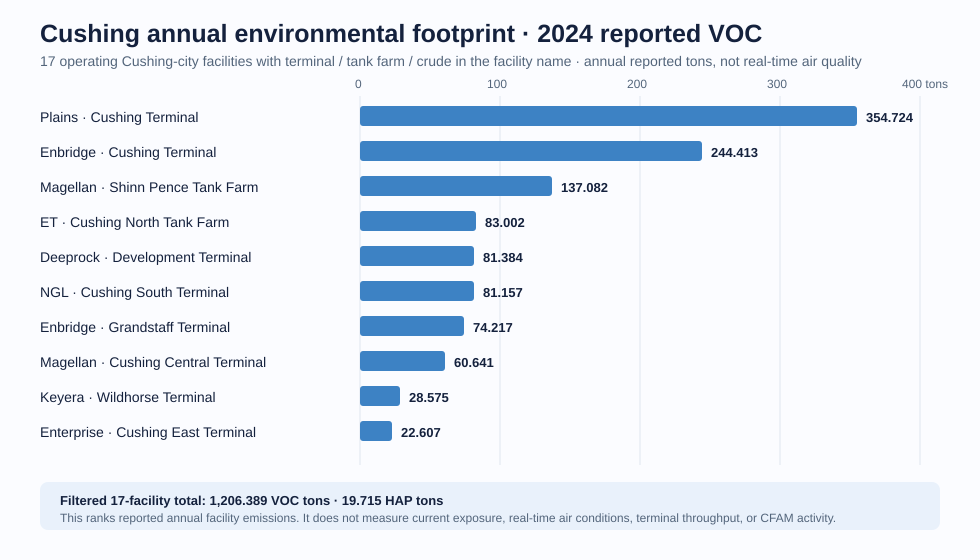

# 091-W — Cushing Annual Environmental Footprint

## Result

This is the approved **annual companion** to `Cushing Air Quality Now`.
It is not an AQI display, a real-time pollution monitor, a throughput estimate,
or a CFAM busy score.

The official Oklahoma DEQ 2024 layer yields **17 operating Cushing-city
terminal-like facilities**, mechanically defined by facility names containing
`TERMINAL`, `TANK FARM`, or `CRUDE`:

| 2024 reported annual quantity | total |
| --- | ---: |
| VOC | **1,206.389 tons** |
| HAP | **19.715 tons** |

## What it establishes

- Oklahoma DEQ is the primary public source for annual Cushing terminal-context
  emissions, because it reports facility-level VOC and HAP totals with broader
  permitted-facility coverage than TRI's chemical-specific thresholds.
- The two largest records in this frozen city-filtered set are Plains Cushing
  Terminal (**354.724 VOC tons**) and Enbridge Cushing Terminal (**244.413
  VOC tons**).
- EPA TRI remains useful only as a complementary, chemical-specific toxic
  release check; it is not substituted for DEQ here.

## What it does not establish

Annual VOC totals cannot identify today's air quality, a facility's real-time
emissions, terminal utilization, worker count, or oil price direction. The
DEQ page explicitly presents these as annual reported summaries and notes that
amended facility information can update the spreadsheets. No value is carried
into the 091-W live widget or CFAM.

## Scope discipline

This result uses `City = CUSHING`, not an arbitrary radius. A later
**Cushing hub radius** view may include nearby Agra or rural facilities, but it
must be a separately labelled geographic universe—not silently merged into
Cushing city.

The raw excerpt, exact filter and source endpoint are in [raw](raw/README.md).

## Sources

- [DEQ 2024 Point Source Emissions feature layer](https://gis.deq.ok.gov/server/rest/services/AirWeb/MapServer/8)
- [DEQ annual Point Source Emissions summaries](https://oklahoma.gov/deq/divisions/air-quality/emissions-inventory/state-emissions-totals-infographics.html)
- [EPA TRI overview](https://www.epa.gov/enviro/tri-overview)
