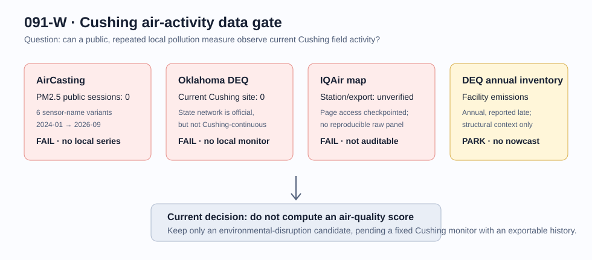

# 091-W — Cushing Air Activity & Disruption Monitor

## Decision

**PARK / E1 — no public, repeatable Cushing air-quality panel was obtained.**

This is deliberately not a score, backtest, or WTI relationship claim. The
question is narrower: can pollution observations identify that Cushing is busy
*now*? The answer from this audit is **not yet**.

## What was actually checked

| candidate | collection and observation test | result | CFAM role |
| --- | --- | --- | --- |
| AirCasting | Public API queried over a Cushing-centred box for 2024-01-01 through 2026-09-05. Six documented AirBeam PM2.5 sensor-name variants returned zero public mobile sessions; fixed active and dormant queries also returned none. | no local sample | **excluded** until coverage appears |
| Oklahoma DEQ ambient network | The official current monitoring-site table has no Cushing station. A DEQ permit review says historical rural monitoring used Mannford, about 38 km ENE, in lieu of immediate-Cushing monitoring. | no continuous local monitor | **excluded** |
| IQAir Cushing map | The visible location page is useful as a current display, but this audit could not obtain a station-identified, reproducible raw historical export; automated access was checkpointed. | non-reproducible | **excluded** |
| DEQ point-source emissions inventory | Official facility emissions exist as annual inventory data. | valid environmental context, too slow for activity | **context only** |

The representative AirCasting response and acquisition ledger are in [raw](raw/README.md).

## Why a pollution score would be wrong today

Even if a local PM2.5 series existed, higher particulate pollution would not
mean “the terminal is busier.” Wind direction, wildfire smoke, rain, road dust,
construction, domestic combustion, and sensor siting can dominate it. A normal
terminal operation can be busy without an ambient pollution excursion; an
incident can raise pollution while decreasing usable throughput.

Therefore an eventual 091-W may only flag a **possible environmental/operational
disruption** when all pre-committed conditions hold:

1. a fixed, Cushing-area, public monitor supplies at least 12 continuous months
   of downloadable hourly observations;
2. the monitor location, pollutant, calibration/quality status and missingness
   are known;
3. PM anomaly is adjusted for wind, precipitation, temperature and regional
   smoke;
4. the residual anomaly is independently compared with a CFAM operational
   observation (for example 091-U fresh industrial roles or 091-D tank-change
   intensity), not WTI; and
5. an excursion is labelled **disruption candidate**, never “busy = polluted.”

## Re-open conditions

- AirCasting adds a fixed Cushing contributor with exportable history; or
- DEQ/EPA opens a Cushing-area continuous station; or
- an identified IQAir station exposes a public, reproducible time series and
  source metadata.

Until then, annual DEQ inventories and EPA TRI/PHMSA records may be retained as
long-horizon environmental and incident context but must not enter the CFAM
activity score.

## Sources

- [AirCasting API documentation](https://github.com/HabitatMap/AirCasting/blob/master/doc/api.md)
- [Oklahoma DEQ current monitoring sites](https://oklahoma.gov/deq/divisions/air-quality/ambient-monitoring/current-air-quality-forecasts.html)
- [DEQ Cushing permit review: monitoring context](https://www.deq.ok.gov/wp-content/uploads/air-division/Permit_2003104-cp4.pdf)
- [DEQ annual point-source inventory](https://oklahoma.gov/deq/divisions/air-quality/emissions-inventory/state-emissions-totals-infographics.html)
- [IQAir historical-data description](https://www.iqair.com/support/knowledge-base/how-can-i-access-historical-data-on-the-iqair-platform)
