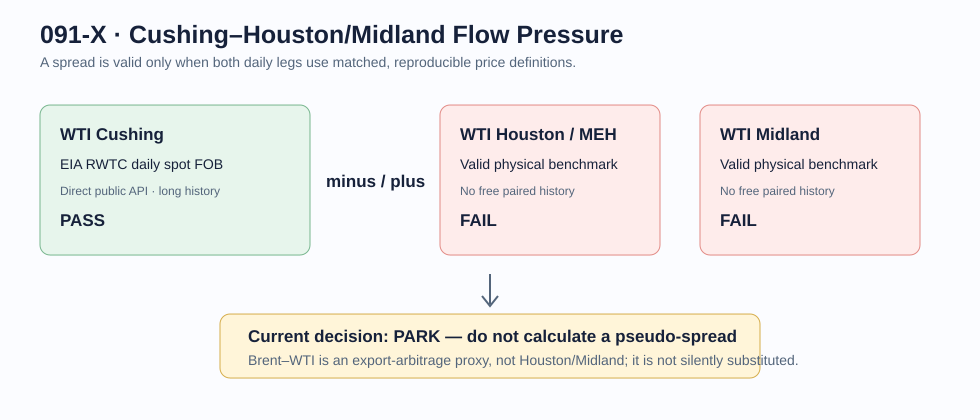

# 091-X — Cushing–Houston/Midland Flow Pressure

## Decision

**PARK / E1 — the spread is economically meaningful, but no free, matched,
reproducible long Cushing–Houston or Cushing–Midland price panel was obtained.**

This is a market-context monitor, not a physical CFAM activity observation.
It measures what the market prices for location and flow pressure; it does not
measure trucks, tanks, workers, or terminal throughput.

## Actual data collection

The EIA daily Cushing WTI spot price (`RWTC`) is directly available in the
public API; a five-observation sample is retained in [raw](raw/README.md).
The Houston/MEH and Midland legs are real market locations—ICE and CME both
describe the relevant contracts and location differentials—but the sources
checked here did not expose an equivalently defined, free long historical panel
that can be joined to `RWTC` without licensing or a non-reproducible scrape.

Therefore no correlation, backtest, or chart of an invented spread is produced.
Replacing Houston/Midland with Brent would change the question to export/global
arbitrage context, so it is not substituted under this name.

## Frozen calculation contract, if a licensed/legitimate historical source is added

1. Store the exact Houston/MEH or Midland assessment, delivery basis, timestamp,
   units, publication time and revision policy.
2. Match it only to same-date EIA `RWTC` observations.
3. Define each spread explicitly: `Houston − Cushing` or `Midland − Cushing`.
4. Validate it first against a physical public target such as future EIA Cushing
   inventory change, not WTI return.
5. Keep it separate from CFAM; it may only act as an external confirmation
   alongside independently collected 091-D or 091-U observations.

## Sources

- [EIA daily Cushing WTI spot series](https://www.eia.gov/dnav/pet/hist/leafhandler.ashx?f=a&n=pet&s=rwtc)
- [ICE: Midland WTI Houston vs Cushing differential](https://status.ice.com/oil/midland-wti)
- [CME: WTI Houston and Midland market context](https://www.cmegroup.com/articles/whitepapers/permian-production-growth-creeps-into-the-wti-midland-forward-curve.html)
- [EIA: location differentials and pipeline takeaway constraints](https://www.eia.gov/todayinenergy/detail.php?id=38832)
