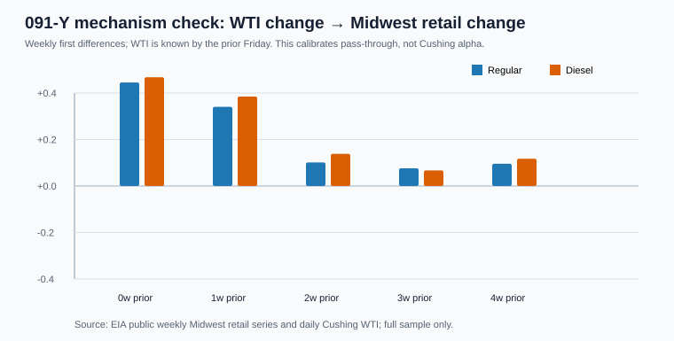

# 091-YB — Midwest pass-through calibration

## Question

Does a long free public benchmark support the expected direction: **WTI changes
arrive before regional retail pump-price changes**? This does **not** turn the
Cushing Maverik board into a historical Cushing series or a WTI-leading factor.

## Result

| fuel | strongest prior-WTI lag | Pearson r | n | interpretation |
| --- | ---: | ---: | ---: | --- |
| Regular | 0 week(s) | +0.445 | 1693 | regional retail follows the prior WTI move most closely at this lag |
| Diesel | 0 week(s) | +0.468 | 1693 | regional retail follows the prior WTI move most closely at this lag |

The displayed bars use weekly **first differences**, not price levels. For each
retail Monday, WTI is the most recent observation on or before the preceding
Friday, preventing the retail observation from looking into later crude prices.
The full lag grid, including the reverse direction, is in [lag_tests.csv](lag_tests.csv).

## What this changes

The five archived Cushing station observations remain evidence of local
co-movement only. This broader EIA calibration supports a downstream
WTI-to-retail mechanism; it does not support pump-to-WTI forecasting. 091-Y
therefore remains **FORWARD ONLY** as a local product-stress board.

## Reproduction and raw receipts

- [Collector](../../../notebooks/091-cushing-operations-nowcasting/calibrate_091y_midwest_pass_through.py)
- [Raw EIA collection receipt](../../../gathering/raw/ALT-20260908-25/20260908T180000Z/README.md)
- [EIA Midwest regular retail series](https://www.eia.gov/dnav/pet/hist/LeafHandler.ashx?f=W&n=PET&s=EMM_EPM0_PTE_R20_DPG)
- [EIA Midwest diesel retail series](https://www.eia.gov/dnav/pet/hist/LeafHandler.ashx?f=W&n=PET&s=EMD_EPD2D_PTE_R20_DPG)
- [EIA Cushing WTI](https://www.eia.gov/dnav/pet/hist/LeafHandler.ashx?f=D&n=PET&s=RWTC)
