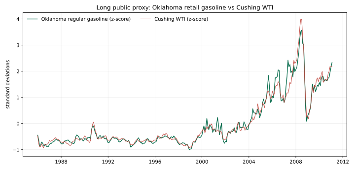

# 091-YD deep check — can one Cushing pump board mean anything?

**Decision:** preserve it, but as a **Cushing Retail Repricing Lag Monitor**, not an oil-price leading factor and not a truck-count proxy.



## The strongest relationship actually found

The fixed Maverik Cushing board has only five irregular Internet Archive observations, so it cannot be honestly backtested as a local time series. The closest long, free and correctly labelled proxy is EIA’s **Oklahoma regular retail gasoline** series (monthly, 1983–2022). It was tested against EIA’s monthly Cushing WTI series without claiming that state data equals the station.

| Pre-specified direction | Pearson r | n | Finding |
| --- | ---: | ---: | --- |
| Same-month WTI return → Oklahoma regular-gas return | **+0.680** | 299 | Strong contemporaneous pass-through |
| WTI return → next-month Oklahoma regular-gas return | **+0.340** | 299 | Retail repricing continues after the crude shock |
| Oklahoma regular-gas return → next-month WTI return | **+0.105** | 299 | No useful reverse/leading relationship |

The raw test table is [`retail_proxy_lag_tests.csv`](retail_proxy_lag_tests.csv); the aligned rows are [`eia_ok_retail_regular_wti_monthly.csv`](eia_ok_retail_regular_wti_monthly.csv). This is a direction check, not a fitted trading strategy; no thresholds, selection search or post-hoc horizon was used.

## What the station can truthfully become

**Name:** *Cushing Retail Repricing Lag Monitor*  
**Meme:** “WTI moves the tank; Main Street marks it up later.”

It can show whether a Cushing household/truck-stop price board has caught up with a crude shock, and whether diesel is repricing differently from regular gasoline. That is useful for a dashboard because it bridges the settlement hub and lived fuel cost.

It cannot establish that an expensive diesel board means more truck traffic, terminal congestion, refinery outages, or future WTI returns. Retail price is a mixture of wholesale products, station pricing policy, taxes, seasonality and local competition.

## The only defensible forward version

At one fixed collection time each week, retain:

```text
regular price, diesel price, diesel − regular,
current/previous WTI change, and collection timestamp
```

After 12 weeks: audit timestamp consistency and whether the page still provides both grades.  
After 52 weeks: test whether the Cushing **retail premium relative to a pre-chosen regional retail benchmark** predicts only a future *local/region product-price catch-up*, not WTI. A separately acquired ODOT truck series would be required before testing any “diesel spread = truck activity” story.

The four publicly indexed historical Mavericks snapshots were independently checked through the Internet Archive CDX index on 2026-09-08; their scarcity is exactly why they are not used for statistics.

## Sources and limits

- [EIA Oklahoma prices, sales volumes & stocks](https://www.eia.gov/dnav/pet/pet_sum_mkt_dcu_sok_m.htm): the page explicitly labels the Oklahoma retail-price history as ending in 2022.
- [EIA Oklahoma regular-retail history](https://www.eia.gov/dnav/pet/hist/LeafHandler.ashx?n=PET&s=EMA_EPMR_PTC_SOK_DPG&f=M) and [EIA Cushing WTI history](https://www.eia.gov/dnav/pet/hist/LeafHandler.ashx?n=PET&s=RWTC&f=M): the two raw inputs.
- [Maverik Cushing #5097](https://locations.maverik.com/ok/cushing/2001-e-main-st#fuel): current fixed-station source. It publishes displayed prices, not sales volumes or historical exports.

The source bytes and SHA-256 receipt are in
[`ALT-20260908-28`](../../../../gathering/raw/ALT-20260908-28/20260908T210000Z/README.md).
