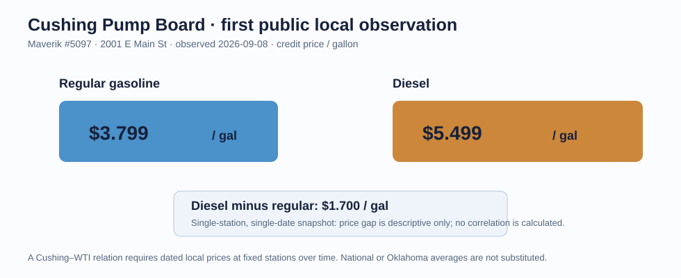
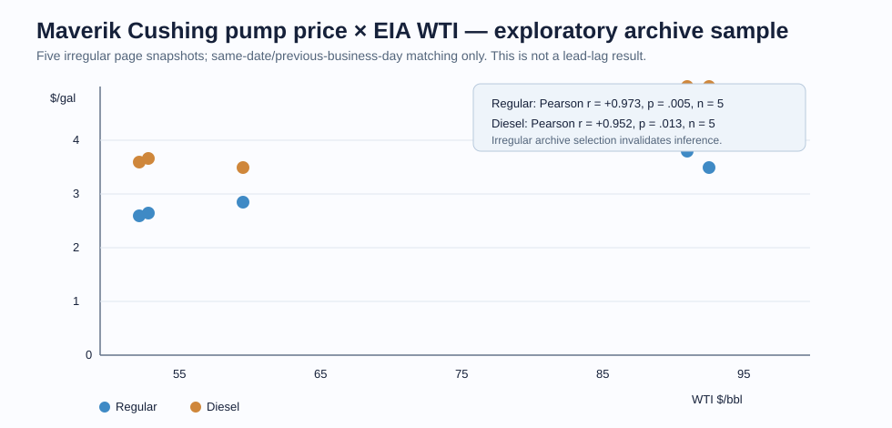

# 091-Y — Cushing Pump Price Board

## First local observation

The official Maverik #5097 public station page provides a real Cushing retail
display. On the 2026-09-08 retrieval it showed credit prices of **$3.799/gal
Regular** and **$5.499/gal Diesel**.

## Historical-price recovery and correlation verdict

**Leading relationship: not established.** Four public Wayback snapshots plus
the live display recovered five irregular local observations. Same-date
exploratory correlations with matched EIA WTI are high—Regular `r=+0.973,
p=.005`; Diesel `r=+0.952, p=.013`; `n=5`—but this is not a lead-lag test and
is far too small, irregular and archive-selected to validate an indicator.

The exact paired observations and matching rule are retained in
[raw](raw/maverik-wayback-wti-paired-sample-20260908.csv). The 2026-09-08 live
display had to match 2026-09-01 WTI because no later EIA daily observation was
returned at collection time; this is another reason it cannot support a lead claim.

The recovery was extended beyond the current Maverik screen: the official
predecessor Kum & Go #0842 page at the same address/telephone is archived in
2023 but contains no price field, and a Common Crawl copy duplicates the
2025-12 Maverik observation. The public archive audit is retained in the
[deep-research report](report-source.md#historical-recovery-audit-and-next-measurement).
Thus the five values are the complete reproducible first-party price history
found at this vintage—not five values chosen from a longer hidden series.

## Monthly RWTC robustness check

The supplied EIA workbook `RWTCm.xls` was opened read-only. It contains the
official **monthly** Cushing WTI series from 1986-01 through 2026-08 (release
date 2026-09-02). Matching the five displays to their calendar-month WTI value
(the 2026-09 live price must use the latest available 2026-08 monthly value)
gives lower descriptive correlations: Regular `r=+0.865`, Diesel `r=+0.852`.
An exact five-item permutation check gives two-sided `p=.058` and `.092`,
respectively. The matched table is [retained here](raw/maverik-wayback-monthly-rwtc-robustness-20260908.csv).

This is the appropriate conservative reading: there is visible price
co-movement, but the result is sensitive to sampling convention and has only
five observations. It neither establishes a lead nor authorizes a trading rule.

EIA's Cushing WTI `RWTC` series is long and daily, but that only solves one side
of the pair. Oklahoma or U.S. retail averages may be useful external context,
but are not substituted for Cushing local pump prices.

## Deep-research verdict on a leading-indicator claim

The **price relationship itself is visible**; what fails is the claim that this
downstream retail board leads its upstream benchmark. Economic ordering normally
runs from crude/wholesale prices to retail prices. Cushing's documented Hudson
refinery closed in 1982, so an operating-local-refinery mechanism was not
verified. The evidence, exceptions and frozen upgrade gates are in the
[deep-research report](report-source.md).

## Forward-only contract

For 90 days, record at a fixed weekly time:

1. price, price type and visible freshness at Maverik #5097;
2. the same fields at at least two additional fixed Cushing stations **only if**
   their public pages expose a price and source timestamp;
3. EIA WTI `RWTC` value available at that observation time; and
4. a missingness reason—not an imputed zero—when a station does not publish.

After at least 12 paired weekly observations, test both contemporaneous and
one-week-lag changes. Report station-level results before any city composite.

## What this can become

This is a human-facing Cushing widget: what local drivers and truck operators
pay for gasoline and diesel near the WTI hub. It is **not** a CFAM activity
score, and the diesel–gasoline gap is not inferred to represent terminal
throughput without independent evidence.

Raw receipt: [raw](raw/README.md).

## Sources

- [Maverik #5097 official Cushing station page](https://locations.maverik.com/ok/cushing/2001-e-main-st)
- [EIA Cushing WTI daily series](https://www.eia.gov/dnav/pet/hist/leafhandler.ashx?f=a&n=pet&s=rwtc)
- [EIA Cushing WTI monthly series](https://www.eia.gov/dnav/pet/hist/LeafHandler.ashx?n=PET&s=RWTC&f=M)
- [GasBuddy location-price search documentation](https://help.gasbuddy.com/hc/en-us/articles/27612659871767-Finding-Prices)
