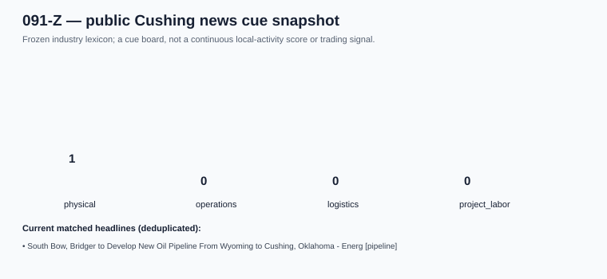

# 091-Z — Cushing Public News Cue Monitor

**Status:** FORWARD ONLY / E1  
**Purpose:** catch publicly reported Cushing industrial events quickly and
transparently. It is an event queue, not an inferred local-busyness score.

## Free, live sources proved accessible

| source | collection route | current use |
| --- | --- | --- |
| [1600 KUSH News](https://www.1600kush.com/category/news/) | WordPress News RSS plus public `wp-json` posts endpoint | local context; headlines/excerpts only |
| [Google News RSS](https://news.google.com/) | frozen Cushing industrial query | broader pickup; retain the retrieved feed each run |

The collection obtained **79** deduplicated current items, of which
**1** matched at least one frozen industry term. Current lane counts:
physical `1`, operations `0`,
logistics `0`, project/labor `0`.

## Frozen interpretation rules

- **Physical:** terminal, pipeline, tank farm, refinery, midstream, oilfield.
- **Operations:** turnaround, maintenance, outage, shutdown, spill, leak, rupture, fire.
- **Logistics:** truck, rail, diesel, fuel, shipment.
- **Project/labor:** construction, permit, hiring, welder, pipefitter, operator.

An item must contain the Cushing place-name anchor and one cue lane; finance/fund
headlines are excluded. A match only makes an article eligible for human review; it
does not prove a terminal event, the size of any effect, or that Cushing is busier.
Separate calendar/incident articles remain visible in the raw audit but do not
enter this cue count.

## Valid next test

Collect this unchanged feed at a fixed daily time for at least 90 days. First
validate whether manually confirmed physical/industrial local events are caught
within 24 hours. Only then test pre-specified event windows against CFAM
observations such as EIA inventory changes or the future 091-S/091-U panels.
Do not correlate a single current headline snapshot with WTI.

## Reproduction

- [Collector](../../../notebooks/091-cushing-operations-nowcasting/collect_091z_local_news_cues.py)
- [Headline-level audit](headline_audit.csv)
- [Raw responses + SHA-256 receipt](../../../gathering/raw/ALT-20260908-26/20260908T190000Z/README.md)
