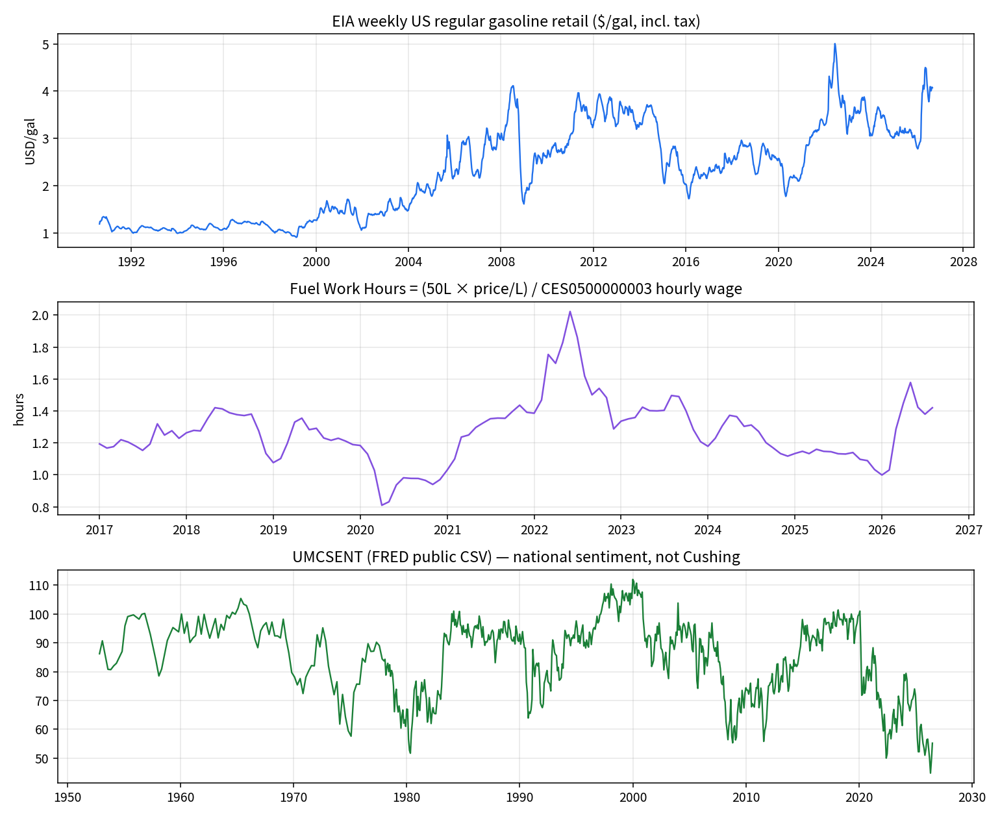
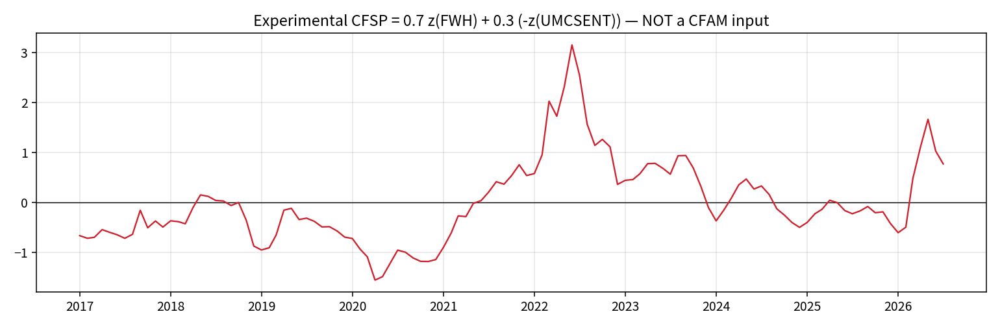

# 091-CFSP collection — 2026-09-09

National regular gasoline, private hourly earnings, and Michigan sentiment.
Not Cushing field activity.

**Figure 1 — components.** Weekly EIA regular gasoline ($/gal), monthly Fuel Work Hours, UMCSENT.

**Figure 2 — experimental score.** `0.7 z(FWH) + 0.3 (−z(UMCSENT))` on the 2017–2026 overlap. Not a WTI or CFAM input.

| Field | Value |
| --- | --- |
| Retrieved | 2026-09-09T03:05:00Z |
| EIA XLS SHA-256 | `1a263c7510fbc906c76501bab4009b3af435e6457ac4d85bfa93a64d360755ed` |
| Gas weeks | 1,875 · 1990-08-20 → 2026-08-31 · $4.071/gal |
| BLS months | 116 · 2017-01 → 2026-08 · $37.75/hr |
| UMCSENT last | 2026-07 · 55.2 |
| Overlap gas+wage | 116 months |
| Last complete CFSP month | 2026-07 · FWH 1.380 · CFSP +0.775 |

Files: [weekly gas](eia_regular_gas_weekly.csv) · [wages](bls_ces0500000003_monthly.csv) · [panel](cfsp_monthly_panel.csv) · [receipt](receipt.json)

## What was not visualized

- Live FastAPI `/cfsp` JSON — environment has no EIA/FRED keys; v2 EIA is 403 without a key.
- Genscape-style flow or Cushing tanker layers — not in this design.
- WTI overlay — withheld on purpose.
- August 2026 composite — sentiment print missing.
- Docker frontend — out of 091 research scope for this pass.
