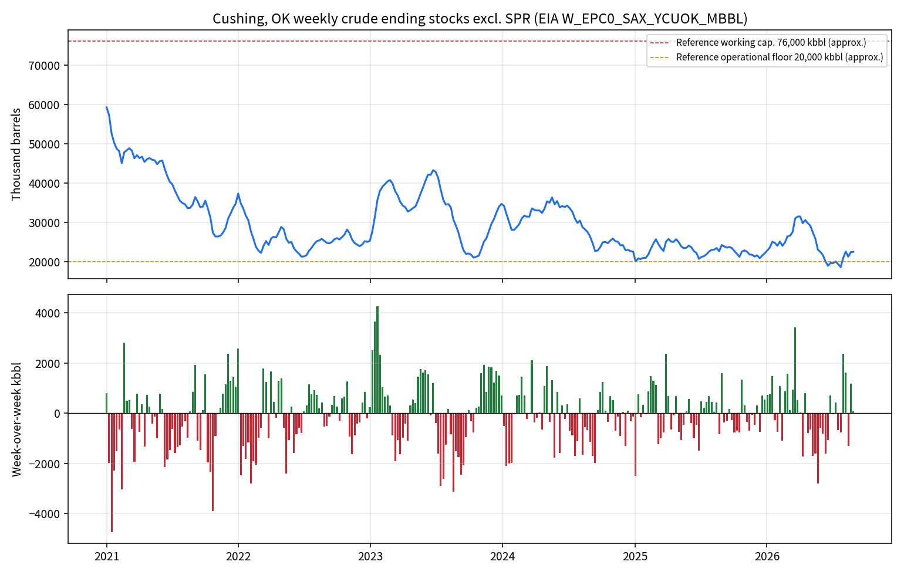

# 091-EIA — Cushing weekly stocks collection (2026-09-09)

**What this is:** a dated pull of EIA’s official weekly Cushing, OK crude
ending stocks excluding SPR.  
**What this is not:** a pipeline-flow series, a tanker count, a CFAM activity
score, or a WTI direction signal.

Submitted script: `research/notebooks/091-cushing-operations-nowcasting/cushing_storage_monitor.py`  
(Cushing Storage & Stress Monitor). The script’s own comments already reject
named-pipeline EIA flows and a 50 km tanker radius. That boundary is kept.

## Collection that actually ran

| Path | Result |
| --- | --- |
| EIA v2 `seriesid/PET.W_EPC0_SAX_YCUOK_MBBL.W` without `api_key` | **403** |
| Submitted script `--once` with empty `EIA_API_KEY` | **blocked** — key required |
| Genscape / Kpler stubs | **not called** — no verified endpoint |
| Free hist XLS `W_EPC0_SAX_YCUOK_MBBLw.xls` | **PASS** |

XLS URL:
`https://www.eia.gov/dnav/pet/hist_xls/W_EPC0_SAX_YCUOK_MBBLw.xls`

| Field | Value |
| --- | --- |
| Retrieved | 2026-09-09T02:20:50Z |
| SHA-256 | `ceec373d99f402eba325d31e0fc3793de71ed805500757c6bbfd0e126c150b85` |
| Bytes | 79,872 |
| File stamp on workbook | Last-Modified 2026-09-02 15:42:15 GMT |
| Release date on Contents sheet | 2026-09-02 |
| Next release on Contents sheet | 2026-09-10 |
| First week | 2004-04-09 |
| Latest week | **2026-08-28** |
| Latest level | **22,508** thousand barrels |
| Week-over-week | **+80** kbbl (+0.36%) |
| Rows kept | 1,169 weeks |
| Approx. share of 76,000 kbbl working-cap reference | 29.6% |

The 76,000 kbbl working-capacity and 20,000 kbbl floor numbers in the submitted
script are **reference lines only**. EIA publishes official working/shell
capacity twice a year. They are not used here as a trading threshold.

## Figures



- [5y PNG](figures/cushing_stocks_5y.png) · [5y SVG](figures/cushing_stocks_5y.svg)
- [Full history 2004–2026 PNG](figures/cushing_stocks_full.png)
- [Processed CSV](cushing_stocks_weekly.csv)
- [Receipt](receipt.json)

## Why some visuals / paths did not run

1. **API line chart from the submitted script** — no EIA key in this
   environment. v2 returns 403 without it. Did not invent a key.
2. **Genscape / Kpler flow overlay** — stubs raise `NotImplementedError` on
   purpose. No vendor contract, no chart.
3. **Pipeline-by-pipeline inflow/outflow** — EIA does not publish a free
   Keystone/Seaway named-line weekly series. Nothing to plot.
4. **Tanker tracks near Cushing** — inland hub, ~800 km from the Gulf. No
   ocean tanker panel exists to draw.
5. **Week of 2026-09-05** — not on this file. Latest published week is
   2026-08-28; next listed release is 2026-09-10.
6. **WTI overlay / tightness→price test** — out of scope for this pull.
   091 already treats EIA stocks as physical context, not a CFAM input.
   010 already tested US buffer tightness vs later WTI RV and did not
   support the “low buffer → high vol” pilot.

## Reproduce

```bash
curl -fsSL -o W_EPC0_SAX_YCUOK_MBBLw.xls \
  https://www.eia.gov/dnav/pet/hist_xls/W_EPC0_SAX_YCUOK_MBBLw.xls
python research/notebooks/091-cushing-operations-nowcasting/collect_eia_cushing_xls.py
```

Optional, if an EIA Open Data key exists:

```bash
EIA_API_KEY=... python research/notebooks/091-cushing-operations-nowcasting/cushing_storage_monitor.py --once --plot /tmp/cssm-api.png
```

Do not double-count this series with OilPriceAPI or MacroMicro. Those pages
display the same EIA week.
