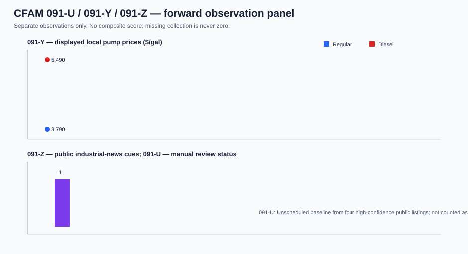

# CFAM 091-U / 091-Y / 091-Z — forward observation panel

**Status:** COLLECTION STARTED — not a backtest, not a composite and not an
activity verdict.  This is the durable record that converts the first one-off
samples into time-stamped observations.

## Collection contract

| Track | What is recorded | Cadence | Rule |
| --- | --- | --- | --- |
| 091-U | frozen-rule count of eligible public industrial roles | Thursday 01:00 KST fixed weekly slot | manual review only; record the U.S. Central equivalent; no job-platform automation; missing is never zero |
| 091-Y | visibly labelled Regular and Diesel price at Maverik #5097 | Thursday 01:00 KST fixed weekly public-page check | ambiguous/unlabelled page output is `source_unavailable`, never inferred |
| 091-Z | deduplicated, Cushing-anchored public industry-news cue count | daily 01:00 KST fixed-time public-feed check | raw feeds and headline decisions are retained per run; count is an event queue, not busyness |

The panel begins with an **unscheduled baseline**. It is visualised so the
reference is not lost, but is excluded from the fixed-cadence count. A time
pattern starts only after multiple scheduled rows exist. After seven valid
091-Z dates and twelve scheduled 091-U/091-Y snapshots, inspect the separate
trend panels. Only then consider independent operational validation. No score
is summed across the tracks.

## Baseline actually captured

The first run is a reference, not an evidence claim: **091-U = 4** distinct
high-confidence public industrial listings in the earlier manual audit;
**091-Y = $3.790 Regular / $5.490 Diesel** per gallon at Maverik #5097; and
**091-Z = 1** deduplicated frozen-lexicon cue lane. The values are retained so
future scheduled observations have an auditable starting point.

## Files

- [`observations.csv`](observations.csv): append-only observation ledger.
- [`figures/091-uyz-forward-panel.svg`](figures/091-uyz-forward-panel.svg): separate-track board.
- Raw response receipts: `research/gathering/raw/ALT-20260908-91/<UTC run>/README.md`.
- [091-U frozen protocol](../20260908T091UZ/091u-industrial-job-pulse-protocol.md).
- [091-Y board](../20260908T091YZ/README.md) and [091-Z monitor](../20260908T091ZNEWSZ/README.md).
