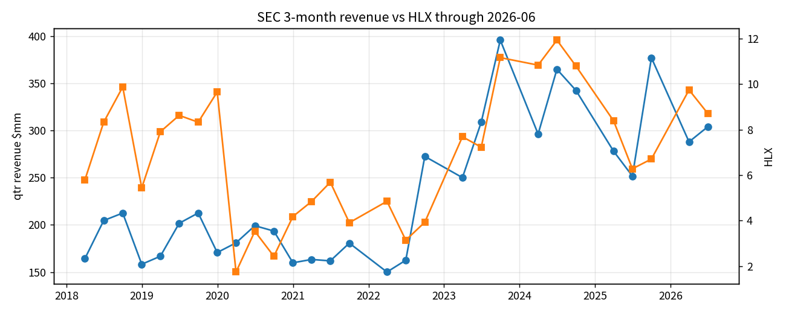

# 20260910T097SECZ

SEC companyfacts CIK 0000866829 (Helix filings; ticker file now labels Hornbeck after the 2026 combination).

3-month revenue windows only (start–end 80–100 days). 33 quarters 2017Q1–2026Q2.

YoY revenue growth → next-quarter HLX log return: r = +0.20, n = 28.

Not alpha. Do not splice post-2026-09-01 HOS financials into this series.

