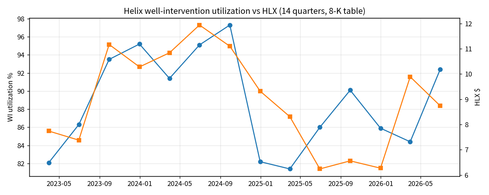
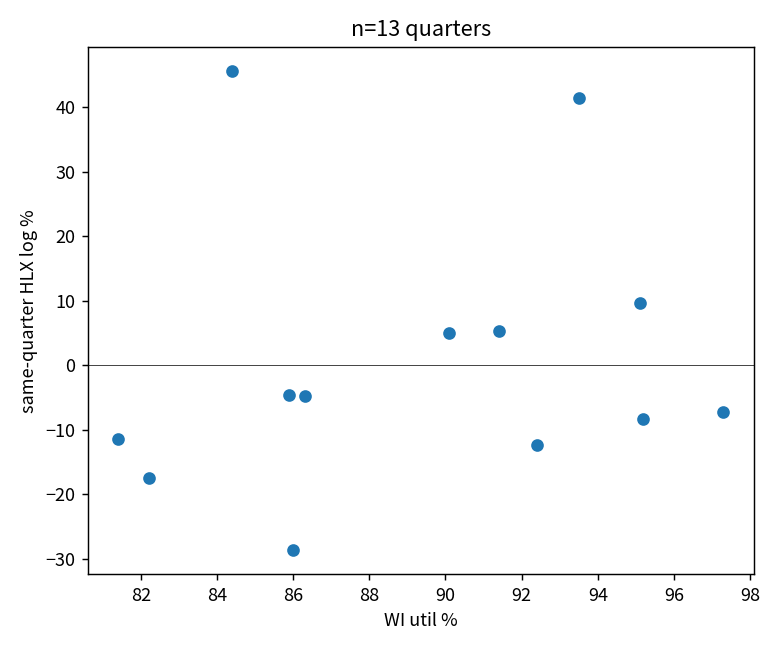

# 20260910T097UTILZ

Helix well-intervention utilization and average dayrate, 1Q23–2Q26, from the Hornbeck combination 8-K appendix (active fleet). 14 quarters.

util_t → HLX return t+1: r = −0.07, n = 12
same-quarter r = +0.16, n = 13

Not a daily factor. Not alpha. Source table is pre-merger HLX WI fleet, not HOS.
