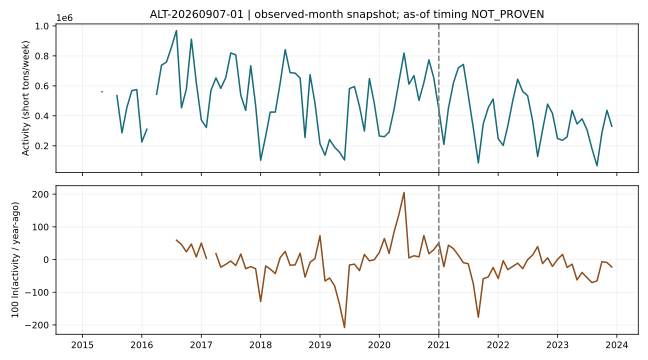
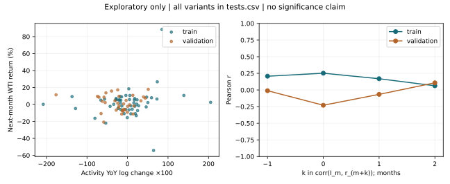

# ALT-20260907-01 — Locks 27 곡물 바지선 활동

**PARK — 실제 시계열 구성·탐색 검정 완료, 시점 안전성 미검증.** 숫자는 모두 `repo empirical only`이며 예측 알파·인과·거래 성과를 뜻하지 않는다. [실행 영수증](20260907T062017Z/receipt.json)과 [전체 검정표](20260907T062017Z/tests.csv)가 정본이다.

## 출처와 지수

[USDA 공식 데이터 안내](https://www.ams.usda.gov/services/transportation-analysis/gtr-datasets)는 곡물 운송표가 비기밀·비저작권 원천에서 집계됐음을 설명한다. [USDA/USACE 데이터셋](https://agtransport.usda.gov/d/n4pw-9ygw)은 특정 수문별 주간 남행 곡물량이며 단위는 short tons다. 본 후보는 `MS Locks 27` 한 지점에서 Corn/Soybeans/Wheat/Other Grain 네 품목만 합산한다. 곡물 물량은 원유 소비량이 아니며 WTI와의 연결은 운송·수출 활동이라는 **검정 가설**이다.

토요일 주말 날짜가 속한 달의 평균 주간 톤수 `A_m`를 구하고 `I_m=100 ln(A_m/A_(m-12))`를 계산한다. 해당 달의 모든 토요일과 매주 네 품목이 있어야 한다. 제공자 `month/year`는 주의 과반 일수 기준이므로 본 달력월 집계에 쓰지 않았다. 월 총톤수가 아니며 품목 결측을 0으로 바꾸지 않았다. 원문 숫자는 보존했고 clipping/보간/역채움은 없다.

원자료는 2015-01-03~2023-12-30, 1,880행. 톤수 결측 10셀 때문에 10개 주의 합산을 무효로 처리했다. 완전한 월은 102개, 전년동월 로그 신호는 90개다. [월별 가용성 표](20260907T062017Z/coverage.csv), [집계 통계](20260907T062017Z/coverage.json), [절대 로그 변화 100 초과 표](20260907T062017Z/outlier-signals.csv)를 함께 읽는다. 극단 변화는 제거하지 않았다.

Finance가 운영 코드를 import하지 않고 [독립 재계산](20260907T062017Z/independent-finance-review.json)했다. 알려진 원문 톤수 합계 **217,649,472 = 완전월 반영 208,499,047 + 불완전월에 속한 완전주의 값 5,510,402 + 불완전주의 알려진 값 3,640,023** short tons로 일치한다. 결측 10셀의 실제 톤수는 모른다. 원문 품목 셀의 0은 389개이며 `coverage.json`의 `source_zero_values=5`는 **완전한 주간 합계가 0인 주의 수**다. 두 집계를 혼용하지 않는다.

## WTI와 관계

Yahoo `CL=F`, `download_ohlcv(start="2015-01-01", end="2024-01-01")`, `auto_adjust=True`, 1일봉을 이용했다. 2,262행 중 비양수 종가 1일과 결측 종가 0행이 확인됐다. 이 0은 **반환된 행의 결측**이며 거래소 캘린더 누락이 없다는 증거가 아니다. 일별 실제 거래일 캘린더 대조는 미실행이다.

월말 마지막 종가 `P_m`와 `r_m=P_m/P_(m-1)-1`를 사용한다. 주 검정은 `corr(I_m,r_(m+1))`. 가격 구간 안의 일별 종가가 하나라도 비양수/결측이면 비율 수익률을 무효로 한다. 2015-01은 이전 달 입력이 없어 제외됐고 2020-04는 중간 음수 가격 때문에 제외됐다. [제외 표](20260907T062017Z/excluded-price-windows.csv). 달러 변화 보조 검정은 음수가격 창을 보존한다.

| 사전 지정 변형 | 학습 2015–2020 n / r | 내부 검증 2021–2023 n / r |
| --- | --- | --- |
| 주 검정, 다음 달 수익률 | 52 / 0.169196 | 35 / -0.065802 |
| 다음 달 달러 변화 | 53 / 0.102790 | 35 / -0.098551 |
| 2020 관련 분자·전년 분모·타깃창 제외 | 41 / 0.131332 | 23 / -0.253665 |
| 신호 이용을 한 달 더 늦춘 가정 | 51 / 0.063141 | 34 / 0.107804 |
| split 안에서 12개월 이동 placebo | 40 / -0.109612 | 23 / 0.000751 |
| WTI 당월 수익률만의 기준 관계 | 68 / 0.178397 | 35 / 0.033889 |

각 split에서 신호 관측월과 타깃 시작·끝이 경계를 넘으면 제거했다. 시차 -1/0/+1/+2 전체는 [tests.csv](20260907T062017Z/tests.csv)에 있다. `k>0`은 활동이 이후 WTI 변화보다 앞선다는 정렬 정의일 뿐 실제 공개일 선행의 증거가 아니다. 지연 가정은 주 검정의 +2 시차와 겹치는 표본이므로 독립 증거로 세지 않는다. 기준 WTI 행은 활동 결측에 맞춘 표본이 아니므로 r 크기를 직접 성능 비교하면 안 된다. 통제 후 추가 설명력 검정은 미실행이다.

두 시나리오에서 부호와 표본 수가 변했다. 특히 2020 분모 제외는 2021 신호까지 제외하므로 내부 검증 n=23으로 사전 최소 24쌍에 못 미친다. Placebo도 n=23이다. 계절성·곡물 수확·가뭄·수문 운항·공통 경기 충격이 잔여 설명 후보다(가설). p-value·신뢰구간·다중검정 발견 주장은 하지 않으며 `inference NOT_PROVEN`이다. 별도 외생 사건 목록을 등록하지 않아 사건 연구는 `NOT_RUN`이다.

## 한계, 다음 행동, 재현

- 최신 스냅샷에 과거 빈티지와 행별 `available_at`가 없다. 관측월 결합의 탐색 분석이며 **NOT_PROVEN as-of-safe**. 한 달 지연 시나리오가 빈티지 누수를 해소하지 않는다.
- 2024+ 가격·활동값은 수집/검정에 쓰지 않았다. 기존 저장소의 OOS 노출은 UNKNOWN이며 이번 검증 구간은 내부 검증이다. E4·새 미열람 OOS 주장 없음.
- 학습/검증의 주 관계 부호가 달라 일관된 방향 선행을 확인하지 못했다. 직접 원유 수요량으로 변환하는 모형은 만들지 않았다.
- 손성찬: 2026-09-08까지 USDA 과거 GTR 발행본으로 관측주→공개일/개정 비교가 가능한지 확인. 입수할 수 없으면 PARK 유지, 발표에서는 구성 가능성과 안정된 방향 관계 미확인을 보여준다.
- [동결 계획](plan-v1.json), [실행기와 명령](../../notebooks/ALT-20260907-01/README.md). 실행 전 API schema 확인 과정에서 `Other`라는 설명과 실제 `Other Grain` 명칭 차이, 원천 결측 10셀을 확인해 parser와 결측 경로를 바로잡았다. WTI 관계 결과를 본 뒤 변형을 추가하지 않았다.

현재 증거는 재현 가능한 구성·기술 통계다. 독립 Finance 재계산은 108개 월과 18개 검정행의 값·N·시차·split·시작/끝을 대조해 PASS였다. 전체 후보 주장 검토는 상위 연구 검토를 따른다. 같은 빈티지의 팀 재현은 로컬 원문 공유 또는 허용된 재취득 확인 전까지 미검증이다.
