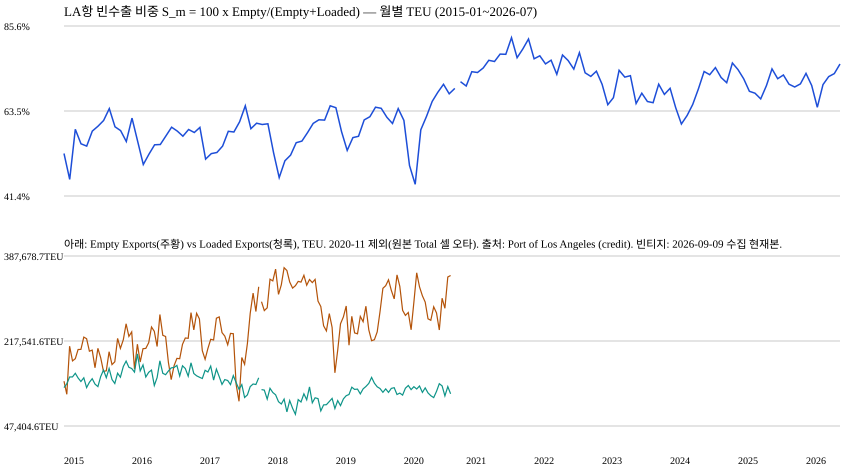

# ALT-20260907-02 — LA항 빈 컨테이너 반출 실제 패널 확보

판정: **관측 구성 E2 / PARK / WTI 관계 NOT_RUN**. 성찬 소유 후보의 첫 실제 수집이며
새 발견으로 합산하지 않는다. [후보 카드](../../../candidates/ALT-20260907-02.md).



위 선은 해당 월 수출 TEU 중 Empty Exports의 비중이다. **분모는 매달 바뀐다.**
항만 전체 연료 소비·물동량·중량·WTI 관계가 아니다. 2020-11은 한 칸이 비어 있는데,
값이 0이라서가 아니라 원본 Total 셀 오타로 제외했기 때문이다(아래 격리 기록).
월별 수치는 processed의 monthly.csv(Git 제외)에 있고, 표시 사본은 [display.json](display.json)이다.
[전체 수치·해시](quality.json).

## 출처와 접근

- [Port of Los Angeles 컨테이너 통계](https://portoflosangeles.org/business/statistics/container-statistics):
  연도별 월표에 Loaded/Empty Imports·Exports 분할이 실재한다(2015~2026 수집).
- 이용 조건(2026-09-09 페이지 문구): 무료 제공, 출처 표기 요청.
  자동 대량 수집을 허가로 확대 해석하지 않는다. 이번 13건은 2.5초 간격 단일 run이다.
- 공표 규칙(페이지 병기): 전월 통계는 익월 후반, 최신월 표에는 익월 15일경 병기.
  월별 최초 공표일·개정 이력의 복원은 아니다.
- 2026-09-07 curl 403과 달리 2026-09-09 직접 GET 13/13 200.
  차단 조건이 바뀌었으므로 재시도이며, 인증·CAPTCHA·쿼터 우회는 없다.

## 이번 구성 명세 — 관측용 v1

사전등록된 예측 모형이 아니다. 파일 구조를 본 뒤 정한 **기술적 관측 집계**이며
가격을 보며 선택하지 않았다.

1. 연도별 월표 1개만 수락한다(헤더 8열 정확 일치). 연간 총계표·재정연도표는 별도 기록.
2. 월 행의 8셀이 전부 비면 미관측 결측으로 둔다(0으로 채우지 않음).
   일부만 비면 실패한다. 월 라벨 중복·예상 밖 라벨·잘못된 날짜·단위도 실패한다.
3. TEU 소수(.00/.25/.50 등)는 정수로 강제하지 않고 Decimal로 보존한다.
   정수 표기(2024-04 Empty Imports `253`)는 표시용으로만 `253.00` 표기 정규화한다.
4. 월 지표 S_m = 100 × Empty Exports / (Empty Exports + Loaded Exports).
   분모가 0인 월은 없었고(최소 분모 217,961 TEU, 2020-03), 그런 월은 만들지 않는다.
5. Total TEUs 단일 셀에만 오타가 있고 나머지 7셀·양쪽 분할 합계가 깨끗하면
   해당 월만 격리하고 계속한다. 그 외 파싱 실패는 run 전체를 중단한다.

## 대사 결과 — repo empirical only

| 항목 | 실측 |
| --- | ---: |
| 수집 원본 | 13 파일·1,671,875 bytes·실패 0 |
| 월별 패널 | 138개월, 2015-01~2026-07 |
| IS(2015~2023) | 107개월 (2020-11 격리로 108이 아님) |
| 미관측 결측 | 2026-08~12 (0으로 채우지 않음) |
| 격리 | 2020-11 1개월 (원본 Total 셀 `889.,748.15` 오타; 분할 합계 889,746.15와 숫자 자체가 불일치) |
| 빈수출 비중 범위 | 44.42%~82.57% |
| 최신월(2026-07) | Loaded 111,775.50 + Empty 348,691.25 = Total Exports 460,466.75, 비중 75.73% |

월별 3식 대사(Decimal 정확 연산): 수입 쪽 137/138, 수출 쪽 134/138, 총계 135/138 일치.

| 월 | 수입 Loaded+Empty−Total | 수출 Loaded+Empty−Total | 총계 Imports+Exports−TEUs | 원인 |
| --- | ---: | ---: | ---: | --- |
| 2020-07 | 0.00 | −0.05 | 0.00 | 제공 Total 셀 반올림 먼지, 미확인 |
| 2022-11 | 0.00 | −100.00 | +100.00 | 제공 Total Exports 셀 +100, Total TEUs는 분할 합계와 일치, 미확인 |
| 2025-03 | 0.00 | −2.00 | +2.00 | 제공 Total 셀 불일치, 미확인 |
| 2025-10 | −3.00 | −4.00 | +7.00 | 제공 Total 셀 불일치, 미확인 |

제공 Prior Year Change 대조(같은 월 전년도 패널이 있을 때, 허용오차 0.015%p):
**125/125 일치, 불일치 0.** 연간 합계행 대조(관측월 합 vs 제공 연간행):

| 연도 | 비교 | 결과 | 원인 |
| --- | --- | --- | --- |
| 2015~2019, 2021, 2023, 2024 | 8개년 | 일치 | — |
| 2020 | 11개월 vs 12개월행 | 비교 불가 | 2020-11 격리, 원인 특정됨 |
| 2022 | Total Exports 100 차이, 총계 일치 | 불일치 1 | 제공 연간행 내부 불일치(월표 Total Exports 셀과 같은 +100), 미확인 |
| 2025 | Total Imports 3.00·Total Exports 6.00 차이, 총계 일치 | 불일치 2 | 제공 연간행 내부 불일치, 미확인 |
| 2026 | Loaded Imports 10.00 차이, 나머지·총계 일치 | 불일치 1 | 제공 연간행 내부 불일치(YTD 7개월 합과 대조), 미확인 |

메인 최신월 표 vs 2026-07 연도표 교차 대조(Loaded Exports·Total Empty·Total):
**3/3 일치.** 불일치 값 수와 불일치 발생 월 수는 구별한다(위 표 참조).
원본을 수정하지 않았고, S_m은 수출 분할 셀만 쓰므로 Total 셀 먼지의 영향이 없으나
분할 셀 자체의 오류는 이 대사로 잡히지 않는다는 잔여 위험을 남긴다.
수입 쪽 Total 셀(2025-10 +3.00)도 표시에는 쓰이지 않으므로 앱 가드는
수출·수입·총계 세 식의 문서화된 먼지만 허용하고 그 외 편차는 실패한다.

## 검정 경계와 다음 행동

WTI 상관·시차·사건·placebo는 **NOT_RUN**. 월별 최초 공개시각·개정 빈티지 미복원으로
시점 안전성을 입증하지 못했다. 2024년 이후 값도 열람했으므로 해당 노출은 **SEEN**이며
미열람 OOS로 소급하지 않는다. IS 107개월 패널은 확보했으나 검정 명세 동결 전이다.

**손성찬(배정 제안), 2026-09-09 이후:** 월별 실제 공표일·개정 이력 확인,
또는 허용 수동 인계 경로 확정. 그 뒤에만 2015~2023 안의 별도 검정 명세를 정한다.

## 수집기 안전 교정 (2026-09-09 UTC, 감독 재현 이슈 대응)

원본·v1 산출물 바이트는 불변이다(위 해시와 `--run` 재생 일치 확인).
수집기만 다음을 교정했으며 관측 수치·판정에는 변경이 없다.

- 실제 `urllib.error.HTTPError`의 403/429 코드를 보존하고 즉시중단한다.
  예전에는 예외 시 상태가 "ERROR" 문자열로 남아 중단 조건이 작동하지 않았다.
- `KeyboardInterrupt`는 해당 요청(URL·시각·error_type)을 영수증에 남기고 즉시 raise한다.
  첫 요청 중단 시 1행, 2성공 뒤 중단 시 3행이다.
- 일반 실패는 `complete`가 아니라 `partial`(일부 성공) / `failed`(전부 실패)로 구분한다.
- 짝없는 괄호(`(12.00`, `12.00)`, `-(1.00)` 등)를 거부한다. 기존 정상 수치와
  부호 백분율(`-22.77%`)·괄호 음수(`(44,176.30)`)는 그대로 수락한다.
- `--run`은 `request.json`의 상태·파일셋·중복명·해시·바이트를 먼저 대사하고
  변조·누락·추가·실패 영수증이면 빌드하지 않는다.
- 기존 CSV/display/quality/SVG와 다른 바이트 덮어쓰기를 거부하고 동일 재실행만 허용한다.

## v2 수정 그림 (UI 다운로드 연결용)

v1 `observation.svg`는 역사 보존하며 수정하지 않는다. 아래 v2만 별도 경로에 생성한다.

- 생성: `python3 research/notebooks/ALT-20260907-02/collect.py --figure-v2 20260909T003314Z`
- 그림: [v2/observation-v2.svg](v2/observation-v2.svg) — 양 패널 동일 달력 x축,
  2020-11 공백에서 세 계열 모두 끊김, 마지막 x 일치, 각주 캔버스 내.
- 별도 영수증: [v2/receipt.json](v2/receipt.json) — 코드 SHA·실행 UTC·입력 13원본 해시·
  출력 해시 기록. 기존 quality.json에는 넣지 않았다.

## 재현

저장소 루트, Python 표준 라이브러리만. 새 의존성·키 없음. `assert` 검사를 쓰므로
`-O`를 쓰지 않는다.

```bash
python3 research/notebooks/ALT-20260907-02/collect.py --self-test
# 공식 페이지를 새 UTC 폴더에 수집(2.5초 간격)
python3 research/notebooks/ALT-20260907-02/collect.py --collect
# 이 빈티지 재생: 원본 해시 검증 뒤 파생물 재생성
python3 research/notebooks/ALT-20260907-02/collect.py --run 20260909T003314Z
# v2 수정 그림 재생(결정적, v1 불변)
python3 research/notebooks/ALT-20260907-02/collect.py --figure-v2 20260909T003314Z
```

- 원본: `research/gathering/raw/ALT-20260907-02/20260909T003314Z/pola_*.html`,
  `request.json` (gitignored). [원본 안내](../../../gathering/raw/ALT-20260907-02/20260909T003314Z/README.md).
- 파생: `research/data/processed/ALT-20260907-02/20260909T003314Z/monthly.csv` (gitignored).
- 코드: `research/notebooks/ALT-20260907-02/collect.py`.
- 원본 SHA-256 13건은 원본 안내 README, 파생물 해시는 quality.json 참조.
- 사람 팀원의 동일 빈티지 인계·재현은 미검증이다. 공식 페이지가 바뀌면 같은 URL
  재다운로드가 같은 빈티지를 보장하지 않는다.
