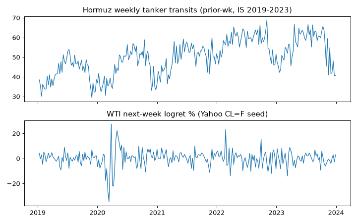

# ALT-20260907-18 run-20260907 — Hormuz tanker transit check (IS only)

실행시각(KST): 2026-09-07 16:00 · 실행자: joint-hunt (Finance) · 코드: research/notebooks/hunt-20260907/analyze_wti_checks.py
입력: research/gathering/raw/ALT-20260907-18/20260907T063658Z/hormuz.json (2799d, 2019-01-01~2026-08-30)
WTI: research/data/clf-daily-2015-2026.csv (committed seed) · 산출: research/data/processed/hunt-20260907/ALT-20260907-18_panel.csv (gitignored)

## 가정 (assumptions)

- 주간 평균 n_tanker, 전주값 사용(화요일 공개 가정 보수 +1주 시프트).
- PortWatch AIS 과소집계(GPS 교란·spoofing·going-dark) 구간도 제외하지 않고 포함. 결측 0건.
- 2020-04 선물 음수 주간의 로그수익률 NaN은 쌍별 제외.

## reconciled stats (IS 2019-2023, weekly)

- Hormuz prior-wk vs WTI next-wk logret: Pearson +0.051, Spearman +0.003, n=260.
- Placebo Suez prior-wk 동일 타깃: Pearson +0.039, Spearman +0.018, n=260.
- Lag curve (k+, 지수 선행): k=+1 +0.053, +2 +0.045, +4 +0.027. k- (WTI 선행): -4 +0.058, -2 +0.072, -1 +0.029.
- OOS: NOT_OPENED.

## 시나리오·강건성 노트

1. 전 구간 |r|<0.08이며 placebo와 동급. 방향 선행 주장 불가.
2. Lag 양쪽이 전부 ≈0이므로 "WTI가 통과량을 이끈다"는 역주장도 불가. 무관계 판정 유지.
3. 다음에 살릴 길은 상관 곡선이 아니라 외생 사건창(통과 급감 주 전후 RV)이며, 사건 목록 사전고정이 조건.

## 주장 범위

- 주장 가능: IS 주간 패널에서 Hormuz 탱커 통과량과 다음 주 WTI 수익률은 사실상 무관계.
- 주장 불가: 인과, 사건 예측, OOS 일반화, 일별 선행성.

