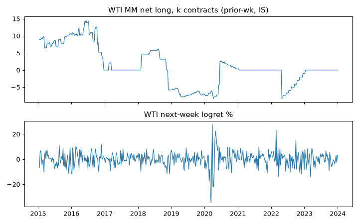

# ALT-20260907-20 run-20260907 — CFTC WTI MM positioning check (IS only)

실행시각(KST): 2026-09-07 16:00 · 실행자: joint-hunt (Finance) · 코드: research/notebooks/hunt-20260907/analyze_wti_checks.py
입력: research/gathering/raw/ALT-20260907-20/20260907T063658Z/fut_disagg_txt_2015~2023.zip (NYMEX 06765A WTI Financial 추출)
WTI: research/data/clf-daily-2015-2026.csv · 산출: research/data/processed/hunt-20260907/ALT-20260907-20_panel.csv (gitignored)

## 가정

- 화요일 포지션·금요일 공개 → 전주값 사용. 주간 금요일 WTI 종가 기준 다음 주 수익률.
- Managed Money 순매수(level)와 주간 변화(change) 2변형만 사전 고정. 다른 트레이더 구분 탐색 없음.

## reconciled stats (IS 2015-2023, weekly)

- Level vs next-wk logret: Pearson +0.025, Spearman +0.008, n=468.
- Change vs next-wk logret: Pearson -0.011, Spearman -0.011, n=467.
- OOS: NOT_OPENED.

## 시나리오·강건성 노트

1. Level·변화 모두 0 근처. 포지셔닝이 다음 주 방향을 이끈다는 증거 없음.
2. 시도 family는 2변형이며 둘 다 null이므로 다중검정 보정 이슈 없음(발견 없음).
3. 다음 변형은 방향이 아니라 변동성 타깃(RV5) 또는 극단 포지션 사건창이며, 새 사전고정이 필요.

## 주장 범위

- 주장 가능: IS에서 MM 순매수는 다음 주 WTI 방향과 무관계.
- 주장 불가: 변동성·베이시스·롤 수익률에 대한 주장, 인과.

