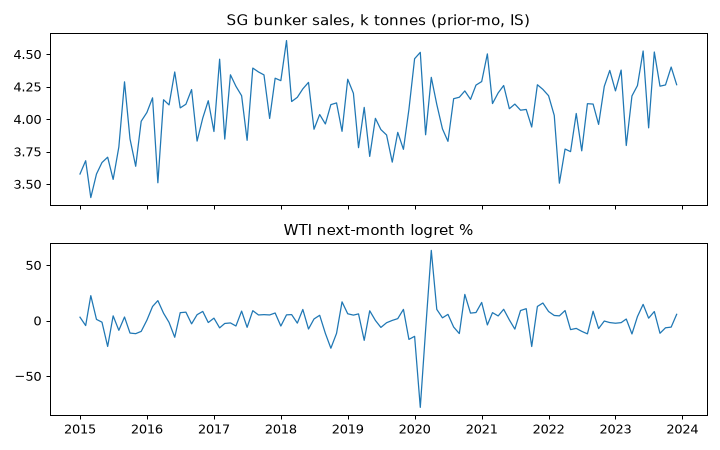

# ALT-20260907-21 run-20260907 — Singapore bunker sales check (IS only)

실행시각(KST): 2026-09-07 16:00 · 실행자: joint-hunt (Finance) · 코드: research/notebooks/hunt-20260907/analyze_wti_checks.py
입력: research/gathering/raw/ALT-20260907-21/20260907T063658Z/bunker_sales.csv (6064행, 1995-01~)
WTI: research/data/clf-daily-2015-2026.csv · 산출: research/data/processed/hunt-20260907/ALT-20260907-21_panel.csv (gitignored)

## 가정

- 전 유종 합산 월간 총량, 전월값 사용(월간 파일 익월 공개 가정 +1개월 시프트).
- 빈티지 미복원(current-vintage). Bio-blend 등 신규 유종 추가로 분모가 바뀌는 구간 존재 가능.

## reconciled stats (IS 2015-2023, monthly)

- Level vs next-mo logret: Pearson -0.043, Spearman +0.062, n=108.
- YoY(계절 통제) vs next-mo logret: Pearson +0.032, Spearman +0.002, n=139.
- OOS: NOT_OPENED.

## 시나리오·강건성 노트

1. Level과 YoY가 부호·크기 모두 0 근처에서 불일치. 수요 선행 증거 없음.
2. 월간 n=108으로 검정력 낮음. 부호 반전이 아니라 전 구간 null이므로 PARK(검정력 부족이 아니라 효과 부재 패턴).
3. 다음 길은 해운 사이클(운임·선복) 통제 후 잔차 검정이며, 통제 변수 확보가 조건.

## 주장 범위

- 주장 가능: 월간 SG 벙커 총량과 다음 달 WTI 방향은 IS에서 무관계.
- 주장 불가: 해운 수요 자체의 방향, 싱가포르 외 항만 일반화.

