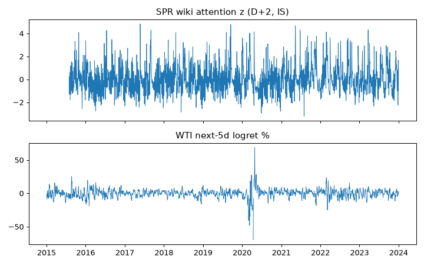

# ALT-20260907-23 run-20260907 — Wiki attention check (IS only, as-of NOT PROVEN)

실행시각(KST): 2026-09-07 16:00 · 실행자: joint-hunt (Finance) · 코드: research/notebooks/hunt-20260907/analyze_wti_checks.py
입력: research/gathering/raw/ALT-20260907-23/20260907T063658Z/cushing.json·spr.json·pizza_placebo.json (각 3106일, 2015-07-01~2023-12-31)
WTI: research/data/clf-daily-2015-2026.csv · 산출: research/data/processed/hunt-20260907/ALT-20260907-23_panel.csv (gitignored)

## 가정

- log-views 30일 중앙값 기준 z, 회고 D+2 시프트. **당시 빈티지 영수증 없음 → NOT_PROVEN as-of-safe**.
- 타깃: WTI next-5d logret. Placebo: Pizza 문서(등록 시 고정).

## reconciled stats (IS 2015-07~2023-12, daily)

- Cushing z vs fwd5: Pearson -0.004, Spearman -0.006, n=2114.
- SPR z vs fwd5: Pearson -0.031, Spearman -0.007, n=2114.
- Pizza placebo vs fwd5: Pearson -0.003, Spearman -0.018, n=2114.
- SPR lag curve: k=-5 -0.048, -1 +0.022, 0 +0.023, +1 -0.036, +2 -0.048, +5 +0.010.
- OOS: NOT_OPENED.

## 시나리오·강건성 노트

1. 세 시리즈 전부 0 근처, placebo와 구분 불가. 관심도 선행 증거 없음.
2. Lag 양방향이 전부 |r|<0.05. "관심이 변동성을 앞선다"는 주장도 "WTI가 관심을 끈다"는 주장도 불가.
3. as-of 미증명이므로 E2 유지. 빈티지 영수증 확보 전에는 지수 승격 금지(049W/050W 사후서사 전례).

## 주장 범위

- 주장 가능: 회고 정렬 하에서 세 관심도 시계열과 WTI 5일 수익률은 무관계.
- 주장 불가: 실시간 선행성, 변동성 타깃 주장, OOS 일반화.

