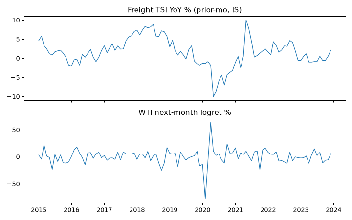

# ALT-20260907-24 run-20260907 — US freight TSI check (IS only)

실행시각(KST): 2026-09-07 16:10 · 실행자: joint-hunt (Finance) · 코드: research/notebooks/hunt-20260907/analyze_wti_checks.py
입력: research/gathering/raw/ALT-20260907-24/20260907T063658Z/TSIFRGHT.csv (2000-01~2026-06 월간)
WTI: research/data/clf-daily-2015-2026.csv · 산출: research/data/processed/hunt-20260907/ALT-20260907-24_panel.csv (gitignored)

## 가정

- BTS Freight TSI YoY, 전월값 사용. current-vintage(개정 반영) 한계 명시.
- DCOILWTICO는 현물 참고용으로만 수집, WTI 타깃은 Yahoo CL=F 유지.

## reconciled stats (IS 2015-2023, monthly)

- TSI YoY vs next-mo logret: Pearson -0.016, Spearman +0.007, n=108.
- OOS: NOT_OPENED.

## 시나리오·강건성 노트

1. 단일 변형 null. 육상 화물은 수요 동행지표이지 WTI 선행지표가 아니라는 사전과 일치.
2. 월간 n=108. 효과 부재 패턴이므로 표본 탓으로 돌리지 않음.

## 주장 범위

- 주장 가능: IS에서 화물 TSI YoY와 다음 달 WTI 방향은 무관계.
- 주장 불가: 실물 수요 자체의 방향, 분기·연간 horizon 주장.

