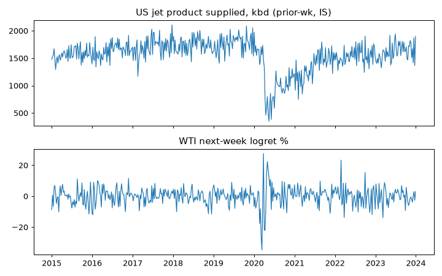

# ALT-20260907-25 run-20260907 — EIA jet product supplied check (IS only)

실행시각(KST): 2026-09-07 16:00 · 실행자: joint-hunt (Finance) · 코드: research/notebooks/hunt-20260907/analyze_wti_checks.py
입력: research/gathering/raw/ALT-20260907-25/20260907T063658Z/jet_weekly.xls (Data 1 시트, 최신 2026-08-28)
WTI: research/data/clf-daily-2015-2026.csv · 산출: research/data/processed/hunt-20260907/ALT-20260907-25_panel.csv (gitignored)

## 가정

- 주간 제트유 product supplied(kbd) 전주값 사용(EIA 주간 +5일 보수).
- API 키 없는 dnav XLS 경로. 빈티지 미복원.

## reconciled stats (IS, weekly)

- Jet prior-wk vs next-wk logret: Pearson -0.071, Spearman -0.021, n=470.
- OOS: NOT_OPENED.

## 시나리오·강건성 노트

1. Pearson -0.07은 Spearman -0.02와 괴리. 소수 극단 주(COVID 붕괴·반등)가 끄는 수준 차이이며 방향 주장 불가.
2. 항공 수요는 여행 서사지, 정제·원유 수급 서사가 아님. RBOB/제트 스프레드 분리 없이는 WTI 연결 약함.
3. 다음 길은 COVID 구간 제외 민감도 + 계절 조정이며, 새 사전고정이 필요.

## 주장 범위

- 주장 가능: IS 주간 패널에서 제트 공급량과 다음 주 WTI 방향은 무관계.
- 주장 불가: 항공유·RBOB 크랙 주장, COVID 구간 일반화.

