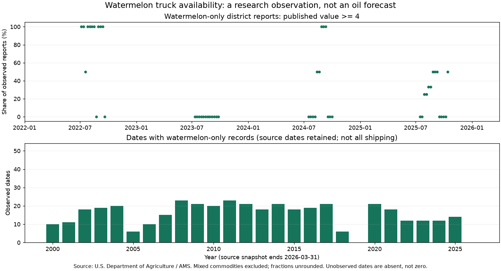

# 수박 출하지 냉장차 가용성 — 실제 주간 입력 확보

판정: **관측 구성 E2 / PARK / WTI·HO 관계 NOT_RUN**. 성찬님 기존 [085](../../../factors/085-watermelon-reefer-squeeze-index/README.md)의 주간 본입력 후속이며 새 후보 발견으로 세지 않는다. [후보 카드](../../../candidates/ALT-20260907-36.md).



위 점은 해당 날짜에 보고된 수박 단독 출하지의 동등 가중 비중이다. **분모는 매번 바뀐다.** 전국 트럭 부족률·수박 출하량·디젤 판매량이 아니다. 아래 그림의 0은 해당 연도에 선택된 행이 없다는 뜻이며 활동 0이 아니다. [연도별 커버리지](yearly-coverage.csv) · [전체 수치·해시](quality.json).

## 출처와 접근

- [USDA AMS 공식 목록](https://www.ams.usda.gov/services/transportation-analysis/agricultural-refrigerated-truck-quarterly-datasets)의 Weekly Truck Availability by Origin and Commodity 파일을 사용했다. 제공자는 출하지·상품별 주간 spot-market 가용성으로 설명하고, 1=Surplus부터 5=Shortage까지의 척도를 안내한다.
- [직접 XLSX](https://www.ams.usda.gov/sites/default/files/media/WeeklyTruckAvailabilitybyOriginandCommodity.xlsx): 키 없는 GET 200. 예전 API 차단 기록을 지우지 않고, 별도 공개 파일 경로로 해소했다.
- [USDA Digital Rights and Copyright](https://www.usda.gov/about-usda/policies-and-links): 대부분의 USDA 정보는 public domain이며 표기된 예외를 별도로 확인하도록 안내한다. 이번 공식 통계와 파일에서 별도 제3자 제한 표기를 발견하지 못했다. 원본은 로컬 보존하고 작은 파생표·그림에 U.S. Department of Agriculture 출처를 붙인다. 기관의 보증을 뜻하지 않는다. 확인일 2026-09-08.

## 이번 구성 명세 — 관측용 v1

사전등록된 예측 모형이 아니다. 파일 구조를 본 뒤 정한 **기술적 관측 집계**이며 가격을 보며 선택하지 않았다.

1. `Date`, `district`, `Commodities`, `Availability` 네 열을 검사한다. 원래 Date를 보존하며 공개일·시간대로 번역하지 않는다. 화요일 외 수박 행 3건도 이동하지 않는다.
2. 품목명의 대소문자·양끝 공백·끝 마침표를 정리한 뒤 `WATERMELON` 또는 `WATERMELONS`만 선택한다. 수박을 포함해도 다른 작물과 섞인 행은 제외한다. district 이름을 합치거나 전국 대표 지역으로 간주하지 않는다.
3. 날짜 d의 지표 = `100 × (Availability >= 4인 선택 행 수) / (그 날짜 선택 행 수)`. 물동량 가중치 없음. 1~5 사이 소수값을 반올림하지 않는다. 소수값의 생성 방식은 **미확인**이므로 이 비율을 원보고서의 '부족 판정 빈도'로 단정하지 않는다.
4. 분모 0인 날짜는 생성하지 않는다. 그림은 점만 표시하고 미관측 구간을 연결하지 않는다. 원안의 52주 z-score는 **NOT_CONSTRUCTED**이며 긴 빈 구간을 0으로 채워 만들지 않는다.

## 대사 결과 — repo empirical only

| 항목 | 실측 |
| --- | ---: |
| 원본 전체 행 | 33,339 |
| 수박 단독 / 혼합 수박 제외 / 기타 제외 | 518 / 1,009 / 31,812 |
| 분할 대사 | 518 + 1,009 + 31,812 = 33,339 |
| 수박 날짜 / 서로 다른 district 표기 | 409 / 19 |
| 수박 값 >=4 / 소수값 | 140 / 38 |
| 빈 셀 / 중복 원본 키 / 수박 날짜·district 중복 | 0 / 0 / 0 |
| 분모 2 이상 날짜 | 77 / 409 |
| 원천 전체 Date 범위 | 2000-01-04 ~ 2026-03-31 |
| 수박 단독 Date 범위 | 2000-05-09 ~ 2025-10-14 |

518행 중 332행은 단일 출하지 날짜에 속한다. 즉 409개 날짜 가운데 **332개 날짜의 분모가 1**이다. 점이 0%·100%에 몰리는 것을 큰 경제 충격으로 해석하면 안 된다. 2019년과 2026년 1분기에는 수박 단독 행이 없으며 그 이유는 미확인이다. 계절·명칭·보고 범위 문제를 분리해야 한다.

마지막 수박 날짜 2025-10-14의 원단위 대사:

| district | 원자료값 | 값 >=4 |
| --- | ---: | --- |
| DELAWARE, MARYLAND AND EASTERN SHORE VIRGINIA | 3.1666666666666665 | 아니오 |
| SOUTHWEST INDIANA AND SOUTHEAST ILLINOIS | 4 | 예 |

따라서 **1/2 = 50%**다. 수집 시각은 2026-09-08T06:50:43.896563+00:00이고 HTTP Last-Modified는 2026-05-14T17:32:47Z다. Last-Modified는 파일 메타데이터이며 각 행의 최초 공개일이 아니다. '오늘의 수박 트럭 상황'으로 표시할 수 없다.

## 두 가지 민감도 확인

- **소수값을 정수만 남기는 경우:** 관측 날짜 6개가 사라지고, 양쪽에서 비교 가능한 날짜 11개의 비중이 바뀐다. 최대 차이는 75%p다. 이 처리는 최근 자료의 분모를 바꾸므로 채택하지 않는다. 값이 왜 소수인지 원보고서와 대조해야 한다.
- **최소 분모를 2개 출하지로 요구하는 경우:** 409개 중 77개 날짜만 남는다. 단일 출하지와 지역 구성 변화에 매우 민감한 관측이다. 이 진단은 새 최적화·유의성 검정이 아니다.

## 검정 경계와 다음 행동

WTI·HO 상관, 시차, 사건, placebo는 **NOT_RUN**. 날짜별 최초 공개시각·개정 이력과 소수 집계 정의가 없어 시점 안전성을 입증하지 못했다. 기존 085의 분기 HO 검정 결과·기각 판단은 유지한다. 이번에 2024~2026 원천 값도 확인했으므로 해당 데이터 노출은 **SEEN**이고 미열람 OOS로 소급하지 않는다.

**손성찬(배정 제안), 2026-09-09:** USDA 원보고서와 같은 출하지·날짜를 대조해 소수값이 만들어지는 방식과 Date의 의미를 확인한다. Noah는 원본 영수증·수집기·관측표를 유지한다. 정의/공개시점이 풀린 뒤에만 2015~2023 안의 별도 검정 명세를 정한다. WTI 목표와 기존 HO 목표는 각각 구분한다.

## 재현

저장소 루트, 기존 환경(Python과 matplotlib은 research 의존성). 새 라이브러리·키 없음. `assert` 검사를 사용하므로 `-O`를 쓰지 않는다.

```bash
research/.venv/bin/python research/notebooks/ALT-20260907-36/collect.py --self-test
# 공식 파일을 새 UTC 폴더에 수집하고 관측표·그림 생성
research/.venv/bin/python research/notebooks/ALT-20260907-36/collect.py --collect
# 이 빈티지 재생: 기존 파일은 같은 바이트일 때만 보존
research/.venv/bin/python research/notebooks/ALT-20260907-36/collect.py --run 20260908T065043Z
```

- 원본: `research/gathering/raw/ALT-20260907-36/20260908T065043Z/weekly.xlsx`, `request.json` (gitignored).
- 파생: `research/data/processed/ALT-20260907-36/20260908T065043Z/watermelon.csv`, `weekly.csv` (gitignored). weekly.csv에는 각 점의 실제 분모·분자가 있다.
- 코드: `research/notebooks/ALT-20260907-36/collect.py`. 이 폴더 `execution-*.json`에 실행시각·명령·Python·Git revision/dirty·코드 해시 기록.
- 원본 SHA-256: `d223c27bdbcb610887379cb0daac1af50fb5772e2edca7399606723ad430e27b`; 모든 파생물 해시는 quality.json 참조.
- 첫 경로 probe `20260908T064407Z`와 최종 수집은 같은 원본 SHA였으며 로컬에 둘 다 보존했다. 초기 probe는 Python 표준 urllib, 최종 수집은 위 `--collect`를 실제 실행했다.
- 공유 체크아웃에서 Agency의 별도 원본 계산·최종 run 재생·파생4개 해시 대조는 PASS이며 사람 팀원의 동일 빈티지 인계·재현은 미검증이다. 공식 파일이 바뀌면 같은 URL 재다운로드가 같은 빈티지를 보장하지 않는다.
