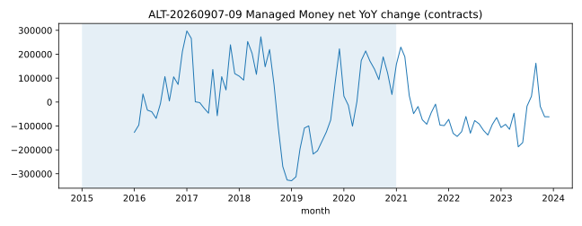
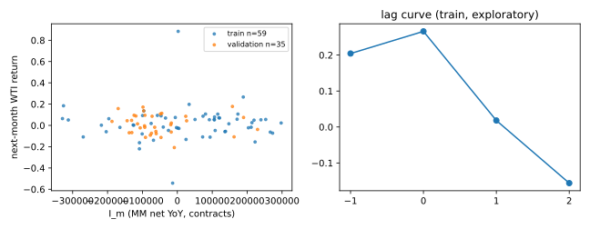

# ALT-20260907-39 — COT WTI 순포지셔닝 활동

> 2026-09-07 통합: 보관본 18–25를 39–46으로 이관했습니다. 이전 실행 영수증·그림·본문의 짧은 번호는 당시 기록입니다. [번호·해시 대응표](../../reports/2026-09-07-research-convergence.md)를 참조하세요.

**PARK — 실제 시계열 구성·탐색 검정 완료, 시점 안전성 미검증.** 숫자는 모두 `repo empirical only`이며 예측 알파·인과·거래 성과를 뜻하지 않는다. [실행 영수증](20260907T065704Z/receipt.json)과 [전체 검정표](20260907T065704Z/tests.csv)가 정본이다.

## 출처와 지수

[CFTC COT 설명서](https://www.cftc.gov/MarketReports/CommitmentsofTraders/ExplanatoryNotes/index.htm)는 Disaggregated 보고서의 거래자 분류·화요일 정산·금요일 공개를 정의한다. 본 후보는 상품코드 **067651**의 주간 Managed Money 순포지션(`long-short`, 선물만, 스프레드 제외)이다. 동일 코드는 2015~2021년 `CRUDE OIL, LIGHT SWEET - NYMEX`, 2022년 혼재, 2023년 `WTI-PHYSICAL - NYMEX`로 명명됐다. 이름이 아니라 코드로 추적했고 연도별 관측 명칭을 영수증에 보존했다. 순포지셔닝은 물리 수요량이 아니며 WTI와의 연결은 과밀·반전 지점의 변동성 단서라는 **검정 가설**이다.

월별 마지막 화요일 `NET_m`을 취하고 `I_m = NET_m - NET_(m-12)`(계약 수 YoY 변화)를 계산한다. 수준값이 비정상적이므로 로그 비율을 쓰지 않았다. 해당 월 화요일 관측이 없으면 해당 월을 제외하고 이월·보간은 없다.

원자료는 2015-01-06~2023-12-26, 469개 화요일. 신호는 2016-01~2023-12, 96개월. [월별 표](../../data/processed/ALT-20260907-39/20260907T065704Z/monthly.csv)는 로컬 gitignored이며 hash는 영수증에 있다. 수집 때 무명 스크립트 UA가 연별 zip에서 403을 받았고, 식별용 연구 UA로 재요청해 9개 연도 200을 받았다. 브라우저 사칭·프록시·미러를 쓰지 않았고 방법은 manifest에 기록했다.

Finance가 운영 코드를 import하지 않고 [독립 재계산](20260907T065704Z/independent-finance-review.json)했다. 주 검정 train n=59 r=+0.018116, validation n=35 r=-0.065098이 stdlib 재계산과 소수점 이하로 일치해 PASS다.

## WTI와 관계

Yahoo `CL=F`, `download_ohlcv(start="2015-01-01", end="2024-01-01")`, `auto_adjust=True`, 1일봉을 이용했다. 2,262행(2015-01-02~2023-12-29). 월초 규약으로 월말 마지막 종가 `P_m`와 `r_(m+1)=P_(m+1)/P_m-1`를 사용한다. 주 검정은 `corr(I_m,r_(m+1))`. 월말 종가가 비양수·결측인 쌍은 제외하며 이번 run에서 제외된 쌍은 없다. 2015-01은 신호 warmup 때문에 존재하지 않는다.

| 사전 지정 변형 | 학습 2015–2020 n / r | 내부 검증 2021–2023 n / r |
| --- | --- | --- |
| 주 검정, 다음 달 수익률 | 59 / 0.018116 | 35 / -0.065098 |
| 다음 달 달러 변화 | 59 / 0.027031 | 35 / -0.112012 |
| 2020 분자·2021 분모 제외 | 48 / -0.057755 | 23 / -0.386722 (24쌍 미만, 표본 부족) |
| 신호 이용을 한 달 더 늦춘 가정 | 58 / -0.156115 | 34 / -0.055476 |
| split 안에서 12개월 이동 placebo | 47 / 0.095836 | 35 / 0.206688 |
| WTI 당월 수익률만의 기준 관계 | 71 / 0.099787 | 35 / 0.033889 |

각 split에서 신호 관측월과 타깃 시작·끝이 경계를 넘으면 제거했다. 시차 -1/0/+1/+2 전체는 [tests.csv](20260907T065704Z/tests.csv)에 있다. `k>0`은 활동이 이후 WTI 변화보다 앞선다는 정렬 정의일 뿐 실제 공개일 선행의 증거가 아니다. 지연 가정은 주 검정의 +2 시차와 같은 관측쌍이므로 독립 증거로 세지 않는다. 기준 WTI 행은 활동 결측에 맞춘 표본이 아니므로 r 크기를 직접 성능 비교하면 안 된다.

읽을 수 있는 패턴은 하나다. 동행(lag0: +0.266/+0.345)과 후행(lag-1: +0.204/+0.306)이 두 구간에서 같은 부호로 재현되고, 선행(lag+1)은 0 근처에서 부호가 없다. 포지셔닝이 가격을 이끈다는 증거가 아니라 가격을 뒤따른다는 기술 통계이며 인과·수익 주장의 근거가 아니다. 검증 placebo(+0.207)가 주 검정(-0.065)과 같은 자릿수이므로 방향 주장도 금지한다. p-value·신뢰구간·다중검정 발견 주장은 하지 않으며 `inference NOT_PROVEN`이다. 별도 외생 사건 목록을 등록하지 않아 사건 연구는 `NOT_RUN`이다.

## 한계, 다음 행동, 재현

- 최신 스냅샷이 아니라 연별 역사 zip이지만 각 행별 `available_at`(당시 금요일 공개 시각) 빈티지를 복원하지 않았다. 탐색 분석이며 **NOT_PROVEN as-of-safe**. 한 달 지연 시나리오가 빈티지 누수를 해소하지 않는다.
- 2024+ 가격·활동값은 수집/검정에 쓰지 않았다. 기존 저장소의 OOS 노출은 UNKNOWN이며 이번 검증 구간은 내부 검증이다. E4·새 미열람 OOS 주장 없음.
- 선행 관계가 없으므로 과밀 long-short 반전 지점의 변동성 조건부 분석은 다음 단계 가설로만 남긴다. 직접 수요량으로 변환하는 모형은 만들지 않았다.
- 손성찬: 2026-09-08까지 CFTC 과거 보고서 발행 일정과 개정 이력으로 as-of 패널 가능성을 판단. 입수할 수 없으면 PARK 유지, 발표에서는 구성 가능성과 선행 부재를 보여준다.
- [동결 계획](plan-v1.json), [실행기](../../notebooks/ALT-20260907-39/hunt.py). 수집 중 계약명 변경(067651 동일 코드)을 확인해 코드 추적으로 바로잡았다. WTI 관계 결과를 본 뒤 변형을 추가하지 않았다.

현재 증거는 재현 가능한 구성·기술 통계다. 독립 Finance 재계산은 주 검정 n/r을 대조해 PASS였다. 전체 후보 주장 검토는 상위 연구 검토를 따른다. 같은 빈티지의 팀 재현은 로컬 원문 공유 또는 허용된 재취득 확인 전까지 미검증이다.
