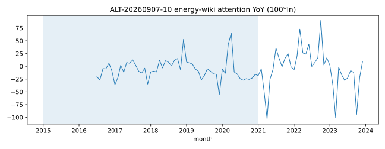
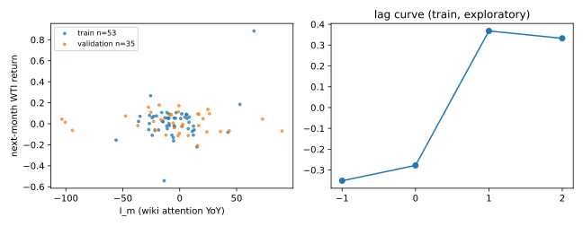

# ALT-20260907-40 — 에너지 문서 관심도 활동

> 2026-09-07 통합: 보관본 18–25를 39–46으로 이관했습니다. 이전 실행 영수증·그림·본문의 짧은 번호는 당시 기록입니다. [번호·해시 대응표](../../reports/2026-09-07-research-convergence.md)를 참조하세요.

**PARK — 실제 시계열 구성·탐색 검정 완료, 시점 안전성 미검증.** 숫자는 모두 `repo empirical only`이며 예측 알파·인과·거래 성과를 뜻하지 않는다. [실행 영수증](20260907T065722Z/receipt.json)과 [전체 검정표](20260907T065722Z/tests.csv)가 정본이다.

## 출처와 지수

[Wikimedia Pageviews API](https://wikimedia.org/api/rest_v1/)는 영문 위키 문서의 일별 조회수를 제공한다. 본 후보는 `OPEC`·`Petroleum`·`Shale_gas` 세 문서 일별 조회수 합계의 월평균 `A_m`와 `I_m=100 ln(A_m/A_(m-12))`다. 문서 집합은 049W·050W·052W·054·063의 지정학·음모론 문서와 겹치지 않는다. 조회수는 연료 소비가 아니며 WTI와의 연결은 서사 관심의 비교 기준이라는 **검정 가설**이다.

셋 중 하나라도 해당 월 관측일수가 15일 미만이면 해당 월을 제외하고 결측일 0 대체는 없다. API 시작일(2015-07-01) 때문에 신호는 2016-07~2023-12, 90개월이다. 원자료는 2015-07-01~2023-12-31, 3,106일. [월별 표](../../data/processed/ALT-20260907-40/20260907T065722Z/monthly.csv)는 로컬 gitignored이며 hash는 영수증에 있다. 연락가능 User-Agent로 연도별 27개 청크를 수집했고 빈 응답·2024+ 혼입은 없었다.

Finance가 운영 코드를 import하지 않고 [독립 재계산](20260907T065722Z/independent-finance-review.json)했다. 주 검정 train n=53 r=+0.367922, validation n=35 r=-0.125537이 stdlib 재계산과 소수점 이하로 일치해 PASS다.

## WTI와 관계

Yahoo `CL=F`, `download_ohlcv(start="2015-01-01", end="2024-01-01")`, `auto_adjust=True`, 1일봉을 이용했다. 2,262행(2015-01-02~2023-12-29). 월초 규약으로 월말 마지막 종가 `P_m`와 `r_(m+1)=P_(m+1)/P_m-1`를 사용한다. 주 검정은 `corr(I_m,r_(m+1))`. 월말 종가가 비양수·결측인 쌍은 제외하며 이번 run에서 제외된 쌍은 없다.

| 사전 지정 변형 | 학습 2015–2020 n / r | 내부 검증 2021–2023 n / r |
| --- | --- | --- |
| 주 검정, 다음 달 수익률 | 53 / 0.367922 | 35 / -0.125537 |
| 다음 달 달러 변화 | 53 / 0.214234 | 35 / -0.112092 |
| 2020 분자·2021 분모 제외 | 42 / 0.140037 | 23 / -0.044130 (24쌍 미만, 표본 부족) |
| 신호 이용을 한 달 더 늦춘 가정 | 52 / 0.332442 | 34 / 0.093231 |
| split 안에서 12개월 이동 placebo | 41 / -0.244480 | 35 / -0.178231 |
| WTI 당월 수익률만의 기준 관계 | 71 / 0.099787 | 35 / 0.033889 |

각 split에서 신호 관측월과 타깃 시작·끝이 경계를 넘으면 제거했다. 시차 -1/0/+1/+2 전체는 [tests.csv](20260907T065722Z/tests.csv)에 있다. `k>0`은 활동이 이후 WTI 변화보다 앞선다는 정렬 정의일 뿐 실제 공개일 선행의 증거가 아니다. 지연 가정은 주 검정의 +2 시차와 같은 관측쌍이므로 독립 증거로 세지 않는다. 기준 WTI 행은 활동 결측에 맞춘 표본이 아니므로 r 크기를 직접 성능 비교하면 안 된다.

읽을 수 있는 패턴은 비재현이다. 학습 lag+1 +0.368이 검증에서 -0.126으로 부호가 바뀌고, 2020 제외 시 학습 값은 +0.140까지 낮아진다. 학습 구간의 양의 관계는 2020에 민감하며 안정된 선행이 아니다. 검증 placebo(-0.178)가 주 검정(-0.126)과 같은 자릿수이므로 방향 주장도 금지한다. p-value·신뢰구간·다중검정 발견 주장은 하지 않으며 `inference NOT_PROVEN`이다. 별도 외생 사건 목록을 등록하지 않아 사건 연구는 `NOT_RUN`이다.

## 한계, 다음 행동, 재현

- 일별 조회수를 D+1 확정값으로 가정했고 당시 로드 시점 빈티지를 복원하지 않았다. 탐색 분석이며 **NOT_PROVEN as-of-safe**. 한 달 지연 시나리오가 빈티지 누수를 해소하지 않는다.
- 2024+ 가격·활동값은 수집/검정에 쓰지 않았다. 기존 저장소의 OOS 노출은 UNKNOWN이며 이번 검증 구간은 내부 검증이다. E4·새 미열람 OOS 주장 없음.
- 학습 구간의 양의 관계가 내부 검증에서 유지되지 않았으므로 관심도 지수의 선행 사용은 중단하고 서사 비교 기준으로만 둔다. GPR 통제 후 상관도 인과로 부르지 않는다.
- 오태환: 2026-09-08까지 Wikimedia 빈티지·갱신 정책으로 as-of 패널 가능성을 판단. 입수할 수 없으면 PARK 유지, 발표에서는 구성 가능성과 부호 반전을 보여준다.
- [동결 계획](plan-v1.json), [실행기](../../notebooks/ALT-20260907-40/hunt.py). WTI 관계 결과를 본 뒤 변형을 추가하지 않았다.

현재 증거는 재현 가능한 구성·기술 통계다. 독립 Finance 재계산은 주 검정 n/r을 대조해 PASS였다. 전체 후보 주장 검토는 상위 연구 검토를 따른다. 같은 빈티지의 팀 재현은 로컬 원문 공유 또는 허용된 재취득 확인 전까지 미검증이다.
