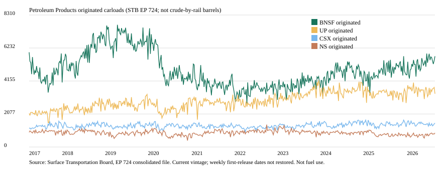

# STB Petroleum Products originated — 주간 입력 확보

판정: **관측 구성 E2 / KEEP / WTI 관계 NOT_RUN**. 성찬 기존 43의 주간 파일 경로·유종 정의 후속이며 새 후보 발견으로 세지 않는다. [후보 카드](../../../candidates/ALT-20260907-43.md).



위 선은 BNSF·UP·CSX·NS의 주간 originated 차종이다. **산업 합계가 아니다.** 원유 배럴·연료 소비량·AAR 주간 RTI가 아니다. [연도별 커버리지](yearly-coverage.csv) · [전체 수치·해시](quality.json).

## 출처와 접근

- [STB Rail Service Data](https://www.stb.gov/reports-data/rail-service-data/)의 All Class I 통합표를 사용했다. 시트명 Sheet1, 측정명 `Weekly Carloads By 22 Commodity Categories`, 유종 `Petroleum Products`, 흐름 Originated/Received/Total.
- [직접 XLSX](https://www.stb.gov/wp-content/uploads/files/rsir/All%20Class%201%20Railroads/EP724%20Consolidated%20Data%20through%202026-09-02.xlsx): 키 없는 GET 200, 7,658,204 bytes, SHA-256 `0e103085f77052e9f03b03dcd9184a2e9db7b5e459d0a2f8d85814813b206d6f`. Last-Modified Thu, 03 Sep 2026 12:44:26 GMT.
- [STB policies-and-notices](https://www.stb.gov/policies-and-notices/): 공공 서비스 자료, 무보증. Waybill 기밀 자료가 아니다. 원본은 로컬 보존하고 작은 파생표·그림에 Surface Transportation Board 출처를 붙인다. 기관의 보증을 뜻하지 않는다. privacy-policy URL은 2026-09-09 HTTP 404.
- AAR 주간 PDF는 HEAD 200이지만 표시에 쓰지 않는다.

## 이번 구성 명세 — 관측용

사전등록된 예측 모형이 아니다. 파일 구조를 본 뒤 정한 **기술적 관측 집계**이며 가격을 보며 선택하지 않았다.

1. 날짜 헤더는 Excel 시리얼이며 수요일만, 간격 7일, 열 G부터 연속이다. 파일명 연도를 전체 연간 자료로 가정하지 않는다.
2. 유종 행만 읽는다. Category No. 11, Sub-Category i. 비료 lookalike 행은 버린다.
3. 표시 분모는 미국 4사 originated. CN·CP·KCS·CPKC는 표에만 남기고 합치지 않는다. CP 마지막 주 2025-05-07, CPKC 첫 주 2025-05-14.
4. Total이 Originated+Received와 같으면 비교 가능으로 기록한다. 불일치가 있으면 원본을 고치지 않는다. 이번 빈티지는 0값/0주.
5. 공백 문자열은 결측이다. 0으로 바꾸지 않는다. 계획 전년비 로그 지수는 NOT_CONSTRUCTED.

## 대사 결과 — repo empirical only

| 항목 | 실측 |
| --- | ---: |
| 주간 열 / 수요일 | 493 / 전수 |
| 헤더 시작 / 끝 | 2017-03-29 / 2026-09-02 |
| 미국 4사 originated 합 | 4,922,684 |
| BNSF / UP / CSX / NS | 2,381,801 / 1,434,967 / 665,175 / 440,741 |
| 미국 4사 originated 영값 / 소수 | 0 / 0 |
| Total=Orig+Recv 불일치 값 / 주 | 0 / 0 |
| CP·KCS 주 / CPKC 주 | 424 / 69 |
| 2024+ 주 (SEEN) | 140 |

마지막 주 2026-09-02 originated: BNSF 5712, UP 3351, CSX 1504, NS 883. 수집 완료 시각은 2026-09-09T00:34:30.220975+00:00이다. Last-Modified는 파일 메타데이터이며 각 주의 최초 공개일이 아니다.

EIA U.S. Crude Oil by Rail XLS(SHA-256 `b1e54ec13e70cf621c2a00b55ed24e0d93528601ccf90b6e2ede7ef7e8649193`)는 월간 천 배럴이며 이 차트와 같은 자료가 아니다.

## 검정 경계와 다음 행동

WTI 상관, 시차, 사건, placebo는 **NOT_RUN**. 주별 최초 공개시각·개정 이력이 없어 시점 안전성을 입증하지 못했다. 이번에 2024~2026 원천 값도 확인했으므로 해당 데이터 노출은 **SEEN**이고 미열람 OOS로 소급하지 않는다.

**손성찬(배정 제안), 2026-09-15:** 주간 최초 공표일과 개정 여부를 확인한다. Noah는 원본 영수증·수집기·관측표를 유지한다. 정의/공개시점이 풀린 뒤에만 2015~2023 안의 별도 검정 명세를 정한다.

## 재현

저장소 루트, 시스템 python3. matplotlib 없음. 새 라이브러리·키 없음. `assert` 검사를 사용하므로 `-O`를 쓰지 않는다.

```bash
python3 research/notebooks/ALT-20260907-43/collect.py --self-test
python3 research/notebooks/ALT-20260907-43/collect.py --run 20260909T003038Z
```

- 원본: `research/gathering/raw/ALT-20260907-43/20260909T003038Z/ep724-consolidated.xlsx`, `receipts.json` (gitignored). [안내](../../../gathering/raw/ALT-20260907-43/20260909T003038Z/README.md).
- 파생: `research/data/processed/ALT-20260907-43/20260909T003038Z/weekly-originated.csv` (gitignored).
- 코드: `research/notebooks/ALT-20260907-43/collect.py`. 이 폴더 `execution-*.json`에 실행시각·명령·Python·Git revision/dirty·코드 해시 기록.
- 원본 SHA-256: `0e103085f77052e9f03b03dcd9184a2e9db7b5e459d0a2f8d85814813b206d6f`; 파생물 해시는 quality.json 참조.
- 사람 팀원의 동일 빈티지 인계·재현은 미검증이다. 공식 파일이 바뀌면 같은 URL 재다운로드가 같은 빈티지를 보장하지 않는다.
- 로컬 화면·독립 검토: [검토 보고서](../../../../docs/reviews/2026-09-09-stb-petroleum-rail-closeout.md). WTI는 NOT_RUN. git/운영은 그 파일의 단계표를 따른다.
