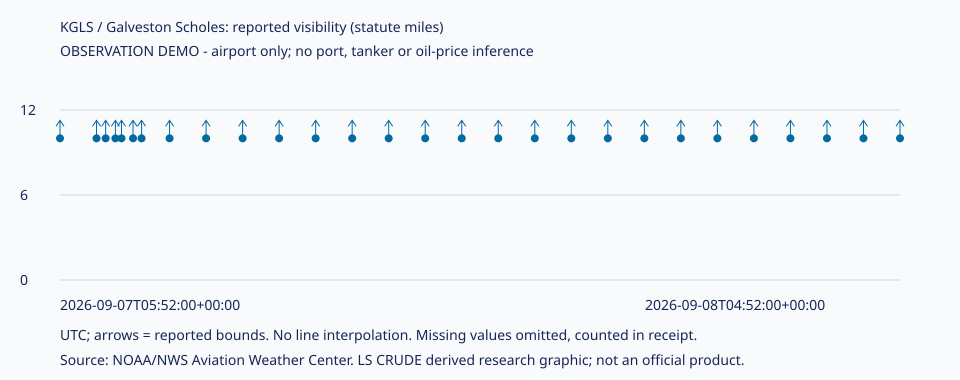

# ALT-20260908-16 — 갤버스턴 공항 시정 관측 시연

**PARK / E2 / WTI NOT_RUN.** 숫자는 모두 [실행 영수증](receipt.json)의 **repo empirical only** 결과다. [관측표](observations.md) · [그림](visibility.svg) · [코드](../../../notebooks/ALT-20260908-16/run.py) · [후보](../../../candidates/ALT-20260908-16.md).



## 실제로 본 것

| 항목 | 결과 |
| --- | --- |
| 수집 | 2026-09-08 05:07:40.574003 UTC / HTTP 200 |
| 원본 요청 | KGLS 단일 관측소, 직전 24h |
| 관측 기간 | 2026-09-07 05:52 ~ 2026-09-08 04:52 UTC |
| 행 대사 | 입력 28 = 채택 28 + 기각 0 |
| 시정 대사 | 채택 28 = 하한표기 28 + 정확값 0 + 결측 0 |
| 관측 시간 | 서로 다른 UTC hour 24, 최대 행 간격 60분 |
| 최신성 | 마지막 관측→수집 15.676분; UTC 날짜 일치 |
| 실제 시정 평균/표준편차 | 계산 불가: 모든 API 값이 10+라 하한 위 변화는 알 수 없음 |
| WTI/운항 제한 관계 | 미검정, 가격·공지 자료 미수집 |

24시간은 요청 범위다. 관측이 매분이라는 뜻도, 24개의 독립 사건이라는 뜻도 아니다. 이 응답에 28개 보고가 있어 사건·날씨가 여러 번 관측될 수 있다. 차트는 점만 표시하고 보간하지 않는다. `10+`를 10으로 놓아 평평한 선이나 변동성 0을 만들지 않았다.

## 계약·가정과 한계

- 공식 [NWS 관측소 안내](https://www.weather.gov/hgx/models)는 KGLS를 Galveston Scholes Field로 식별한다. 공항 시정을 휴스턴 수로나 쿠싱의 시정으로 확대하지 않는다.
- [AWC 자료 설명](https://aviationweather.gov/help/data/#metars)에 따르면 미국 METAR 시정 단위는 statute mile, 보고시각은 UTC이며 특별 보고 SPECI가 존재한다. 공항 시정은 활동량 자체가 아니라 현장 기상 조건이다.
- 단일 역의 `visib` 원표기 → 숫자 경계 + exact/lower_bound/upper_bound/missing 상태. 가중·합성·위험 임계값 없음. `10+`와 P6SM을 하한, M1/4SM을 상한으로 다루는 보수적 parser 정책이다. 실제 응답은 10+만 포함했다; P6SM·분수 검사는 경계 단위검사이며 관측 실적에 포함하지 않았다.
- 결측은 0이 아니며 보간하지 않는다. 비정상 schema·미래 observed/receipt/report·중복 관측은 기각 사유를 기록한다. 수정 보고를 자동 최신선택하지 않는다. `reportTime`은 원천 필드로 보존하며 관측시각/공개시각과 같다고 보지 않는다.
- `receiptTime`은 API 원천의 수신 필드다. 당시 외부 이용 가능 시각이라는 보장은 미확인이다. 보수적으로 이 빈티지는 우리 `retrieved_at` 이후 이용 가능하다. 과거 as-of-safe 미입증.
- 각 행 품질점수 1은 필수 필드 validation 통과, 0.5는 시정 결측이다. 측정 정확도 점수가 아니다. 원본은 불변이며 정제본은 원본 hash로 재생성한다. 삭제·수정 수집 또는 gold 소비계층을 만들지 않은 단발 관측 시연이다.
- 최신 API는 [최대 15일](https://aviationweather.gov/data/api/) 범위를 안내하므로 이 endpoint만으로 2015–2023 검정 표본을 확보할 수 없다. 이번에는 과거원천을 조사하거나 OOS 독립성을 주장하지 않았다.

### 두 가지 민감도 메모

1. **표기 상한 민감도:** 10+를 10으로 대입하면 평균 10/분산 0처럼 보이지만 참 시정의 값·분산은 알 수 없다. 하한 표기만 남기며 corr와 변화율 계산을 금지했다.
2. **보고 빈도 민감도:** SPECI/불규칙 보고가 많아진 날은 행 단순평균이 시간 평균과 다를 수 있다. 이번에는 집계를 하지 않고 원시 관측시각별 점을 유지한다. 시간별 대표값·운영 기준은 향후 별도 사전 명세가 필요하다.

## 재현

저장소 루트에서 Python 3 표준 라이브러리만 사용한다.

```bash
python3 research/notebooks/ALT-20260908-16/run.py --check
# 네트워크 없이 이 빈티지 재현:
python3 research/notebooks/ALT-20260908-16/run.py --raw research/gathering/raw/ALT-20260908-16/20260908T050739Z/metar.json
# 새 24h 빈티지 수집(다른 관측임):
python3 research/notebooks/ALT-20260908-16/run.py
```

원본: [manifest pointer](../../../gathering/raw/ALT-20260908-16/20260908T050739Z/README.md), `metar.json`·`manifest.json`은 gitignored. 정제 CSV: `research/data/processed/ALT-20260908-16/20260908T050739Z/observations.csv`(gitignored). 실제 SHA-256은 receipt.json에 기록했다. 외부 팀원의 동일 원본 재현은 파일 인계 전 미검증; rolling API 재취득은 같은 빈티지를 복원하지 않는다. 오늘의 작은 파생 표/그림은 Git에 보존한다.

권리: [NWS 이용 조건](https://www.weather.gov/disclaimer)을 2026-09-08 확인. 별도 표시 없는 NWS 정보는 합법적 이용을 허용하며 출처·비공식 파생물·비보증을 표시하고 공식 승인처럼 제시하지 않는다. [AWC API 지침](https://aviationweather.gov/data/api/)에 따라 custom User-Agent·단일역 제한 요청; 운영 갱신은 대부분 시간 단위이므로 자동 매분 수집을 만들지 않았다. 최초 HTTP200 접근 probe 1회는 터미널에서 내용 일부만 확인했고 저장하지 않았다. 2분 이상 뒤 위 증거 빈티지를 1회 수집했으며 retry 없음.

## 다음 한 가지

손성찬, 2026-09-15: 공식 Houston–Galveston 통항 제한/해제 공지에서 시각이 있는 사례 1건의 공개·재사용 경로를 확인한다. 확보 전에는 공항→항만 대표성을 주장하지 않는다. Noah는 이 관측 그림의 흥미·이해 가능성을 판단할 수 있지만 제품 편입은 별도 결정이다.
