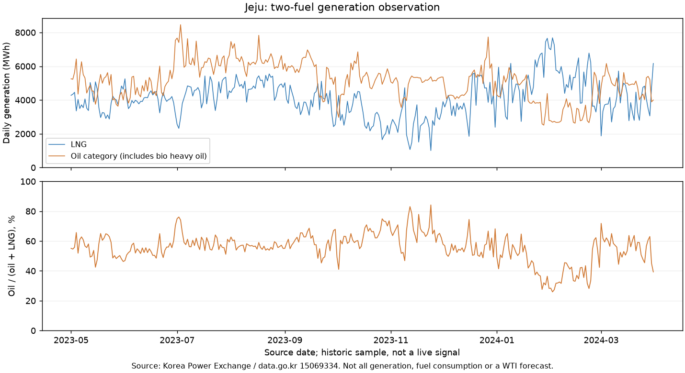

# 제주 LNG·유류 발전 관측 — 080 보조 표본

**COLLECTED / E2 / PARK / WTI 관계 NOT_RUN.** 성찬님 [080 원안](../../../factors/080-korea-fuel-switch-dispatch-alert/README.md)의 제주 보조 관측이다. 전국 연료전환 지수·제주 전체 발전믹스·실시간 경보는 확보하지 않았다. [후보 카드](../../../candidates/ALT-20260908-20.md).



위는 일별 원단위 MWh, 아래는 **유류 / (유류 + LNG)**다. 유류는 바이오중유·중유·경유의 합계로 안내된다. 발전량은 연료 소비량이나 원유 배럴이 아니다. 원천은 [전력거래소 공식 파일](https://www.data.go.kr/data/15069334/fileData.do)과 [메타데이터](https://www.data.go.kr/catalog/15069334/fileData.json). 작은 집계와 그림은 제공기관을 표시해 사용한다. 공식 이용조건은 **무료·이용허락범위 제한 없음**, 확인일 2026-09-08이다. 이 조건을 다른 EPSIS 자료에 전용하지 않았다.

## 무엇을 확보했나 — repo empirical only

| 항목 | 결과 |
| --- | --- |
| 실제 파일 | ZIP 51,362bytes 안의 CP949 CSV 2개; 카탈로그 CSV/1행 표기만으로 형식을 추정하지 않음 |
| 기간 | 2023-05-01 ~ 2024-03-31, 336일 |
| 시간 값 | 연료당8,064개, 합16,128개 |
| 날짜·시간 누락 / 날짜 중복 / 빈 값 / 음수 | 모두0 |
| 실제0값 | LNG130개, 유류0개; 결측으로 바꾸지 않음 |
| LNG 총 발전량 | 1,378,812.390 MWh |
| 유류 범주 총 발전량 | 1,721,806.582 MWh |
| 합계 대사 | 각 시간 합 = 일 합 = 월 합, 두 연료 모두 정확히 일치 |
| 최신 표본일 | 2024-03-31, 현재 관측이 아님 |

최신일 LNG6,164.278 + 유류3,997.953 = **두 연료 합10,162.231 MWh**. 조건부 유류 비중은39.3412922812%다. 분모에는 다른 발전원·연계선 수전 등을 더하지 않았으므로 제주 전체에서의 비중으로 읽으면 안 된다.

[월별 원단위·비중 표](monthly.csv) · [품질·해시 영수증](quality.json). 월별 표는11개월이며 비중은 월간 두 연료 MWh 합계를 분모로 한다.

## 구성 명세와 두 가지 확인

- 원래 `날짜,1,...,24`를 유지한다. 시간 번호의 시작/끝·표준시 정의는 별도로 확인하지 못했으므로 거래시각으로 변환하지 않는다. 두 CSV의 날짜 집합·일별24열·연속 날짜·비음수 유한값을 검사하고 하나라도 빠지면 계산을 중단한다.
- 일별 LNG/유류는24시간 MWh의 합이다. `100 × oil_category / (oil_category + LNG)`만 계산하고, 0분모는 실패로 처리한다. Decimal로 원단위 합계를 대사한다. 표준화·튜닝·52주지수·임계값 탐색은 없다.
- **비중과 절대량:** 335개 전일 비교 중61일은 유류 비중이 상승했으나 유류 발전량은 감소했다. 비중 상승을 유류 소비 증가로 번역하면 안 된다는 실제 반례다.
- **집계 방법:** 월별 합계 기반 비중과 일별 비중 단순평균의 최대 차는0.5060784802%p(2023-11)다. 두 통계를 혼용하지 않는다. 이는 기술적 대사이며 시장 관계 검정이 아니다.
- 바이오중유를 분리할 수 없어 순수 석유 발전량·연료전환량은 **계산 불가**다. 변화를 LNG 부족이나 발전소 고장 때문이라고 단정하지 않는다.

## 시점·검정·다음 행동

공식 메타데이터 등록일2024-04-15·수정일2025-06-12는 개별 시간의 최초 공개시각이 아니다. 이번 수집 완료는2026-09-08T07:34:02.693488+00:00다. 현재 빈티지와 원래 관측 날짜를 분리하며 as-of-safe는NOT_PROVEN이다.

이번은 구성 시연으로 WTI corr/lag/event/placebo 모두NOT_RUN. 2024년 입력도 열람했으므로 OOS노출은SEEN이다. 전국080 가설과 제주 보조표본의 지리 범위를 바꾸어 독립 검증 성공이라고 부르지 않는다.

**PARK 유지.** 사람 배정 제안: 손성찬이 유류의 세부 연료 구성과 동일 정의의 후속 공개자료를 확인할 경로를 검토(2026-09-09). Noah는 수집·대사 코드를 유지한다. 최신 자료·원유 연결을 확인하기 전에는 이 오래된 표본을 라이브 카드로 올리지 않는다. EPSIS 전국 최신표는 별도 재사용 조건 확인이 남아 있다.

## 수집·재현

공식 다운로드 화면의 공개 함수에서 확인한 순서대로 catalog GET → 다운로드 metadata POST → check-limit POST → fileDownload GET을 사용했다. 모두HTTP200, `needCaptcha=false`. 키·로그인·제한 우회 없음. 원본과 metadata/한도 응답은 로컬에 그대로 보존한다. 최초 수집 뒤 권리/gate 자기검사를 보강했으며 당시 응답도 현재 규칙(COEX07, needCaptcha=false)을 충족한다.

```bash
# 저장소 루트, 새 라이브러리 없이 기존 research 환경 사용; -O 금지
python3 research/notebooks/ALT-20260908-20/collect.py --self-test
# 동일 공식 경로의 새 UTC 빈티지 수집. CAPTCHA/권리 변경 시 중단
python3 research/notebooks/ALT-20260908-20/collect.py
research/.venv/bin/python research/notebooks/ALT-20260908-20/analyze.py --self-test
research/.venv/bin/python research/notebooks/ALT-20260908-20/analyze.py --run 20260908T073402Z
```

- 원본: `research/gathering/raw/ALT-20260908-20/20260908T073402Z/jeju-original.bin`(실제 ZIP), catalog.json, download-info.json, download-limit.json, requests.json; gitignored.
- 원본 SHA256: `33dd370821581a6d817afd25454d95394e691de6d8f0bb5bf8a027b751a04a90`.
- 일별 산출: `research/data/processed/ALT-20260908-20/20260908T073402Z/daily.csv`(gitignored). 월별 표·그림·해시는 이 폴더. 원본·출력 덮어쓰기 없음.
- `execution-*.json`: 분석 명령·Python/matplotlib·Git revision/dirty·분석코드 SHA. 현재 원본이 바뀌면 같은 빈티지를 재다운로드할 수 있다는 보장은 없다.
- Agency Trend Researcher: 원본을 별도 Decimal로 계산해336일·총합·최신일·61/335·0.50607848%p를 대사하고 자기검사/동일run 재생PASS. Main도 직접 원본·그림·명령을 확인했다. 공유 체크아웃 AI검토이며 사람 팀원의 인계/재현은 미검증이다.
