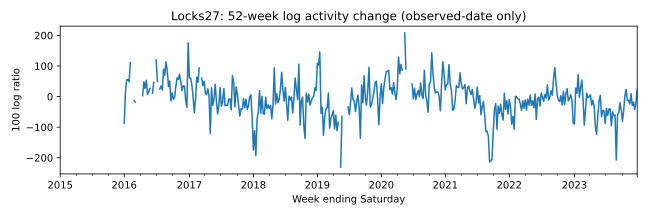
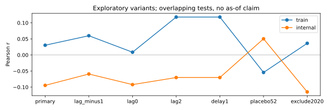
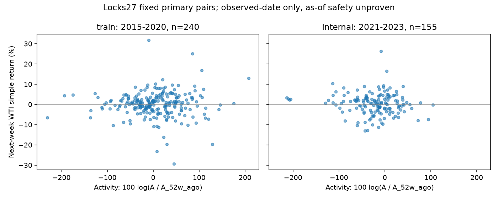

# Joint hunt — ALT-20260907-01 주별 후속 탐색

**PARK 유지.** 아래 숫자는 모두 **repo empirical only**. 관측주 기준 관계를 계산했으며 최초 공개일·과거 빈티지가 없어 **as-of-safe NOT_PROVEN**이다. 기존 월별 결과를 알고 추가한 빈도 robustness로 독립 발견/확증이 아니다. 새 후보 수에도 포함하지 않는다.

- [사전 계획](../../notebooks/joint-hunt-20260908/plan.md), [재현](../../notebooks/joint-hunt-20260908/README.md)
- [입출력 SHA256/환경 영수증](20260908T044354588864Z/receipt.json)
- [전체 14검정과 누락/분모](20260908T044354588864Z/tests.csv), [질량·표본 대사](20260908T044354588864Z/reconciliation.json)
- 로컬 파생물: `research/data/processed/joint-hunt-20260908/20260908T044354588864Z/weekly.csv` 및 `pairs.csv` (gitignored)

## 구성·검정

4곡물 합계가 완전한 토요일 종료 주간 short tons A_t에 `100 ln(A_t/A_(t-52))`를 적용한다. 52 **달력주**로 재색인 후 이동하며 관측행 번호를 이동하지 않는다. 이 정의는 364일 전 대비이며 정확한 전년 같은 날짜 비교가 아니다. 원유 사용량으로 환산하지 않는다. 원천 설명은 [USDA](https://agtransport.usda.gov/d/n4pw-9ygw), [권리·집계 안내](https://www.ams.usda.gov/services/transportation-analysis/gtr-datasets); WTI 연결은 운송활동이라는 검정 가설이다.

1,880품목행, 470주 중 10주에 톤수 결측이 있어 460주만 합산. 완전주 중 0톤 5주, 원문 0셀 389개를 구분한다. 양수 분자/52주 분모의 지수는 398개다. 알려진 원문 톤수 **217,649,472 = 완전주 214,009,449 + 불완전주의 알려진 톤수 3,640,023**. 결측 10셀의 실제 톤수는 모른다.

Yahoo CL=F IS 입력은 2,262행(2015-01-02..2023-12-29). 주말 실제 마지막 종가 변화율을 쓰고 전후 종가 사이에 일별 비양수/결측이 있으면 제외한다. 2015-01-03은 이전 가격 없음, 2020-04-25는 음수가격 창으로 무효. 468주 수익률이다. 거래소 캘린더 누락 여부는 미검증이다.

| 사전 변형 | train 2015–2020 n / r | internal 2021–2023 n / r |
|---|---:|---:|
| 다음 주 주 검정 | 240 / 0.030305 | 155 / -0.094648 |
| 이전 주 lag -1 | 240 / 0.059887 | 154 / -0.059239 |
| 같은 주 lag 0 | 240 / 0.008552 | 155 / -0.092219 |
| 두 주 뒤 lag +2 | 239 / 0.117933 | 155 / -0.070222 |
| 지수 1주 지연 | 239 / 0.117933 | 155 / -0.070222 |
| 52주 이동 placebo | 193 / -0.054417 | 104 / 0.050295 |
| 2020 관련 분자/분모/가격창 제외 | 193 / 0.036263 | 104 / -0.115046 |

2021–2023은 OOS가 아니라 IS 내부 구간이다. 신호 관측주와 타깃 실제 시작/종료일을 split 안에 제한한다. 52주 전 지수 분모는 과거 입력으로 허용하며 최초 분모일을 표에 남긴다. Placebo는 원신호의 관측주까지 split 안으로 제한한다. 2020 제외가 2021 분모에도 적용되어 internal n이 155→104로 줄었다. 모든 변형에 `scoped_n = scenario_excluded_n + missing_pair_n + n`이 성립한다.

## 해석과 다음 행동

주 검정은 내부 구간에서 부호가 바뀌었다. 2020 제외에도 부호 차이가 남지만 이것으로 안정성·효과 존재를 주장하지 않는다. 1주 지연과 lag +2는 동일한 pair들의 재표현이므로 독립 증거로 세지 않는다. 52주 placebo는 계절 구조를 남겨 유효한 귀무분포가 아니다. 다중검정 보정/p-value/인과/성과 추론은 미실행이다. 관측주 lag는 공개시점 선행을 뜻하지 않는다.

손성찬: 과거 USDA GTR 발행본의 관측주→공개일·개정 비교를 확인. Noah: 해당 활동을 원유 수요가 아닌 곡물 운송 탐색으로 발표할지 판단. 빈티지 자료를 얻지 못하면 PARK 유지한다. 2024+는 이번 실행에서 읽지 않았다.

## 독립 수치 검토

[Finance 리뷰](20260908T044354588864Z/independent-finance-review.json): 운영 코드 import 없이 표준 라이브러리로 470주/14검정/2,566 pair와 입력·출력 hash를 대조해 PASS. 실행기 내 assert와 별도 검증이며 사람 동료심사·as-of 검증은 아니다. [검증 실행기](../../notebooks/joint-hunt-20260908/finance-audit.py). 최초 run receipt의 pending은 이후 이 리뷰가 해소했다.

## 리뷰 후 주검정 시각적 검증 보완

기존 고정 pair만 사용한 [학습/내부검증 산점도](review-20260908/primary-scatter.png), [해시 영수증](review-20260908/scatter-receipt.json). 재현: `research/.venv/bin/python research/notebooks/joint-hunt-20260908/plot_primary.py` (저장소 루트). 추가 검정·회귀선 적합·OOS 열람 없음.

