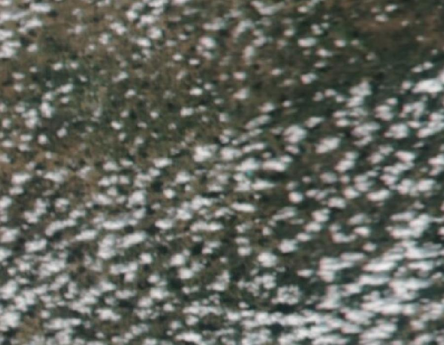
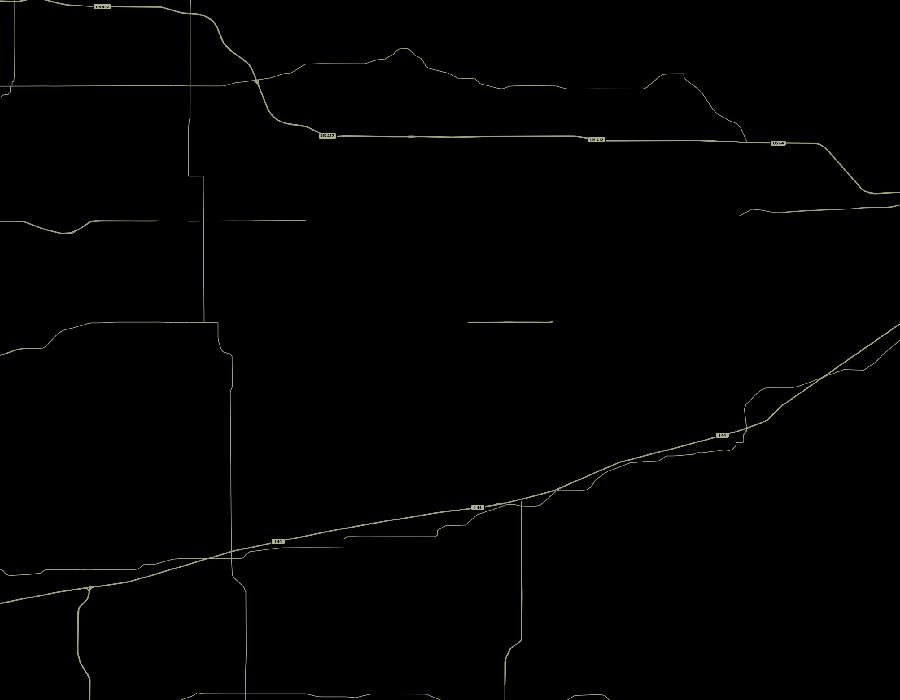

# 091-B look board (no score)

Not real-time. Not motel-vs-tank. Not a CFAM number.

NASA GIBS/Worldview can show the Cushing box about **3 hours after** a night pass.
Pixel scale of the Day/Night Band is hundreds of metres. That is why 091-B
failed as a quantitative input: the light blob is the town, not a tank farm.

Use the live map, then decide with your eyes. Do not feed a brightness
histogram into WTI.

Worldview (Cushing box, DNB + roads):
https://worldview.earthdata.nasa.gov/?v=-97.15,35.78,-96.35,36.22&l=VIIRS_SNPP_DayNightBand_ENCC,Reference_Features_15m,Coastlines_15m

Snapshots (2026-09-09 pull):

- True color: cloud deck. You cannot see pads.
- DNB + roads: road overlay only. Town lights did not separate.

091-B research status stays **RUN / 미통과** as a number.
