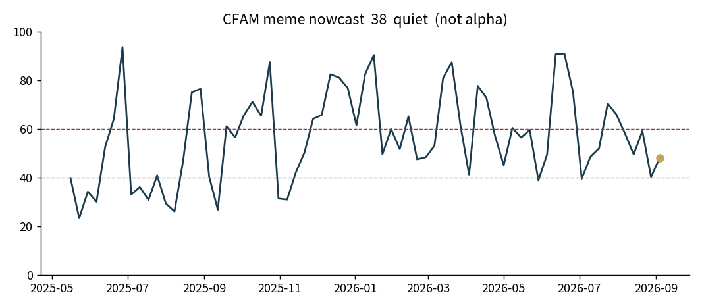
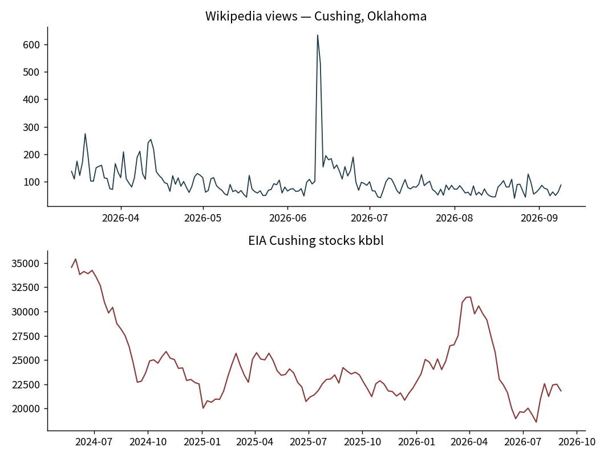
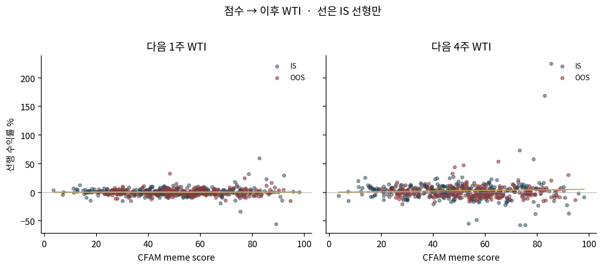
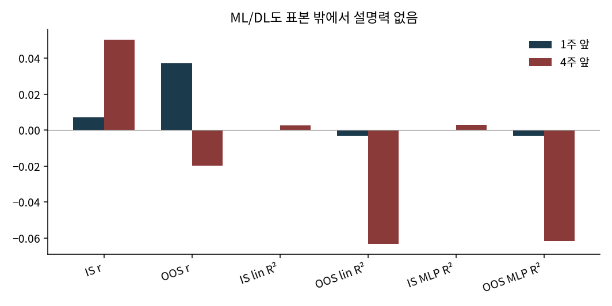

**실시간 아님. ML/DL은 가중치 설명만, WTI 예측 아님.**

# CFAM meme nowcast (not alpha)

Free public series only. Not a trade. Not 091-B night lights. Not a 0–100 that predicts WTI.

\[
\text{score}=
0.4\cdot q(\text{wiki 7d})+
0.4\cdot q(|\Delta \text{Cushing stocks}|_{52w})+
0.2\cdot(100-q(\text{stock level}_{5y}))
\]

- Wikipedia daily views, page `Cushing, Oklahoma`
- EIA weekly Cushing stocks excluding SPR (`W_EPC0_SAX_YCUOK_MBBL`)
- \(q\) = percentile in the window above

| now (2026-09-11) | |
| --- | --- |
| score | **37.5 quiet** |
| wiki 7d | 66 views, 12th pctile (little attention) |
| EIA week | 2026-09-04, 21,824 kbbl, |Δ| 684, 39th pctile |
| tightness | 87th pctile (tanks lower than most of 5y) |

Tanks look somewhat light. Field-attention and weekly pipe move do not. The old line still holds: the field can look quiet while tanks are not full.

Do not feed this into a WTI model. If 091 later gets truck/hotel panels, replace the wiki leg.

## Engine

5-minute loop: [../engine/README.md](../engine/README.md).
QSR pinch weight **0.15**, observer file only. Google is not scraped.

## WTI check (not a model)

Oil tape: Yahoo `CL=F`. Split matches the desk freeze, not a new hunt.

- IS 2016-01-01 .. 2021-12-31 (n=314 weeks)
- OOS 2022-01-03 .. 2026-04-21 (n=224)

Score at EIA week → next 1-week and 4-week WTI return.
Linear fit on IS only. Tiny 1-hidden MLP fit on IS only. No QSR in the history (no observer tape).

| | 1w IS | 1w OOS | 4w IS | 4w OOS |
| --- | ---: | ---: | ---: | ---: |
| r | 0.007 | 0.037 | 0.050 | −0.020 |
| lin R² | 0.000 | −0.003 | 0.003 | −0.063 |
| MLP R² | 0.000 | −0.003 | 0.003 | −0.062 |

OOS 4w |r| permutation p ≈ 0.76.

091 already forbids feeding CFAM into WTI ML. This page is the reason: the net does not beat a flat line out of sample.

## 091-A
Lodging packet + AVC40 annual. [091a/README.md](091a/README.md). Not daily. Weight 0.05 lodging only.
## 091-H
Travel-search meme pinch 0.05. [091h/README.md](091h/README.md).
## 091-M
City jobs pinch 0.05. [091m/README.md](091m/README.md).
## 091-U
Industry jobs pinch 0.10. [091u/README.md](091u/README.md).
